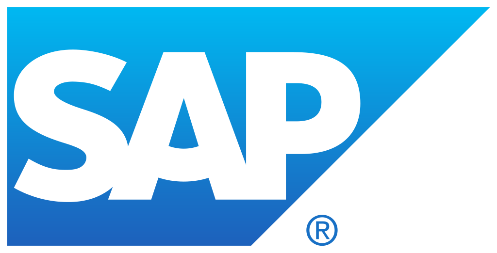
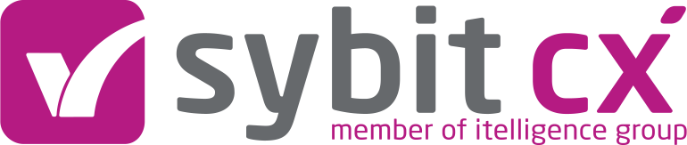

 

<!-- markdown-link-check-disable-next-line -->

> [!NOTE]
> Kyma has successfully undergone its transformation, achieving modularity. The [global Kyma releases](https://github.com/kyma-project/kyma/releases) are discontinued. Now, each Kyma module provides functionality developed and delivered independently of the other ones. To benefit from the functionalities, subscribe to individual Kyma module repositories. You can add and delete modules without installing the monolithic Kyma. For more details, please refer to [Kyma Modules](https://kyma-project.io/#/06-modules/README).

## Overview

**Kyma** `/'ki.ma/` Kyma is an opinionated set of Kubernetes-based modular building blocks, including all necessary capabilities to develop and run enterprise-grade cloud-native applications. It is the open path to the SAP ecosystem supporting business scenarios end-to-end.

Kyma is an actively maintained open-source project supported by SAP. The Kyma project is also a foundation of SAP BTP, Kyma runtime which is a part of SAP Business Technology Platform (BTP). You can use Kyma modules in your own Kubernetes cluster, or try the managed version from SAP BTP with a ready-to-use Kubernetes cluster powered by Gardener.

Kyma modules offer various functionalities, such as:

- [Serverless](https://kyma-project.io/#/serverless/user/README) development platform to run lightweight Functions in a cost-efficient and scalable way
- [System connectivity](https://kyma-project.io/#/application-connector-manager/user/README) that provides an endpoint to securely register Events and APIs of external applications
- [Istio](https://kyma-project.io/#/istio/user/README) for service-to-service communication and proxying
- [Service Management](https://kyma-project.io/#/btp-manager/user/README) to use the built-in cloud services from such cloud providers as GCP, Azure, and AWS
- Secure [API exposure](https://kyma-project.io/#/api-gateway/user/README)
- Collection and shipment of telemetry data to observability backends using the [Telemetry module](https://kyma-project.io/#/telemetry-manager/user/README)
- CLI supported by the intuitive UI through which you can connect your application to a Kubernetes cluster

Go to the [Kyma project website](https://kyma-project.io/) to learn more about our project, its features, and Kyma modules.

## Installation

To get started with Kyma and install it with specific modules, see the [Quick Install](https://kyma-project.io/#/02-get-started/01-quick-install) guide.

## Usage

Kyma comes with ready-to-use code snippets that you can use to test the extensions and the core functionality. See the list of existing examples in the [`examples`](https://github.com/kyma-project/examples) repository.

## Contributing

Read the [`CONTRIBUTING.md`](CONTRIBUTING.md) document that includes the contributing rules and development steps specific to this repository.

## Kyma Users

The following companies use Kyma:

  
  
  
  

  
  
  
  

  
  

## Join Us

Kyma team is located mostly in Poland and Germany. See the open job positions for both locations:

- [Gliwice, Poland](https://jobs.sap.com/search/?createNewAlert=false&q=%23kymaopensource&optionsFacetsDD_department=&optionsFacetsDD_customfield3=&optionsFacetsDD_country=&locationsearch=)
- [Munich, Germany](https://jobs.sap.com/search/?createNewAlert=false&q=%23kyma&optionsFacetsDD_department=&optionsFacetsDD_customfield3=&optionsFacetsDD_country=&locationsearch=munich)

### FAQ

- **What is your IDE?**

  Nothing is enforced. People often use GoLand, Visual Studio Code, VIM.

- **How do you approach testing in Go? Do you use any frameworks?**

  We use tools such as classical Go runner, Gomega, Testify.

- **How to learn Go?**

  Here are some useful sources to learn Go:
  - [Official Go learning tutorials](https://go.dev/learn/)
  - [50 Shades of Go: Traps, Gotchas, and Common Mistakes for New Golang Devs](http://devs.cloudimmunity.com/gotchas-and-common-mistakes-in-go-golang/)
  - [Language converter](https://ide.onelang.io/?input=HelloWorldRaw) - this tool helps you to convert code from one language to any other one

## Code of Conduct

See the [Code of Conduct](CODE_OF_CONDUCT.md) document.

## Licensing

See the [license](./LICENSE) file.
