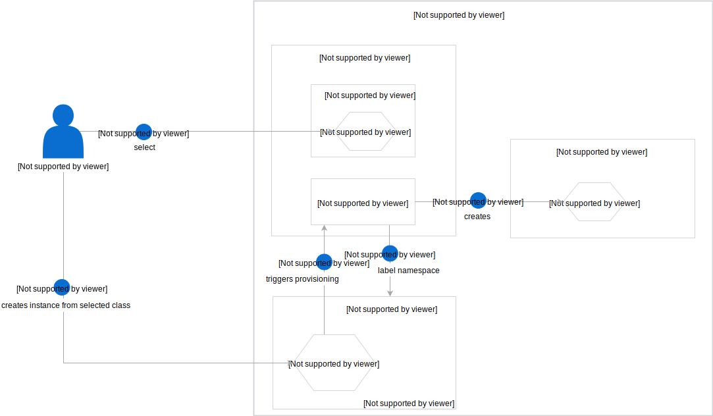

## Architecture from a bird’s eye view

### Provisioning action aka enable Events in a given namespace

This ServiceClass has a **bindable** parameter set to `false` which means that after provisioning a ServiceClass in the Namespace, given Events are ready to use for all services. The provisioning workflow for an Event ServiceClass consists of the following steps:

1. Select a given Event ServiceClass from the Service Catalog.
2. Provision this ServiceClass by creating a ServiceInstance in the given Namespace.
3. Service Catalog is notified by new ServiceInstance and triggers the provisioning process.
4. Application Broker receives provision requests. As the result:
    1. broker adds EventBroker label to the Namespace where ServiceInstance was created,
    2. and creates the Subscription resource in `kyma-integration` Namespace.

### Deprovisioning action 

1. User deletes the ServiceInstance. (via kubectl/UI/ or just delete the whole Namespace)
2. Service Catalog notices that ServiceInstance is marked as deleted and triggers the deprovisioning process.
3. Application Broker receives deprovision requests. As a result, removes the EventBroker label from the Namespace where ServiceInstance was created.
4. K8s Garbage Collector triggers the deletion of the Subscription CR that was own by the removed ServiceInstance, thanks to the OwnerReference.
