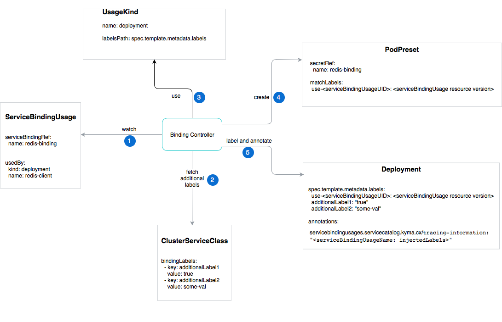

# Architecture

The Binding Usage Controller workflow steps are as follows:

1. The Binding Usage Controller watches the ServiceBindingUsages in all Namespaces and triggers the logic described in this section. The user decides on the names of the ServiceBindingUsages.

2. The Binding Usage Controller fetches all labels from the bindingLabels section in the ClusterServiceClass for which the ServiceBinding was created.

3. The Binding Usage Controller creates a PodPreset which is applied to all Pods with the **use-{serviceBindingUsageUID}** label set to `{serviceBindingUsage resource version}`. The name of the PodPreset is the SHA1-encoded name of the ServiceBindingUsage. The PodPreset injects a Secret with the same name as specified in the  **serviceBindingRef.name** field into those Pods. By default, the prefixing of the injected environment variables is disabled. Set the **envPrefix.name** to enable the prefix. **envPrefix.name** is used to prefix the name of the environment variable.

4. The Binding Usage Controller labels the resource specified in the **usedBy** property. The labels mentioned in step 2 and 3 are used for labelling.

5. The Binding Usage Controller adds an annotation with data of the applied ServiceBindingUsage. Annotations are used for the tracing and debugging purposes. With annotations, you can trace the labels that have been attached to a given Deployment. The patter of such annotation is as follows:

 ```
 servicebindingusages.servicecatalog.kyma.cx/tracing-information: '{
  "{ServiceBindingUsage Name}": {
    "injectedLabels": {
      "{label-key}": "{label-value}"
    }
  }
}'
 ```
See the example:

  ```
servicebindingusages.servicecatalog.kyma.cx/tracing-information: '{
  "azure-mysqldb-instance-binding-usage": {
    "injectedLabels": {
      "use-db31ae30-7ecb-11e8-a568-000d3a384f22": "445978"
      “access-label”: “ec-default“
    }
  },
  "azure-sqldb-instance-1-binding-usage": {
    "injectedLabels": {
      "use-1f29d2e2-7ecc-11e8-a568-000d3a384f22": "446537"
    }
  }
}
```


