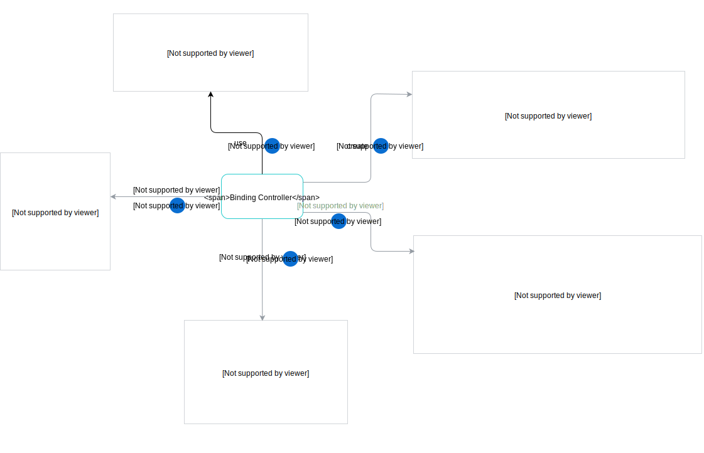

# Architecture

The Service Binding Usage Controller workflow looks as follows:



1. The Service Binding Usage Controller watches Service Binding Usages in all Namespaces and triggers the logic described in this section. The user decides on the names of Service Binding Usages.

2. The Service Binding Usage Controller fetches all labels from the **bindingLabels** section in the Cluster Service Class for which the Service Binding was created.

3. The Service Binding Usage Controller finds the corresponding Usage Kind specified in the **usedBy.Kind** field. The Usage Kind defines the resource to be labeled and the field which contains labels.

4. The Service Binding Usage Controller creates a Pod Preset which is applied to all Pods with the **use-{serviceBindingUsageUID}** label set to `{serviceBindingUsage resource version}`. The name of the Pod Preset is the SHA1-encoded name of the Service Binding Usage. The Pod Preset injects a Secret with the same name as specified in the  **serviceBindingRef.name** field into those Pods. By default, the prefixing of the injected environment variables is disabled. Set **envPrefix.name** to enable the prefix. **envPrefix.name** is used to prefix the name of the environment variable.

5. The Service Binding Usage Controller adds the labels from steps 2 and 3 to the resource specified in the **usedBy** property.

6. The Service Binding Usage Controller adds an annotation with data on the applied Service Binding Usage to the Deployment. Annotations are used for tracing and debugging purposes. With annotations, you can trace the labels attached to a given Deployment. The pattern of such annotation is as follows:

    ```
     servicebindingusages.servicecatalog.kyma-project.io/tracing-information: '{
      "{Service Binding Usage Name}": {
        "injectedLabels": {
          "{label-key}": "{label-value}"
        }
      }
    }'
    ```

    See the example:

    ```
    servicebindingusages.servicecatalog.kyma-project.io/tracing-information: '{
      "azure-mysqldb-instance-binding-usage": {
        "injectedLabels": {
          "use-db31ae30-7ecb-11e8-a568-000d3a384f22": "445978"
          “access-label”: “ec-default“
        }
      },
      "azure-sqldb-instance-1-binding-usage": {
        "injectedLabels": {
          "use-1f29d2e2-7ecc-11e8-a568-000d3a384f22": "446537"
        }
      }
    }
    ```
