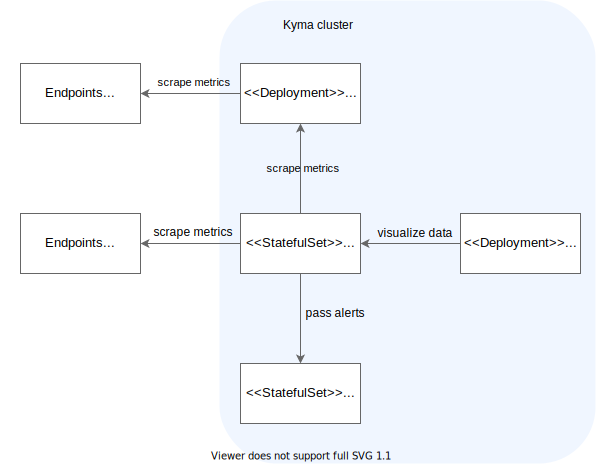

## Default setup

The monitoring chart is preconfigured to collect all metrics relevant for observing the in-cluster [Istio](https://istio.io/latest/docs/concepts/observability/) Service Mesh, including the proxy-level, service-level, and control-plane metrics.

The concept of collecting the [service-level](https://istio.io/latest/docs/concepts/observability/#service-level-metrics) metrics is built around the Istio Proxy implemented by Envoy. Istio Proxy collects all communication details inside the service mesh in a decentralized way. After scraping these high-cardinality metrics from the envoys, the metrics must be aggregated on a service level to get the final service-related details.

Following [Istio's observability best practice](https://istio.io/latest/docs/ops/best-practices/observability/), a dedicated Prometheus instance scrapes and aggregates the service-level metrics. That instance is configured with the smallest possible data retention time because the raw metrics scraped from the Istio Proxies have high-cardinality and don't need to be kept further. Instead, the main Prometheus instance scrapes the aggregated metrics through the `/federate` endpoint.

The Istio-related instance is a Deployment named `monitoring-prometheus-istio-server`, configured with a short data retention time and hardcoded configuration that you should not change. It also has no PersistentVolume attached. This instance never discovers additional metric endpoints from such resources as ServiceMonitors.

## Istio monitoring flow

See the diagram for a broader view of how the Istio-related instance fits into the monitoring setup in Kyma:



## Enable Grafana vizualization

By default, `monitoring-prometheus-istio-server` is not provided as a data source in Grafana.

1. To enable `monitoring-prometheus-istio-server` as a data source in Grafana, provide a YAML file with the following values:

  ```yaml
  monitoring  
    prometheus-istio:
      grafana:
        datasource:
          enabled: "true"
  ```

2. [Deploy](../../../04-operation-guides/operations/03-change-kyma-config-values.md) the values YAML file.

3. Restart the Grafana deployment with the following command:

  ```bash
  kubectl rollout restart -n kyma-system deployment monitoring-grafana
  ```
