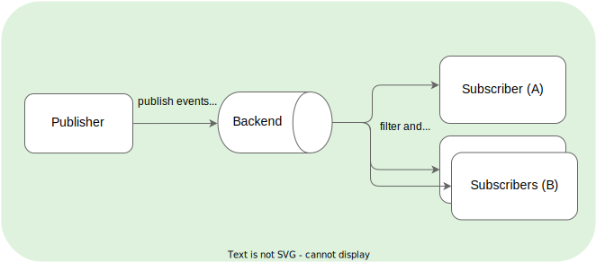

## Overview

With Kyma Eventing, you can focus on your business workflows and trigger them with events to implement asynchronous flows within Kyma. Generally, eventing consists of event producers (or publishers) and consumers (or subscribers) that send events to or receive events from an event processing backend.

The objective of Eventing in Kyma is to simplify the process of publishing and subscribing to events. Kyma uses proven eventing backend technology to provide a seamless experience to the user with their end-to-end business flows. The user does not have to implement or integrate any intermediate backend or protocol.

Kyma Eventing uses the following technology:
- [NATS JetStream](https://docs.nats.io/) as backend within the cluster
- [HTTP POST](https://www.w3schools.com/tags/ref_httpmethods.asp) requests to simplify sending and receiving events
- Declarative [Subscription CR](../../05-technical-reference/00-custom-resources/evnt-01-subscription.md) to subscribe to events

## Kyma Eventing flow

Kyma Eventing follows the PubSub messaging pattern: Kyma publishes messages to a messaging backend, which filters these messages and sends them to interested subscribers. Kyma does not send messages directly to the subscribers as shown below:

Eventing in Kyma from a user’s perspective works as follows:

- Offer an HTTP end point, for example a Function to receive the events.
- Specify the events the user is interested in using the Kyma [Subscription CR](../../05-technical-reference/00-custom-resources/evnt-01-subscription.md).
- Send [CloudEvents](https://cloudevents.io/) or legacy events (deprecated) to the following HTTP end points on our [Event Publishing Proxy](https://github.com/kyma-project/kyma/tree/main/components/event-publisher-proxy) service.
    - `/publish` for CloudEvents.
    - `<application_name>/v1/events` for legacy events.

For more information, read the [Eventing architecture](../../05-technical-reference/00-architecture/evnt-01-architecture.md).

## Glossary

- **Event Types**
    - `CloudEvents`: Events that confirm to the [CloudEvents specification](https://cloudevents.io/) - a common specification for describing event data. The specification is currently under [CNCF](https://www.cncf.io/).
    - `Legacy events` (deprecated): Events or messages published to Kyma that do not conform to the CloudEvents specification. All legacy events published to Kyma are converted to CloudEvents.
- **Streams and Consumers**
    - `Streams`: A stream stores messages for the published events. Kyma uses only one stream, with _**file**_ storage, for all the events. You can configure the retention and delivery policies for the stream, depending on the use case.
    - `Consumers`: A consumer reads or consumes the messages from the stream. Kyma Subscription creates one consumer for each specified filter. Kyma uses push-based consumers.
- **Delivery Guarantees**
    - `at least once` delivery: With NATS JetStream, Kyma now ensures that for each event published, all the subscribers subscribed to that event receive the event at least once.
    - `max bytes and discard policy`: NATS JetStream uses these configurations to ensure that no messages are lost when the storage is almost full. By default, Kyma ensures that no new messages are accepted when the storage reaches 90% capacity.  

## Useful links

Find out more about Eventing by following the links on this page.

To learn more about how Eventing works, see:

- [Eventing architecture](../../05-technical-reference/00-architecture/evnt-01-architecture.md) - describes how Eventing works and the main actors involved, such as the Eventing Controller and Event Publisher Proxy.
- [Event names](../../05-technical-reference/evnt-01-event-names.md) - contains information about event names and event name cleanup.
- [EventingBackend CR](../../05-technical-reference/00-custom-resources/evnt-02-eventingbackend.md) - describes the EventingBackend custom resource, which shows the current status of Kyma Eventing.
- [Subscription CR](../../05-technical-reference/00-custom-resources/evnt-01-subscription.md) - describes the Subscription custom resource, which you need to subscribe to events.
- [CloudEvents](https://cloudevents.io/) - provides information about the CloudEvents specification used in Kyma.
- [NATS JetStream](https://docs.nats.io/nats-concepts/jetstream) - provides more information about the backend technology behind Eventing in Kyma. [Eventing Architecture](../../05-technical-reference/00-architecture/evnt-01-architecture.md#jet-stream) provides details on the new functionalities and higher qualities of service on top of Core NATS.

To perform tasks with Eventing, go through these tutorials:

- [Tutorial: Trigger your workload with an event](../../02-get-started/04-trigger-workload-with-event.md) - part of the [Get Started guides](../../02-get-started), shows how to deploy a Function and trigger it with an event.
- [Tutorial: Create Subscription subscribing to multiple event types](../../03-tutorials/00-eventing/evnt-02-subs-with-multiple-filters.md) - shows how to subscribe to one or more event types using the Kyma Subscription.
- [Tutorial: Event name cleanup in Subscriptions](../../03-tutorials/00-eventing/evnt-03-type-cleanup.md) - explains how Kyma Eventing filters out prohibited characters from event names.
- [Tutorial: Changing Events Max-In-Flight in Subscriptions](../../03-tutorials/00-eventing/evnt-04-change-max-in-flight-in-sub.md) - shows how to set idle "in-flight messages" limit in Kyma Subscriptions.
- [Tutorial: Publish legacy events using Kyma Eventing](../../03-tutorials/00-eventing/evnt-05-send-legacy-events.md) - demonstrates how to send legacy events using Kyma Eventing.

To troubleshoot Eventing-related issues:
- [Basic Eventing Troubleshooting](../../04-operation-guides/troubleshooting/eventing/evnt-01-eventing-troubleshooting.md)
- [NATS JetStream Troubleshooting](../../04-operation-guides/troubleshooting/eventing/evnt-02-jetstream-troubleshooting.md)
- [Event Type Collision](../../04-operation-guides/troubleshooting/eventing/evnt-03-type-collision.md)
- [Eventing Backend Storage Full](../../04-operation-guides/troubleshooting/eventing/evnt-04-free-jetstream-storage.md)

For other technical resources, check out these links on the Kyma GitHub repository:

- [Eventing Helm chart](https://github.com/kyma-project/kyma/tree/main/resources/eventing)
- [Event Publishing Proxy](https://github.com/kyma-project/kyma/tree/main/components/event-publisher-proxy)
- [Eventing Controller](https://github.com/kyma-project/kyma/tree/main/components/eventing-controller)
- [Eventing Metrics](../../04-operation-guides/operations/evnt-02-eventing-metrics.md)
