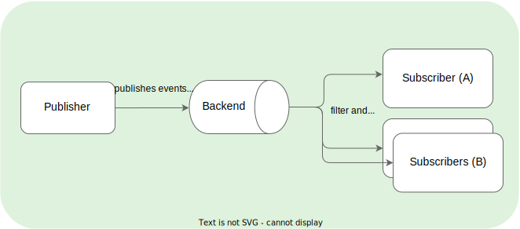

With Kyma Eventing, you can focus on your business workflows and trigger them with events to implement asynchronous flows within Kyma.
Kyma Eventing uses the following technology:
- [NATS JetStream](https://docs.nats.io/) as backend within the cluster
- [HTTP POST](https://www.w3schools.com/tags/ref_httpmethods.asp) requests to simplify sending and receiving events
- Declarative [Subscription CR](../../../05-technical-reference/00-custom-resources/evnt-01-subscription.md) to subscribe to events

## Overview

Generally, eventing consists of event producers (or publishers) and consumers (or subscribers) that send events to or receive events from an event processing backend.

Kyma uses the PubSub messaging pattern, which does not send messages directly to the subscribers. Instead, it sends them to a messaging backend that filters these messages and sends them to interested subscribers. The publishers are not aware of existing and interested subscribers. The following diagram shows a high-level overview of PubSub communication:

The key benefits of PubSub are:
- Asynchronous communication between loosely coupled components
- Easy scaling of publishers and subscribers

## Eventing in Kyma in a nutshell

The objective of Eventing in Kyma is to simplify the process of publishing and subscribing to events. Kyma uses proven eventing backend technology such as [NATS JetStream](https://docs.nats.io/), so that the user gets a seamless experience with their end-to-end business flow. The user does not have to implement or integrate any intermediate backend or protocol. Eventing in Kyma from a user's perspective works as follows:

- Offer an HTTP end point, for example a Function to receive the events.
- Specify the events the user is interested in using the Kyma [Subscription CR](../../../05-technical-reference/00-custom-resources/evnt-01-subscription.md).
- Send legacy or [Cloud Events](https://cloudevents.io/) to configured HTTP end points on our [Event Publishing Proxy](https://github.com/kyma-project/kyma/tree/main/components/event-publisher-proxy) service.
    - `/publish` for Cloud Events.
    - `<application_name>/v1/events` for legacy events.

For more information, read the [Eventing architecture](../../../05-technical-reference/00-architecture/evnt-01-architecture.md).

## Glossary for Eventing

- **Event Types**
    - `Cloud Events`: Events that confirm to the [Cloud Events specification](https://cloudevents.io/) - a common specification for describing event data. The specification is currently under [CNCF](https://www.cncf.io/).
    - `Legacy events` (deprecated): Events or messages published to Kyma that do not conform to the Cloud Events specification. All legacy events published to Kyma are converted to Cloud Events.
- **Streams and Consumers**
    - `Streams`: A stream stores messages for the published events. Kyma uses only one stream, with _**file**_ storage, for all the events. You can configure the retention and delivery policies for the stream, depending on the use case.
    - `Consumers`: A consumer reads or consumes the messages from the stream. Kyma Subscription creates one consumer for each specified filter. Kyma uses push-based consumers.
- **Delivery Guarantees**
    - `at least once` delivery: With NATS JetStream, Kyma now ensures that for each event published, all the subscribers subscribed to that event receive the event at least once.
  