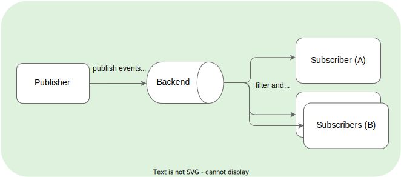

Eventing, in general, consists of event producers (or publishers) and consumers (or subscribers) that send events to or receive events from an event processing backend. The PubSub messaging pattern, which is the eventing paradigm used in Kyma, does not send messages directly to the subscribers but instead sends them to particular topics (or event types) without any knowledge of existing subscribers. The diagram shows a high level overview of PubSub communication:

The key benefits of PubSub are:
- communication between loosely coupled components.
- scale publishers and subscribers easily.
- asynchronous communication.

## Eventing in Kyma in a nutshell

The objective of Eventing in Kyma is to simplify the process of publishing and subscribing to events. Kyma uses proven Eventing backend technology such as [NATS JetStream](https://docs.nats.io/), so that the user can achieve a seamless experience with their end-to-end business flow. The user does not have to implement or integrate any intermediate backend or protocol. Eventing in Kyma from a user's perspective works as follows:

 - Offer an HTTP end point, for example a lambda function to receive the events.
 - Specify the events the user is interested in using the Kyma [Subscription CR](../../../05-technical-reference/00-custom-resources/evnt-01-subscription.md).
 - Send Legacy or [Cloud Events](https://cloudevents.io/) to configured HTTP end points on our [Event Publishing Proxy](https://github.com/kyma-project/kyma/tree/main/components/event-publisher-proxy) service.
   - `/publish` for Cloud Events.
   - `<application_name>/v1/events` for Legacy events.
 
Read [Eventing architecture](../../../05-technical-reference/00-architecture/evnt-01-architecture.md) to know more about the eventing flow in Kyma.

## Glossary for Eventing

- **Event Types**
  - `Legacy Events`: These are events or messages published to Kyma, that do not conform to the [Cloud Events specification](https://cloudevents.io/). All legacy events published to Kyma are always converted to Cloud Events. The legacy event format is deprecated.
  - `Cloud Events`: Kyma supports [Cloud Events](https://cloudevents.io/) - a common specification for describing event data. The specification is currently under [CNCF](https://www.cncf.io/).
- **Streams and Consumers**
  - `Streams`: A Stream stores messages for the published events. In Kyma, we use only one stream, with _**file**_ storage, for all the events. You can configure the retention and delivery policies for the stream, depending on the use case.
  - `Consumers`: A Consumer reads or consumes the messages from the stream. Kyma Subscription creates one consumer for each filter specified. In Kyma we use push-based consumers.
- **Delivery Guarantees**
  - `at least once` delivery: With NATS JetStream, Kyma now ensures that for each event published, all the subscribers subscribed to that event receive the event at least once.
  