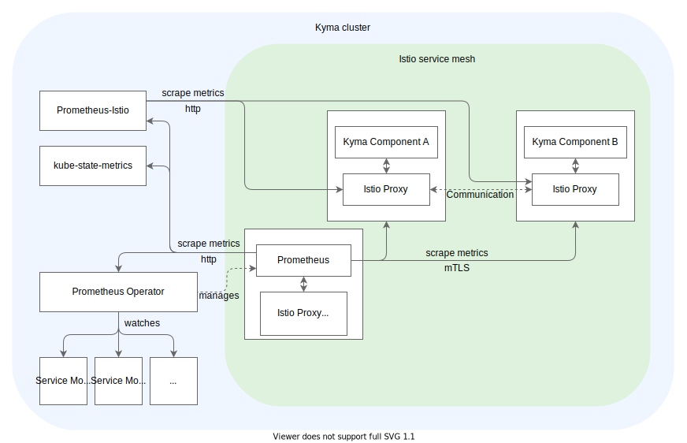

## Default setup

The [monitoring chart](https://github.com/kyma-project/kyma/blob/main/resources/monitoring/values.yaml) is preconfigured to collect all metrics relevant for observing the in-cluster [Istio](https://istio.io/latest/docs/concepts/observability/) Service Mesh, including the proxy-level, service-level, and control-plane metrics.

The concept of collecting the [service-level](https://istio.io/latest/docs/concepts/observability/#service-level-metrics) metrics is built around the Istio Proxy implemented by Envoy. Istio Proxy collects all communication details inside the service mesh in a decentralized way. After scraping these high-cardinality metrics from the envoys, the metrics must be aggregated on a service level to get the final service-related details.

Following [Istio's observability best practice](https://istio.io/latest/docs/ops/best-practices/observability/), a dedicated Prometheus instance scrapes and aggregates the service-level metrics. That instance is configured with the smallest possible data retention time because the raw metrics scraped from the Istio Proxies have high-cardinality and don't need to be kept further. Instead, the main Prometheus instance scrapes the aggregated metrics through the `/federate` endpoint.

The Istio-related instance is a Deployment named `monitoring-prometheus-istio-server`, configured with a short data retention time and hardcoded configuration that you should not change. It also has no PersistentVolume attached. This instance never discovers additional metric endpoints from such resources as ServiceMonitors.

The monitoring chart is configured in such a way that it is possible to scrape metrics using [`Strict mTLS`](https://istio.io/latest/docs/tasks/security/authentication/authn-policy/#globally-enabling-istio-mutual-tls-in-strict-mode). For this to work, Prometheus is configured to scrape metrics using Istio certificates. Prometheus is deployed with a sidecar proxy which rotates SDS certificates and outputs them to a volume mounted to the 
corresponding Prometheus container. To stick to Istio's observability best practices, Prometheus's Istio-proxy is configured to not intercept or redirect any traffic. By default, metrics from Kyma components are scraped using mTLS with some exceptions. Components which's workload is part of the Istio infrastructure, thus deployed with a sidecar proxy, are scraped using mTLS. The others, deployed without sidecar proxy, are scraped using `http`, like controllers (e.g. Prometheus operator).

Learn how to [deploy](../../../03-tutorials/00-observability/obsv-01-observe-application-metrics.md#deploy-the-example-configuration) a sample `Go` service exposing metrics, which are scraped by Prometheus using mTLS.



## Istio monitoring flow

See the diagram for a broader view of how the Istio-related instance fits into the monitoring setup in Kyma:


## Enable Grafana vizualization

By default, `monitoring-prometheus-istio-server` is not provided as a data source in Grafana.

1. To enable `monitoring-prometheus-istio-server` as a data source in Grafana, provide a YAML file with the following values:

  ```yaml
  monitoring  
    prometheus-istio:
      grafana:
        datasource:
          enabled: "true"
  ```

2. [Deploy](../../../04-operation-guides/operations/03-change-kyma-config-values.md) the values YAML file.

3. Restart the Grafana deployment with the following command:

  ```bash
  kubectl rollout restart -n kyma-system deployment monitoring-grafana
  ```

## Enable mTLS for custom metrics

To enable Strict mTLS scraping for a component, the corresponding ServiceMonitor needs to have the Istio TLS certificates configured:

```yaml
---
apiVersion: monitoring.coreos.com/v1
kind: ServiceMonitor
metadata:
  name: metrics
  namespace: kyma-system
  labels:
    prometheus: monitoring
    example: monitoring-custom-metrics
spec:
  selector:
    matchLabels:
      k8s-app: metrics
  targetLabels:
    - k8s-app
  endpoints:
    - port: web
      interval: 10s
      scheme: https
      tlsConfig: 
        caFile: /etc/prometheus/secrets/istio.default/root-cert.pem
        certFile: /etc/prometheus/secrets/istio.default/cert-chain.pem
        keyFile: /etc/prometheus/secrets/istio.default/key.pem
        insecureSkipVerify: true  # Prometheus does not support Istio security naming, thus skip verifying target pod ceritifcate
  namespaceSelector:
    any: true
```
