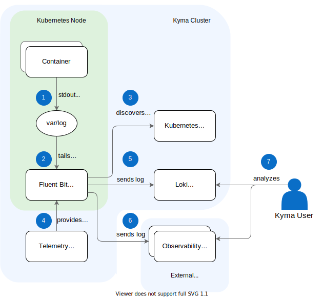
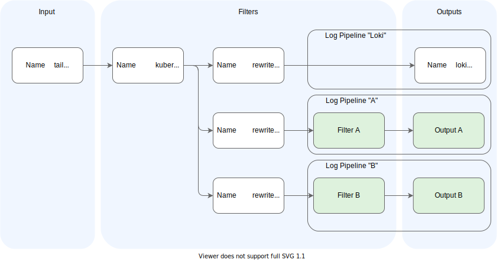
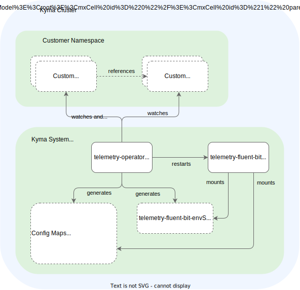
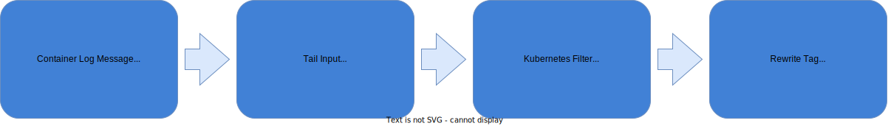

## Kyma's telemetry component

Kyma's observability functionality focuses on the pre-integrated collection of telemetry data from the users' workloads, and making that data available for further analysis and storage in backends of any kind and location. The telemetry component provides the configurable collection and shipment components, and with that, separates them explicitly from the storage and analysis in a specific backend system. You can still choose to install lightweight in-cluster backends with dedicated observability components.

To support the logging domain, the telemetry component provides a log collector, Fluent Bit. You can configure the log shipment with external systems using runtime configuration with a dedicated Kubernetes API (CRD). With that, you can integrate with vendors such as [VMWare](https://medium.com/@shrishs/log-forwarding-from-fluent-bit-to-vrealizeloginsightcloud-9eeb14b40276) using generic outputs, or with any vendor via a [fluentd integration](https://medium.com/hepsiburadatech/fluent-logging-architecture-fluent-bit-fluentd-elasticsearch-ca4a898e28aa) using the forward output. Kyma's optional logging component complements the telemetry component, providing `Loki` as pre-configured log backend.

## Prerequisites

- Your application must log to `stdout` or `stderr`.

## Architecture

### Telemetry component

The telemetry component provides [Fluent Bit](https://fluentbit.io/) as a log collector. Fluent Bit collects all application logs of the cluster workload and ships them to a backend.



1. Container logs are stored by the Kubernetes container runtime under the `var/log` directory and its subdirectories.
2. Fluent Bit runs as a DaemonSet (one instance per node), detects any new log files in the folder, and tails them using a filesystem buffer for reliability.
3. Fluent Bit queries the [Kubernetes API Server](https://kubernetes.io/docs/reference/command-line-tools-reference/kube-apiserver/) for additional Pod metadata, such as Pod annotations and labels.
4. The telemetry component configures Fluent Bit with your custom output configuration.
5. If Kyma's logging component is installed, the operator configures the shipment to the in-cluster Loki instance automatically.
6. As specified in your custom configuration, Fluent Bit sends the log data to observability systems outside the Kyma cluster.
7. The user accesses the internal and external observability system to analyze and visualize the logs.

### Pipelines

Fluent Bit comes with a pipeline concept, which supports flexible combination of inputs with outputs and filtering in between - for details, see [Fluent Bit: Output](https://docs.fluentbit.io/manual/concepts/data-pipeline/output).
Kyma's telemetry component brings a predefined setup of the Fluent Bit DaemonSet and a base configuration, which assures that the application logs of the workloads in the cluster are processed reliably and efficiently. Additionally, the telemetry component provides a Kubernetes API called `LogPipeline` to configure outputs with some filtering capabilities.



1. A central `tail` input plugin reads the application logs.

2. The application logs are enriched by a `kubernetes` filter. Then, for every LogPipeline definition, a `rewrite_tag` filter is generated, which uses a dedicated `tag` with name `<logpipeline>.*`, followed by the custom configuration defined in the LogPipeline resource. You can add your own filters to the default filters.

3. Based on the default and custom filters, you get the desired output for each `LogPipeline`.

This approach assures a reliable buffer management and isolation of pipelines, while keeping flexibility on customizations.

### Telemetry Operator

The LogPipeline resource is managed by the Telemetry Operator, a typical Kubernetes operator responsible for managing the custom parts of the Fluent Bit configuration.



The Telemetry Operator watches all LogPipeline resources and related Secrets. Whenever the configuration changes, it validates the configuration (with a [validating webhook](https://kubernetes.io/docs/reference/access-authn-authz/extensible-admission-controllers/)) and generates a new configuration for the Fluent Bit DaemonSet, where several ConfigMaps for the different aspects of the configuration are generated. Furthermore, referenced Secrets are copied into one Secret that is mounted to the DaemonSet as well.

## Setting up a LogPipeline

### Step 1: Create a LogPipeline and output

1. To ship application logs to a new output, create a resource file of kind LogPipeline:
    ```yaml
    kind: LogPipeline
      apiVersion: telemetry.kyma-project.io/v1alpha1
      metadata:
        name: http-backend
    spec:
      output:
        http:
          dedot: false
          port: "80"
          uri: "/"
          host:
            value: https://myhost/logs
          user:
            value: "user"
          password:
            value: "not-required"
    ```
    An output is a data destination configured by a [Fluent Bit output](https://docs.fluentbit.io/manual/pipeline/outputs) of the relevant type. The LogPipeline supports the following output types:

    - **http**, which pushes the data to the specified http destination.
    - **grafana-loki**, which pushes the data to the Grafana Loki service.
    - **custom**, which supports the configuration of any destination in the Fluent Bit configuration syntax.

    See the following example of the **custom** output:
    ```yaml
    spec:
      output:
        custom: |
          Name               http
          Host               https://myhost/logs
          Http_User          user
          Http_Passwd        not-required
          Format             json
          Port               80
          Uri                /
          Tls                on
          tls.verify         on
    ```

2. To create the instance, apply the resource file in your cluster.
    ```bash
    kubectl apply -f path/to/my-log-pipeline.yaml
    ```

3. Check that the status of the LogPipeline in your cluster is `Ready`:
    ```bash
    kubectl get logpipeline
    NAME              STATUS    AGE
    http-backend      Ready     44s
    ```

### Step 2: Create an input

If you need selection mechanisms for application logs on Namespace or container level, you can use an input spec to restrict or specify from which resources logs are included.
If you don't define any input, it's collected from all Namespaces, except the system Namespaces `kube-system`, `istio-system`, `kyma-system`, and `kyma-integration`, which are excluded by default. You can either define the included Namespaces to collect from, or exclude from all Namespaces or only set system Namespaces to be included. See all parameters [here](#parameters).

The following example collects input from all Namespaces excluding `kyma-system` and only from `istio-proxy` containers:
```yaml
kind: LogPipeline
apiVersion: telemetry.kyma-project.io/v1alpha1
metadata:
  name: http-backend
spec:
  input:
    application:
      namespaces:
        exclude:
          - kyma-system
      containers:
        include:
          - istio-proxy
  output:
    ...
```

It might happen that Fluent Bit prints an error per processed log line that is then collected and re-processed.
To avoid problems with such recursive logs, it is recommended that you exclude the logs of the Fluent Bit container. The following example collects input from all Namespaces including system Namespaces, but excludes the Fluent Bit container:

```yaml
spec:
  input:
    application:
      includeSystemNamespaces: true
      excludeContainers:
        - fluent-bit
```


### Step 3: Add filters

To enrich logs with attributes or drop whole lines, add filters to the existing pipeline.
The following example contains three filters, which are executed in sequence.

```yaml
kind: LogPipeline
apiVersion: telemetry.kyma-project.io/v1alpha1
metadata:
  name: http-backend
spec:
  filters:
    - custom: |
        Name    grep
        Regex   $kubernetes['labels']['app'] my-deployment
    - custom: |
        Name    grep
        Exclude $kubernetes['namespace_name'] kyma-system|kube-system|kyma-integration|istio-system
    - custom: |
        Name    record_modifier
        Record  cluster_identifier ${KUBERNETES_SERVICE_HOST}
  input:
    ...
  output:
    ...
```

 The telemetry operator supports different types of [Fluent Bit filter](https://docs.fluentbit.io/manual/concepts/data-pipeline/filter). The example uses the [grep](https://docs.fluentbit.io/manual/pipeline/filters/grep) and the [record_modifier](https://docs.fluentbit.io/manual/pipeline/filters/record-modifier) filter.

- The first filter keeps all log records that have the `kubernetes.labels.app` attribute set with value `my-deployment`; all other logs are discarded. The `kubernetes` attribute is available for every log record. See [Kubernetes filter (metadata)](#kubernetes-filter-metadata) for more details.
- The second filter drops all log records fulfilling the given rule. Here, typical Namespaces are dropped based on the `kubernetes` attribute.
- A log record is modified by adding a new attribute. Here, a constant attribute is added to every log record for recording the actual cluster node name at the record for later filtering in the backend system. As value, a placeholder is used referring to a Kubernetes-specific environment variable.

### Step 4: Add authentication details from Secrets

Integrations into external systems usually need authentication details dealing with sensitive data. To handle that data properly in Secrets, the LogPipeline supports the reference of Secrets.

With the **http** and the **grafana-loki** output definition, the **valueFrom** attribute allows for mapping of Secret keys as visible in the following **http** output example:

```yaml
kind: LogPipeline
apiVersion: telemetry.kyma-project.io/v1alpha1
metadata:
  name: http-backend
spec:
  output:
     http:
        dedot: false
        port: "80"
        uri: "/"
        host:
           valueFrom:
              secretKeyRef:
                 name: http-backend-credentials
                 namespace: default
                 key: HTTP_ENDPOINT
        user:
           valueFrom:
              secretKeyRef:
                 name: http-backend-credentials
                 namespace: default
                 key: HTTP_USER
        password:
           valueFrom:
              secretKeyRef:
                 name: http-backend-credentials
                 namespace: default
                 key: HTTP_PASSWORD
  input:
    ...
  filters:
    ...
```


The related Secret must fulfill the referenced name and Namespace, and contain the mapped key as in the following example:

```yaml
kind: Secret
apiVersion: v1
metadata:
  name: http-backend-credentials
stringData:
  HTTP_ENDPOINT: https://myhost/logs
  HTTP_USER: myUser
  HTTP_PASSWORD: XXX
```

To leverage data provided by a Kubernetes Secrets in a **custom** output definition, use placeholder expressions for the data provided by the Secret. Then specify the actual mapping to the Secret keys in the **variables** section, like in the following example:

```yaml
kind: LogPipeline
apiVersion: telemetry.kyma-project.io/v1alpha1
metadata:
  name: http-backend
spec:
  output:
    custom: |
      Name               http
      Host               ${ENDPOINT} # Defined in Secret
      HTTP_User          ${USER} # Defined in Secret
      HTTP_Password      ${PASSWORD} # Defined in Secret
      Tls                On
  variables:
    - name: ENDPOINT
      valueFrom:
        secretKeyRef:
        - name: http-backend-credentials
          namespace: default
          key: HTTP_ENDPOINT
  input:
    ...
  filters:
    ...
```

### Step 5: Rotate the Secret

A Secret being referenced with the **secretKeyRef** construct, as used in the previous step, can be rotated manually or automatically. For automatic rotation, update the actual values of the Secret and keep the keys of the Secret stable.
Once an hour, the LogPipeline watches the referenced Secrets and detects changes to them. To enforce the detection, just annotate the LogPipeline; for example, with the following code:

```yaml
kind: LogPipeline
apiVersion: telemetry.kyma-project.io/v1alpha1
metadata:
  name: http-backend
  annotations:
    kyma-project.com/timeStamp: <current-time>
```

### Step 6: Add a parser

Typically, you want to have your logs shipped in a structured format already, so that a backend like OpenSearch can immediately index the content according to the log attributes. By default, a LogPipeline tries to parse all logs as a JSON document and enrich the record with the parsed attributes on the root record. Thus, logging in JSON format in the application results in structured log records. Sometimes, logging in JSON is not an option (the log configuration is not under your control) and the logs are in an unstructured or plain format. To adjust this, you can define your custom [parser](https://docs.fluentbit.io/manual/concepts/data-pipeline/parser) and either activate it with a filter or a Pod annotation.

The following example defines a parser named `dummy_test` using a dedicated `LogParser` resource type:

```yaml
kind: LogParser
apiVersion: telemetry.kyma-project.io/v1alpha1
metadata:
  name: dummy_test
spec:
  parser:
    content: |
      Format regex
      Regex ^(?<INT>[^ ]+) (?<FLOAT>[^ ]+) (?<BOOL>[^ ]+) (?<STRING>.+)$
```

The parser is referenced by its name in a filter of the pipeline and is activated for all logs of the pipeline.

```yaml
kind: LogPipeline
apiVersion: telemetry.kyma-project.io/v1alpha1
metadata:
  name: http-backend
spec:
  filters:
    - custom: |
        Name parser
        Parser dummy_test
  input:
    ...
  output:
    ...
```

Instead of defining a filter, you can [annotate](https://docs.fluentbit.io/manual/pipeline/filters/kubernetes#kubernetes-annotations) your workload in the following way. Here, the parser is activated only for the annotated workload.

```yaml
apiVersion: v1
kind: Pod
metadata:
  name: dummy
  annotations:
    fluentbit.io/parser: dummy_test
spec:
  ...
```

## Parameters

### LogPipeline.spec attribute

For details, see the [LogPipeline specification file](https://github.com/kyma-project/kyma/blob/main/components/telemetry-operator/apis/telemetry/v1alpha1/logpipeline_types.go).

| Parameter | Type | Description |
|---|---|---|
| input | object | Definition where to collect logs, including selector mechanisms. |
| input.application | object | Input type for application logs collection. |
| input.application.namespaces | object | Provides selectors for Namespaces. Selectors are mutually exclusive. |
| input.application.namespaces.include | []string | List of Namespaces from which logs are collected. |
| input.application.namespaces.exclude | []string | List of Namespaces to exclude during log collection from all Namespaces. |
| input.application.namespaces.system | boolean | Set to `true` if collecting from all namespaces should include system Namespaces as well. |
| input.application.containers | []string | Provides selectors for containers. Selectors are mutually exclusive. |
| input.application.containers.include | []string | List of containers to collect from. |
| input.application.containers.exclude | []string | List of containers to exclude. |
| input.application.keepAnnotations | boolean | Indicates whether to keep all Kubernetes annotations. Default is `false`. |
| input.application.dropLabels | boolean | Indicates whether to drop all Kubernetes labels. Default is `false`. |
| filters | []object | List of [Fluent Bit filters](https://docs.fluentbit.io/manual/pipeline/filters) to apply to the logs processed by the pipeline. Filters are executed in sequence, as defined. They are executed before logs are buffered, and with that, are not executed on retries.|
| filters[].custom | string | Filter definition in the Fluent Bit syntax.|
| output | object | [Fluent Bit output](https://docs.fluentbit.io/manual/pipeline/outputs) where you want to push the logs. Only one output can be specified. |
| output.grafana-loki | object | [Fluent Bit grafana-loki output](https://grafana.com/docs/loki/latest/clients/fluentbit/). |
| output.grafana-loki.url | object | Grafana Loki URL. |
| output.grafana-loki.url.value | string | URL value. |
| output.grafana-loki.url.valueFrom.secretKeyRef | object | Reference to a key in a Secret. You must provide `name` and `namespace` of the Secret, as well as the name of the `key`. |
| output.grafana-loki.labels | map[string]string | Labels to set for each log record. |
| output.grafana-loki.removeKeys | []string | Attributes to be removed from a log record. |
| output.http | object | [Fluent Bit http output](https://docs.fluentbit.io/manual/pipeline/outputs/http). |
| output.http.compress | string | Payload compression mechanism. |
| output.http.dedot | boolean | If `true`, replaces dots with underscores ("dedotting") in the log field names `kubernetes.annotations` and `kubernetes.labels`. Default is `false`. |
| output.http.format | string | Data format to be used in the HTTP request body. Default is `json`. |
| output.http.host | object | IP address or hostname of the target HTTP server. |
| output.http.host.value | string | Host value, can contain references to Secret values. |
| output.http.host.valueFrom.secretKeyRef | object | Reference to a key in a Secret. You must provide `name` and `namespace` of the Secret, as well as the name of the `key`. |
| output.http.password | object | Basic Auth password. |
| output.http.password.value | string | Password value, can contain references to Secret values. |
| output.http.password.valueFrom.secretKeyRef | object | Reference to a key in a Secret. You must provide `name` and `namespace` of the Secret, as well as the name of the `key`.|
| output.http.port | string | TCP port of the target HTTP server. Default is `443`.  |
| output.http.tls | object | TLS Configuration of the HTTP target server.  |
| output.http.tls.disabled | boolean | Indicates if TLS is disabled or enabled. Default is `false`. |
| output.http.tls.skipCertificateValidation | boolean | If `true`, the validation of certificates is skipped. Default is `false`. |
| output.http.uri | string | URI for the target HTTP server. Fluent Bit Default is `/`. |
| output.http.user | object | Basic Auth username.|
| output.http.user.value | string | Username value, can contain references to Secret values. |
| output.http.user.valueFrom.secretKeyRef | object | Reference to a key in a Secret. You must provide `name` and `namespace` of the Secret, as well as the name of the `key`. |
| output.custom | string | Any other Fluent Bit output specified in the Fluent Bit configuration syntax.|
| variables | []object | A list of mappings from Kubernetes Secret keys to environment variables. Mapped keys are mounted as environment variables, so that they are available as [Variables](https://docs.fluentbit.io/manual/administration/configuring-fluent-bit/classic-mode/variables) in the sections.|
| variables[].name | string | Name of the variable to map. |
| variables[].valueFrom.secretKeyRef | object | Reference to a key in a Secret. You must provide `name` and `namespace` of the Secret, as well as the name of the `key`.|
| files | []object | A list of text snippets that are mounted as files to Fluent Bit, so that they are available for reference in filters and outputs. The mounted snippet is available under the `/files` folder.|
| files[].name | string | The file name under which the snippet is mounted. The resulting path will be `/files/<name>`. |
| files[].content | string | The actual text snippet to mount as file.|


### LogPipeline.status attribute

For details, see the [LogPipeline specification file](https://github.com/kyma-project/kyma/blob/main/components/telemetry-operator/apis/telemetry/v1alpha1/logpipeline_types.go).

| Parameter | Type | Description |
|---|---|---|
| conditions | []object | An array of conditions describing the status of the pipeline.
| conditions[].lastTransitionTime | []object | An array of conditions describing the status of the pipeline.
| conditions[].reason | []object | An array of conditions describing the status of the pipeline.
| conditions[].type | enum | The possible transition types are:<br>- Running: The instance is ready and usable.<br>- Pending: The pipeline is being activated. |

### LogParser.spec attribute

For details, see the [LogParser specification file](https://github.com/kyma-project/kyma/blob/main/components/telemetry-operator/apis/telemetry/v1alpha1/logparser_types.go).

| Parameter | Type | Description |
|---|---|---|
| parser | object | [Fluent Bit Parsers](https://docs.fluentbit.io/manual/pipeline/parsers). The parser specified here has no effect until it is referenced by a [Pod annotation](https://docs.fluentbit.io/manual/pipeline/filters/kubernetes#kubernetes-annotations) on your workload or by a [Parser Filter](https://docs.fluentbit.io/manual/pipeline/filters/parser) defined in a pipelines filters section. |
| parser.content | string | The actual parser definition in the syntax of Fluent Bit. |

### LogParser.status attribute

For details, see the [LogParser specification file](https://github.com/kyma-project/kyma/blob/main/components/telemetry-operator/apis/telemetry/v1alpha1/logparser_types.go).

| Parameter | Type | Description |
|---|---|---|
| conditions | []object | An array of conditions describing the status of the parser.
| conditions[].lastTransitionTime | []object | An array of conditions describing the status of the parser.
| conditions[].reason | []object | An array of conditions describing the status of the parser.
| conditions[].type | enum | The possible transition types are:<br>- Running: The parser is ready and usable.<br>- Pending: The parser is being activated. |

For LogPipeline and LogParser examples, see the [samples](https://github.com/kyma-project/kyma/blob/main/components/telemetry-operator/config/samples/telemetry_v1alpha1_logparser.yaml) directory.

## Log record processing

After a log record has been read, it is preprocessed by centrally configured plugins, like the `kubernetes` filter. Thus, when a record is ready to be processed by the sections defined in the LogPipeline definition, it has several attributes available for processing and shipment.



Learn more about these attributes in the following sections.

### Container log message

In the example, we assume there's a container `myContainer` of Pod `myPod` running in Namespace `myNamespace` logging to `stdout` with the following log message in JSON format:

```json
{
  "level": "warn",
  "message": "This is the actual message",
  "tenant": "myTenant",
  "traceID": "123"
}
```

### Tail input

The central pipeline tails the log message from a log file managed by the container runtime. The file name contains the Namespace, Pod, and container information that will be available later as part of the [tag](https://docs.fluentbit.io/manual/concepts/key-concepts#tag). The resulting log record available in an internal Fluent Bit representation looks similar to the following example:

```json
{
  "time": "2022-05-23T15:04:52.193317532Z",
  "stream": "stdout",
  "_p": "F",
  "log": "{\"level\": \"warn\",\"message\": \"This is the actual message\",\"tenant\": \"myTenant\",\"traceID\": \"123\"}
}
```

The attributes in the example have the following meaning:

| Attribute | Description |
|-|-|
| time | The timestamp generated by the container runtime at the moment the log was written to the log file. |
| stream | The stream to which the application wrote the log, either `stdout` or `stderr`. |
| _p | Indicates if the log message is partial (`P`) or final (`F`). Optional, dependent on container runtime. Because a CRI multiline parser is applied for the tailing phase, all multilines on the container runtime level are aggregated already and no partial entries must be left. |
| log | The raw and unparsed log message. |

### Kubernetes filter (metadata)

In the next stage, the [Kubernetes filter](https://docs.fluentbit.io/manual/pipeline/filters/kubernetes) is applied. The container information from the log file name (available in the tag) is interpreted and used for a Kubernetes API Server request to resolve more metadata of the container. All the resolved metadata enrich the existing record as a new attribute `kubernetes`:

```json
{
  "kubernetes":
  {
      "pod_name": "myPod-74db47d99-ppnsw",
      "namespace_name": "myNamespace",
      "pod_id": "88dbd1ef-d977-4636-804d-ef220454be1c",
      "host": "myHost1",
      "container_name": "myContainer",
      "docker_id": "5649c36fcc1e956fc95e3145441f427d05d6e514fa439f4e4f1ccee80fb2c037",
      "container_hash": "myImage@sha256:1f8d852989c16345d0e81a7bb49da231ade6b99d51b95c56702d04c417549b26",
      "container_image": "myImage:myImageTag",
      "labels":
      {
          "app": "myApp",
          ...
      },
      "annotations":
      {
          "sidecar.istio.io/inject"=>"true",
          ...
      }
  }
}
```

### Kubernetes filter (JSON parser)

After the enrichment of the log record with the Kubernetes-relevant metadata, the [Kubernetes filter](https://docs.fluentbit.io/manual/pipeline/filters/kubernetes) also tries to parse the record as a JSON document. If that is successful, all the parsed root attributes of the parsed document are added as new individual root attributes of the log.

Record **before** applying the JSON parser:

```json
{
  "time": "2022-05-23T15:04:52.193317532Z",
  "stream": "stdout",
  "_p": "F",
  "log": "{\"level\": \"warn\",\"message\": \"This is the actual message\",\"tenant\": \"myTenant\",\"traceID\": \"123\"}",
  "kubernetes": {...}
}
```

Record **after** applying the JSON parser:

```json
{
  "time": "2022-05-23T15:04:52.193317532Z",
  "stream": "stdout",
  "_p": "F",
  "log": "{\"level\": \"warn\",\"message\": \"This is the actual message\",\"tenant\": \"myTenant\",\"traceID\": \"123\"}",
  "kubernetes": {...},
  "level": "warn",
  "message": "This is the actual message",
  "tenant": "myTenant",
  "traceID": "123"
}
```

### Rewrite tag

As per LogPipeline definition, a dedicated [rewrite_tag](https://docs.fluentbit.io/manual/pipeline/filters/rewrite-tag) filter is introduced. The filter brings a dedicated filesystem buffer for the outputs defined in the related pipeline, and with that, ensures a shipment of the logs isolated from outputs of other pipelines. As a consequence, each pipeline runs on its own [tag](https://docs.fluentbit.io/manual/concepts/key-concepts#tag).

## Limitations

Currently there are the following limitations for LogPipelines that are served by Fluent Bit:

### Fluent Bit plugins

You cannot enable the following plugins, because they potentially harm the stability:

- Multiline Filter
- Kubernetes Filter
- Rewrite_Tag Filter

In addition, the prefix `__k8s__` is reserved by the LogPipeline and should not be used in any Filter definition.

### Buffer limits

Fluent Bit buffers up to 1 GB of logs if a configured output cannot receive logs. The oldest logs are dropped when the limit is reached.

### Throughput

Each Fluent Bit Pod can process up to 10 MB/s of logs for a single LogPipeline. With multiple pipelines, the throughput per pipeline is reduced. The used logging backend or performance characteristics of the output plugin might limit the throughput earlier.

### Max amount of pipelines - CPU/Mem constraints

In the production profile, no more than 5 LogPipelines.
In the evaluation profile, no more than 3 LogPipelines.
