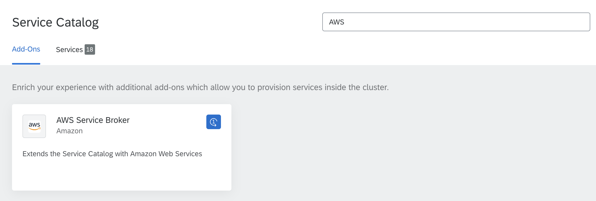
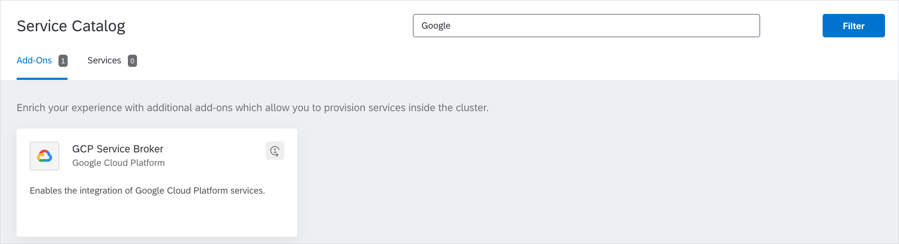

## What are Service Brokers

A Service Broker is a server compatible with the [Open Service Broker API](https://github.com/openservicebrokerapi/servicebroker/blob/master/spec.md) specification. Each Service Broker registered in Kyma presents the services it offers to Service Catalog and manages their lifecycle.

Service Catalog lists all services that Service Brokers offer. Use the Service Brokers to:
* Provision and deprovision an instance of a service.
* Create and delete a ServiceBinding to link a ServiceInstance to an application.

## Service Brokers in Kyma

Each of the Service Brokers available in Kyma performs these operations in a different way. See the documentation of a given Service Broker to learn how it operates. Service Catalog provided by Kyma is currently integrated with the following Service Brokers:

* [Application Broker](../../../05-technical-reference/00-architecture/ac-01-application-connector-components.md#application-broker)
* [Helm Broker](./smgt-10-hb-overview.md)

## Third-party Service Brokers

You can also use Helm Broker addons to install these third-party brokers:

  

  

  Azure Service Broker
  

  Microsoft Azure Service Broker is an open-source, [Open Service Broker](https://www.openservicebrokerapi.org/)-compatible API server that provisions managed services in the Microsoft Azure public cloud. Kyma provides Namespace-scoped Azure Service Broker. In each Namespace, you can configure Azure Service Broker against different subscriptions. Install Azure Service Broker by provisioning the **Azure Service Broker** class provided by Helm Broker.

  

  Once you provision the **Azure Service Broker** class, the Azure Service Broker classes are available in the Service Catalog view in a given Namespace.
  Azure Service Broker provides these ServiceClasses to use with Service Catalog:

  * Azure SQL Database
  * Azure Database for MySQL
  * Azure Redis Cache
  * Azure Application Insights
  * Azure CosmosDB
  * Azure Event Hubs
  * Azure IoT Hub
  * Azure Key Vault
  * Azure SQL Database
  * Azure SQL Database Failover Group
  * Azure Service Bus
  * Azure Storage
  * Azure Text Analytics

  

  

  

  AWS Service Broker
  

  AWS Service Broker is an open-source, [Open Service Broker](https://www.openservicebrokerapi.org/)-compatible API server that provisions managed services in the AWS public cloud. Kyma provides Namespace-scoped AWS Service Broker. In each Namespace, you can configure AWS Service Broker against different subscriptions. Install AWS Service Broker by provisioning the **AWS Service Broker** class provided by Helm Broker.

  

  Once you provision the **AWS Service Broker** class, the AWS Service Broker classes are available in Service Catalog view in a given Namespace.
  AWS Service Broker provides these ServiceClasses to use with Service Catalog:

  * Amazon Athena
  * Amazon EMR
  * Amazon Kinesis
  * Amazon RDS for MariaDB
  * Amazon RDS for PostgreSQL
  * Amazon Translate
  * Amazon KMS
  * Amazon Rekognition
  * Amazon SNS
  * Amazon DynamoDB
  * Amazon Redshift
  * Amazon SQS
  * Amazon Polly
  * Amazon RDS for MySQL
  * Amazon S3
  * Amazon Lex
  * Amazon Route53
  * Amazon ElasticCache
  * Amazon ElasticSearch
  * Amazon DocumentDB
  * Amazon RDS for PostgreSQL
  * Amazon RDS for Oracle
  * Amazon RDS for Mssql
  * Amazon Aurora PostgreSQL
  * Amazon Aurora MySQL

  See the [documentation for each ServiceClass](https://github.com/awslabs/aws-servicebroker/tree/v1.0.0/templates).

  >**NOTE:** Kyma uses the AWS Service Broker open-source project. To ensure the best performance and stability of the product, Kyma uses a version of AWS Service Broker that precedes the newest version released by Amazon.

  

  

  

  GCP Service Broker
  

  GCP Service Broker is an open-source, [Open Service Broker](https://www.openservicebrokerapi.org/)-compatible API server that provisions managed services in the Google Cloud Platform public cloud. Kyma provides Namespace-scoped GCP Service Broker. In each Namespace, you can configure GCP Service Broker against different subscriptions. Install GCP Service Broker by provisioning the **GCP Service Broker** class provided by Helm Broker.

  

  Once you provision the **GCP Service Broker** class, the GCP Service Broker classes are available in **Service Catalog** view in the given Namespace.
  GCP Service Broker provides these ServiceClasses to use with Service Catalog:

  * Google BigQuery
  * Google Bigtable
  * Google CloudSQL for MySQL
  * Google CloudSQL for PostgreSQL
  * Google Cloud Dataflow
  * Google Cloud Datastore
  * Google Cloud Dialogflow
  * Google Cloud Filestore
  * Google Cloud Firestore
  * Google Cloud Memorystore for Redis API
  * Google Machine Learning APIs
  * Google PubSub
  * Google Spanner
  * Stackdriver Debugger
  * Stackdriver Monitoring
  * Stackdriver Profiler
  * Stackdriver Trace
  * Google Cloud Storage

   

To get the addons that the Helm Broker provides, go to the [`addons`](https://github.com/kyma-project/addons) repository. To build your own Service Broker, follow the [Open Service Broker API specification](https://github.com/openservicebrokerapi/servicebroker/blob/master/spec.md). For details on how to [register a sample Service Broker in Service Catalog](../../../03-tutorials/00-service-management/smgt-01-hb-broker-registration.md), go to the **Tutorials** section.

>**NOTE:** The Service Catalog has the Istio sidecar injected. To enable the communication between the Service Catalog and Service Brokers, either inject Istio sidecar into all brokers or disable mutual TLS authentication.
