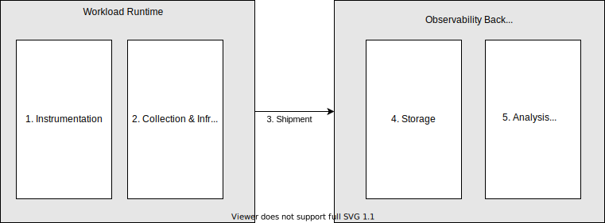
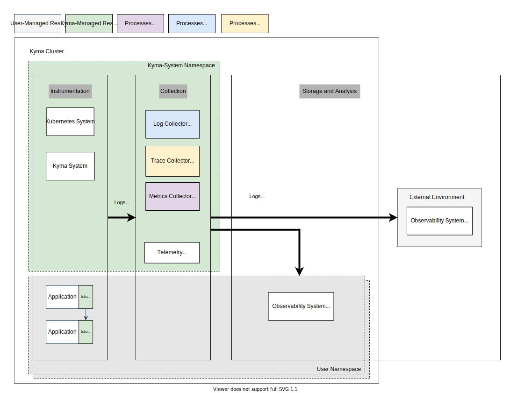

Fundamentally, ["Observability"](https://opentelemetry.io/docs/concepts/observability-primer/) is a measure of how well the application's external outputs can reflect the internal states of single components. The insights that an application and the surrounding infrastructure expose are displayed in the form of metrics, traces, and logs - collectively, that's called "telemetry" or ["signals"](https://opentelemetry.io/docs/concepts/signals/). These can be exposed by employing modern instrumentation.

In order to implement Day-2 operations for a distributed application running in a container runtime, the single components of an application need to expose these signals by employing modern instrumentation. Furthermore, the signals need to get collected and enriched with the infrastructural metadata in order to ship them to a target system.

There are plenty of observability backends available either as a service or as a self-manageable solution focusing on different aspects and scenarios. Here, one solution will never fit all sizes, and the need to integrate with a specific solution will always be present. That's why instrumenting and shipping your telemetry data easily in a vendor-neutral way is relevant for Kyma to enable observability for your application with a low effort by integrating it into existing backends. These aspects must happen alongside your application, and managed tooling with guidance can benefit users' initial investment and maintenance effort. Also, Kyma will not focus on providing a managed in-cluster backend solution as a solution for an enterprise-grade setup will demand a central out-cluster solution.

The Telemetry module focuses exactly on these aspects (instrumentation/collection/shipment) happening in the runtime and explicitly defocuses on backends. In addition, you can check the [tutorials](telemetry-04-tutorials.md) on how to install lightweight in-cluster backends for demo or development purposes.

## Features

The Telemetry module enables your application with the telemetry support by providing the following:

- guidance for the instrumentation - based on [Open Telemetry](https://opentelemetry.io/), community samples are provided on how to instrument your code using the [Open Telemetry SDKs](https://opentelemetry.io/docs/instrumentation/) in nearly any programming language
- tooling for collection, filtering, and shipment - based on the [Open Telemetry Collector](https://opentelemetry.io/docs/collector/), you can configure basic pipelines to filter and ship telemetry data
- integration in a vendor-neutral way to a vendor-specific observability system - based on the [OpenTelemetry protocol (OTLP)](https://opentelemetry.io/docs/reference/specification/protocol/), backend systems can be integrated
- opt-out from features for advanced scenarios - at any time you can opt out per data type and execute the telemetry data collection/shipment with custom tooling
- SAP BTP as first-class integration - integration into BTP Observability services will be prioritized
- Enterprise-grade qualities - the setup is battle-tested and will satisfy typical development standards

Initially,
- metrics will not be supported; follow the related [epic](https://github.com/kyma-project/kyma/issues/13079) for tracking the progress of the minimal first version
- logs will not be based on the vendor-neutral OTLP protocol; follow this [epic](https://github.com/kyma-project/kyma/issues/16307) to understand the current progress on that
- the focus on filtering capabilities is to reduce the overall shipment bandwidth to an acceptable minimum, as telemetry data is high-volume data that is always related to a price. So filtering features focus on reducing signal data to, for example, relevant Namespaces or workloads. By default, system-related telemetry data will not be shipped. For custom scenarios, there is always the opt-out possibility.

## Scope

There will be a focus on the signals of application logs, distributed traces, and metrics only. Other kinds of signals are not considered. Also, logs like audit logs or operational logs are specifically descoped.

Supported integration scenarios are neutral to the vendor of the target system; a vendor-specific way is not planned at the moment.

## Components

### Telemetry Operator

The module ships the Telemetry Operator as its heart component. The operator implements the Kubernetes controller pattern and manages the whole lifecycle of all other components covered in the module. The operator watches for LogPipeline, TracePipeline, and, in the future, MetricPipeline resources created by the user. With these, the user describes in a declarative way what data of a signal type to collect and where to ship it.
If the operator detects a configuration, it will on demand roll out the relevant collector components.
You can find more details about the operator on the [operator](./telemetry-01-operator.md) page.

### Log Collector

The Log Collector is based on a [Fluent Bit](https://fluentbit.io/) installation running as a [DaemonSet](https://kubernetes.io/docs/concepts/workloads/controllers/daemonset/). It reads all containers' logs in the runtime and ships them according to a LogPipeline configuration. More details can be found in the detailed section about [Logs](./telemetry-02-logs.md).

### Trace Collector

The Trace Collector is based on a [OTel Collector](https://opentelemetry.io/docs/collector/) [Deployment](https://kubernetes.io/docs/concepts/workloads/controllers/deployment/). It provides an [OTLP-based](https://opentelemetry.io/docs/reference/specification/protocol/) endpoint where applications can push the trace signals. According to a TracePipeline configuration, the collector will process and ship the trace data to a target system. More details can be found in the detailed section about [Traces](./telemetry-03-traces.md).

