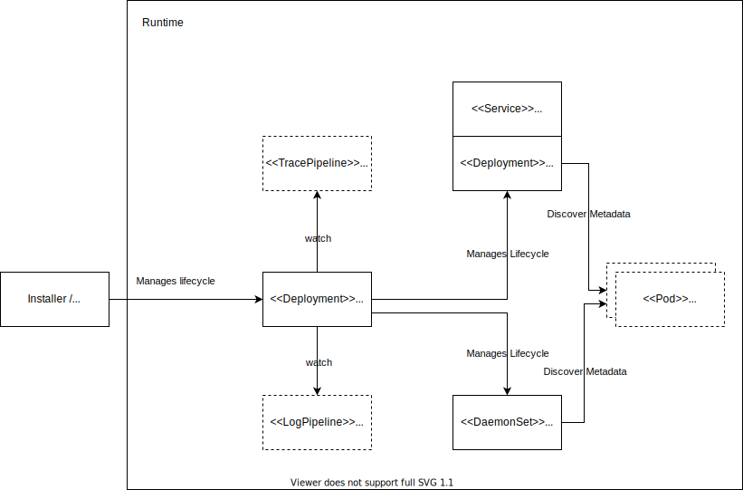

## Module lifecycle

The module on its own ships a single component only, namely the Telemetry Operator. The operator implements the Kubernetes controller pattern and manages the whole lifecycle of all other components relevant to this module. The operator watches for the Kubernetes LogPipeline, TracePipeline, and, in the future, MetricPipeline resources created by the user. With these, the user describes in a declarative way what data of a signal type to collect and where to ship it.
If the operator detects a configuration, it will roll out the relevant collector components on demand.

## Configuration

At the moment, the operator has no configuration options. As part of the [modularization](https://github.com/kyma-project/kyma/issues/16301) efforts, it is planned to introduce a dedicated module resource to watch the module's status and to provide advanced configuration options for the managed components.
