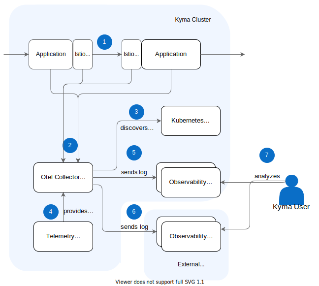
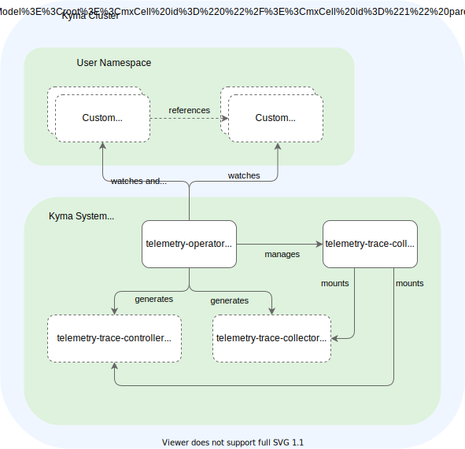

Observability tools aim to show the big picture, no matter if you're monitoring just a few or many components. In a cloud-native microservice architecture, a user request often flows through dozens of different microservices. Logging and monitoring tools help to track the request's path. However, they treat each component or microservice in isolation. This individual treatment results in operational issues.

[Distributed tracing](https://opentelemetry.io/docs/concepts/observability-primer/#understanding-distributed-tracing) charts out the transactions in cloud-native systems, helping you to understand the application behavior and relations between the frontend actions and backend implementation.

The diagram shows how distributed tracing helps to track the request path:


## Prerequisites

For a complete recording of a distributed trace, it is [essential](https://www.w3.org/TR/trace-context/#problem-statement) that every involved component is at least propagating the trace context. In Kyma, all components involved in users' requests support the [W3C Trace Context protocol](https://www.w3.org/TR/trace-context), which is a vendor-neutral protocol getting more and more supported by all kinds of vendors and tools. The involved Kyma components are mainly Istio, Serverless, and Eventing.

With that, your application must also propagate the W3C Trace Context for any user-related activity. This can be achieved easily using the [Open Telemetry SDKs](https://opentelemetry.io/docs/instrumentation/) available for all common programming languages. If an application follows that guidance and is part of the Istio Service Mesh, it's already outlined with dedicated span data in the trace data collected by the Kyma telemetry setup.

Furthermore, an application should enrich a trace with additional span data and send these data to the cluster-central telemetry services. That can also be achieved with the help of the mentioned [Open Telemetry SDKs](https://opentelemetry.io/docs/instrumentation/).

## Architecture

The telemetry module provides an in-cluster central deployment of an [OTel Collector](https://opentelemetry.io/docs/collector/). The collector exposes endpoints for the OTLP protocol for GRPC and HTTP-based communication using the dedicated `telemetry-otlp-traces` service, where all Kyma components and users' applications should send the trace data to.



1. An end-to-end request is triggered and populates across the distributed application. Every involved component is propagating the trace context using the [W3C Trace Context](https://www.w3.org/TR/trace-context/) protocol.
2. The involved components which have contributed a new span to the trace send the related span data to the trace collector using the `telemetry-otlp-traces` service. The communication happens based on the [OTLP](https://github.com/open-telemetry/opentelemetry-specification/blob/main/specification/protocol/otlp.md) protocol either using GRPC or HTTP.
1. The trace collector enriches the span data with relevant metadata, typical for sources running on Kubernetes, like Pod identifiers.
1. With the `LogPipeline` resource, the trace collector is configured with a target backend.
1. The backend can run in-cluster.
1. The backend can also run out-cluster, having a proper way of authentication in place.
1. The trace data can be consumed using the backend system.

### OTel Collector
The OTel Collector comes with a [concept](https://opentelemetry.io/docs/collector/configuration/) of pipelines consisting of receivers, processors, and exporters with which you can flexibly plug pipelines together. Kyma's TracePipeline provides a hardened setup of an OTel Collector and also abstracts the underlying pipeline concept. The benefits of having that abstraction in place are:
- Supportability - all features are tested and supported
- Migratability - smooth migration experiences when switching underlying technologies or architectures
- Native Kubernetes support - API provided by Kyma allows for an easy integration with Secrets, for example, served by the SAP BTP Operator; The Telemetry Operator takes care of the full lifecycle
- Focus - the user doesn't need to understand underlying concepts

The downside is that only a limited set of features is available. Here, you can opt out at any time by bringing your own collector setup. The current feature set focuses on providing the full configurability of backends integrated by OTLP. As a next step, meaningful filter options will be provided. Especially head and tail-based sampling configurations.

### Telemetry Operator
The TracePipeline resource is managed by the Telemetry Operator, a typical Kubernetes operator responsible for managing the custom parts of the OTel Collector configuration.



The Telemetry Operator watches all TracePipeline resources and related Secrets. Whenever the configuration changes, it validates the configuration and generates a new configuration for the OTel Collector, where a ConfigMap for the configuration is generated. Furthermore, referenced Secrets are copied into one Secret that is mounted to the Collector as well.
Furthermore, the operator manages the full lifecycle of the OTel Collector Deployment itself. With that, it only gets deployed when there is an actual TracePipeline defined. At anytime, you can opt out of using the tracing feature by not specifying a TracePipeline.

## Setting up a TracePipeline

In the following steps, you can see how to set up a typical TracePipeline. For an overview of all available attributes, see the [reference document](./../../../05-technical-reference/00-custom-resources/telemetry-03-tracepipeline.md).

### 1. Create a TracePipeline with an output
1. To ship traces to a new OTLP output, create a resource file of the TracePipeline kind:

```yaml
apiVersion: telemetry.kyma-project.io/v1alpha1
kind: TracePipeline
metadata:
  name: jaeger
spec:
  output:
    otlp:
      endpoint:
        value: http://tracing-jaeger-collector.kyma-system.svc.cluster.local:4317
```

This configures the underlying OTel Collector with a pipeline for traces. The receiver of the pipeline will be of the OTLP type and be accessible using the `telemetry-otlp-traces` service. As an exporter, an `otlp` or an `otlphttp` exporter is used, dependent on the configured protocol.

2. To create the instance, apply the resource file in your cluster:
    ```bash
    kubectl apply -f path/to/my-trace-pipeline.yaml
    ```

3. Check that the status of the TracePipeline in your cluster is `Ready`:
    ```bash
    kubectl get logpipeline
    NAME              STATUS    AGE
    http-backend      Ready     44s
    ```

### 2. Switch the protocol to HTTP

To use the HTTP protocol instead of the default GRPC, use the `protocol` attribute and ensure that the proper port is configured as part of the endpoint. Typically port `4317` is used for GRPC and port `4318` for HTTP.
```yaml
apiVersion: telemetry.kyma-project.io/v1alpha1
kind: TracePipeline
metadata:
  name: jaeger
spec:
  output:
    otlp:
      protocol: http
      endpoint:
        value: http://tracing-jaeger-collector.kyma-system.svc.cluster.local:4318
```

### Step 3: Add authentication details

To integrate with external systems, you must configure authentication details. At the moment, only Basic Authentication is supported. A more general token-based authentication will be supported [soon](https://github.com/kyma-project/kyma/issues/16258).

```yaml
apiVersion: telemetry.kyma-project.io/v1alpha1
kind: TracePipeline
metadata:
  name: jaeger
spec:
  output:
    otlp:
      endpoint:
        value: http://tracing-jaeger-collector.kyma-system.svc.cluster.local:4317
      authentication:
        basic:
          user:
            value: myUser
          password:
            value: myPwd
```

### Step 4: Add authentication details from Secrets

Integrations into external systems usually require authentication details dealing with sensitive data. To handle that data properly in Secrets, TracePipeline supports the reference of Secrets.

Use the **valueFrom** attribute to map Secret keys as in the following example:

```yaml
apiVersion: telemetry.kyma-project.io/v1alpha1
kind: TracePipeline
metadata:
  name: jaeger
spec:
  output:
    otlp:
      endpoint:
        valueFrom:
            secretKeyRef:
                name: backend
                namespace: default
                key: endpoint
      authentication:
        basic:
          user:
            valueFrom:
              secretKeyRef:
                 name: backend
                 namespace: default
                 key: user
          password:
            valueFrom:
              secretKeyRef:
                 name: backend
                 namespace: default
                 key: password
```

The related Secret must fulfill the referenced name and Namespace, and contain the mapped key as in the following example:

```yaml
kind: Secret
apiVersion: v1
metadata:
  name: backend
  namespace: default
stringData:
  endpoint: https://myhost:4317
  user: myUser
  password: XXX
```

### Step 5: Rotate the Secret

As used in the previous step, a Secret referenced with the **secretKeyRef** construct can be rotated manually or automatically. For automatic rotation, update the Secret's actual values and keep the Secret's keys stable. TracePipeline watches the referenced Secrets and detects changes, so the Secret rotation takes immediate effect. When using a Secret owned by the [SAP BTP Operator](https://github.com/SAP/sap-btp-service-operator), you can configure `credentialsRotationPolicy` with a specific `rotationFrequency` to achieve an automated rotation.

## Limitations

The trace collector setup is designed using the following assumptions:
- The collector has no autoscaling options yet and has a limited resource setup of 1 CPU and 1 GiB Memory
- Batching is enabled, and a batch will contain up to 512 Spans/batch
- An unavailability of a destination must be survived for 5 minutes without direct loss of trace data
- An average span consists of 40 attributes with 64 character length

It results in the following limitations:
### Throughput
The maximum throughput is 4200 span/sec ~= 15.000.000 spans/hour. If more data needs to be ingested, it can result in a refusal of more data.

### Unavailability of output
The destination can be unavailable for up to 5 minutes; a retry for data will be up to 5min, and then data is dropped.

### No guaranteed delivery
The used buffers are volatile, and the data can be lost on the otel-collector instance crash.

### Single TracePipeline support

Only one TracePipeline resource at a time is supported at the moment.
