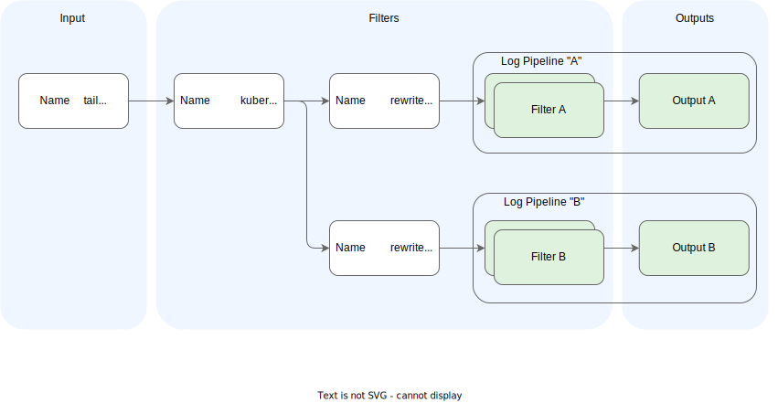
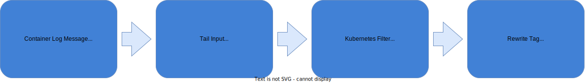

Application logs are the historical go-to signals for debugging an application and deriving the internal state of an application. They can be very useful if developers emit the logs wisely (using the right severity level and context) and are essential for observing an application. However, they usually lack contextual information, such as where they were called from.

The Telemetry component provides the [Fluent Bit](https://fluentbit.io/) log collector for the collection and shipment of application logs of any container running in the Kyma runtime. You can configure the log collector with external systems using runtime configuration with a dedicated Kubernetes API (CRD) named `LogPipeline`. With the LogPipeline's HTTP output, you can natively integrate with vendors which support this output, or with any vendor using a [Fluentd integration](https://medium.com/hepsiburadatech/fluent-logging-architecture-fluent-bit-fluentd-elasticsearch-ca4a898e28aa). The support for the aimed vendor-neutral OTLP protocol will be [added soon](https://github.com/kyma-project/kyma/issues/16307). To overcome the missing flexibility of the current proprietary protocol, you can run the collector in the [unsupported mode](#unsupported-mode), leveraging the full vendor-specific output options of Fluent Bit. You can also bring your own log collector if you need advanced configuration options.

## Prerequisites

Your application must log to `stdout` or `stderr`, which is the recommended way by Kubernetes to [emit logs](https://kubernetes.io/docs/concepts/cluster-administration/logging/). It ensures that the logs are processable by Kubernetes primitives like `kubectl logs`. Any other way of instrumentation is not supported yet. In the future, an OTLP push-based endpoint might be provided to send logs from the application to the collector/agent.

## Architecture

### Fluent Bit

The Telemetry component provides [Fluent Bit](https://fluentbit.io/) as a log collector. Fluent Bit collects all application logs of the cluster workload and ships them to a backend.


1. Container logs are stored by the Kubernetes container runtime under the `var/log` directory and its subdirectories.
2. Fluent Bit runs as a [DaemonSet](https://kubernetes.io/docs/concepts/workloads/controllers/daemonset/) (one instance per node), detects any new log files in the folder, and tails them using a filesystem buffer for reliability.
3. Fluent Bit queries the [Kubernetes API Server](https://kubernetes.io/docs/reference/command-line-tools-reference/kube-apiserver/) for additional Pod metadata, such as Pod annotations and labels.
4. The Telemetry component configures Fluent Bit with your custom output configuration.
5. If Kyma's [deprecated](https://kyma-project.io/blog/2022/11/2/loki-deprecation/) logging component is installed, the operator configures the shipment to the in-cluster Loki instance automatically.
6. As specified in your LogPipeline configuration, Fluent Bit sends the log data to observability systems outside or inside the Kyma cluster. Here, you can use the integration with HTTP to integrate a system directly or with an additional Fluentd installation.
7. The user accesses the internal and external observability system to analyze and visualize the logs.

### Pipelines

Fluent Bit comes with a pipeline concept, which supports a flexible combination of inputs with outputs and filtering in between; for details, see [Fluent Bit: Output](https://docs.fluentbit.io/manual/concepts/data-pipeline/output).
Kyma's Telemetry component brings a predefined setup of the Fluent Bit DaemonSet and a base configuration, which assures that the application logs of the workloads in the cluster are processed reliably and efficiently. Additionally, the telemetry component provides a Kubernetes API called `LogPipeline` to configure outputs with some filtering capabilities.



1. A central `tail` input plugin reads the application logs.

2. The application logs are enriched by the `kubernetes` filter. Then, for every LogPipeline definition, a `rewrite_tag` filter is generated, which uses a dedicated `tag` with the name `<logpipeline>.*`, followed by the custom configuration defined in the LogPipeline resource. You can add your own filters to the default filters.

3. Based on the default and custom filters, you get the desired output for each `LogPipeline`.

This approach assures a reliable buffer management and isolation of pipelines, while keeping flexibility on customizations.

### Telemetry Operator

The LogPipeline resource is managed by the Telemetry Operator, a typical Kubernetes operator responsible for managing the custom parts of the Fluent Bit configuration.


The Telemetry Operator watches all LogPipeline resources and related Secrets. Whenever the configuration changes, it validates the configuration (with a [validating webhook](https://kubernetes.io/docs/reference/access-authn-authz/extensible-admission-controllers/)) and generates a new configuration for the Fluent Bit DaemonSet, where several ConfigMaps for the different aspects of the configuration are generated. Furthermore, referenced Secrets are copied into one Secret that is also mounted to the DaemonSet.

## Setting up a LogPipeline

In the following steps, you can see how to set up a typical LogPipeline. For an overview of all available attributes, see the [reference document](../../05-technical-reference/00-custom-resources/telemetry-01-logpipeline.md).

### Step 1: Create a LogPipeline and output

1. To ship application logs to a new output, create a resource file of the LogPipeline kind:
    ```yaml
    kind: LogPipeline
      apiVersion: telemetry.kyma-project.io/v1alpha1
      metadata:
        name: http-backend
    spec:
      output:
        http:
          dedot: false
          port: "80"
          uri: "/"
          host:
            value: https://myhost/logs
          user:
            value: "user"
          password:
            value: "not-required"
    ```
    An output is a data destination configured by a [Fluent Bit output](https://docs.fluentbit.io/manual/pipeline/outputs) of the relevant type. The LogPipeline supports the following output types:

    - **http**, which sends the data to the specified HTTP destination. The output is designed to integrate with a [Fluentd HTTP Input](https://docs.fluentd.org/input/http), which opens up a huge ecosystem of integration possibilities.
    - **grafana-loki**, which sends the data to the Kyma-internal Loki instance.
    > **Note:** This output is considered legacy and is only provided for backward compatibility with the [deprecated](https://kyma-project.io/blog/2022/11/2/loki-deprecation/) in-cluster Loki instance. It might not be compatible with the latest Loki versions. For integration with a custom Loki installation, use the `custom` output with the name `loki` instead. See also [Installing a custom Loki stack in Kyma](https://github.com/kyma-project/examples/tree/main/loki).
    - **custom**, which supports the configuration of any destination in the Fluent Bit configuration syntax.
    > **Note:** If you use a `custom` output, you put the LogPipeline in the [unsupported mode](#unsupported-mode).

    See the following example of the `custom` output:
    ```yaml
    spec:
      output:
        custom: |
          Name               http
          Host               https://myhost/logs
          Http_User          user
          Http_Passwd        not-required
          Format             json
          Port               80
          Uri                /
          Tls                on
          tls.verify         on
    ```
   > **NOTE:** If you use a `custom` output, you put the LogPipeline in the [unsupported mode](#unsupported-mode).

2. To create the instance, apply the resource file in your cluster:
    ```bash
    kubectl apply -f path/to/my-log-pipeline.yaml
    ```

3. Check that the status of the LogPipeline in your cluster is `Ready`:
    ```bash
    kubectl get logpipeline
    NAME              STATUS    AGE
    http-backend      Ready     44s
    ```

### Step 2: Create an input

If you need selection mechanisms for application logs on the Namespace or container level, you can use an input spec to restrict or specify from which resources logs are included.
If you don't define any input, it's collected from all Namespaces, except the system Namespaces `kube-system`, `istio-system`, `kyma-system`, which are excluded by default. For example, you can define the Namespaces to include in the input collection, exclude Namespaces from the input collection, or choose that only system Namespaces are included. Learn more about the available [parameters and attributes](../../05-technical-reference/00-custom-resources/telemetry-01-logpipeline.md).

The following example collects input from all Namespaces excluding `kyma-system` and only from the `istio-proxy` containers:
```yaml
kind: LogPipeline
apiVersion: telemetry.kyma-project.io/v1alpha1
metadata:
  name: http-backend
spec:
  input:
    application:
      namespaces:
        exclude:
          - kyma-system
      containers:
        include:
          - istio-proxy
  output:
    ...
```

It might happen that Fluent Bit prints an error per processed log line, which is then collected and re-processed.
To avoid problems with such recursive logs, it is recommended that you exclude the logs of the Fluent Bit container. The following example collects input from all Namespaces including system Namespaces, but excludes the Fluent Bit container:

```yaml
spec:
  input:
    application:
      namespaces:
        system: true
      containers:
        exclude:
        - fluent-bit
```


### Step 3: Add filters

To enrich logs with attributes or drop whole lines, add filters to the existing pipeline.
The following example contains three filters, which are executed in sequence.

```yaml
kind: LogPipeline
apiVersion: telemetry.kyma-project.io/v1alpha1
metadata:
  name: http-backend
spec:
  filters:
    - custom: |
        Name    grep
        Regex   $kubernetes['labels']['app'] my-deployment
    - custom: |
        Name    grep
        Exclude $kubernetes['namespace_name'] kyma-system|kube-system|istio-system
    - custom: |
        Name    record_modifier
        Record  cluster_identifier ${KUBERNETES_SERVICE_HOST}
  input:
    ...
  output:
    ...
```
> **NOTE:** If you use a `custom` output, you put the LogPipeline in the [unsupported mode](#unsupported-mode).

 The Telemetry Operator supports different types of [Fluent Bit filter](https://docs.fluentbit.io/manual/concepts/data-pipeline/filter). The example uses the [grep](https://docs.fluentbit.io/manual/pipeline/filters/grep) and the [record_modifier](https://docs.fluentbit.io/manual/pipeline/filters/record-modifier) filter.

- The first filter keeps all log records that have the `kubernetes.labels.app` attribute set with the value `my-deployment`; all other logs are discarded. The `kubernetes` attribute is available for every log record. See [Kubernetes filter (metadata)](#kubernetes-filter-metadata) for more details.
- The second filter drops all log records fulfilling the given rule. Here, typical Namespaces are dropped based on the `kubernetes` attribute.
- A log record is modified by adding a new attribute. Here, a constant attribute is added to every log record to record the actual cluster node name at the record for later filtering in the backend system. As a value, a placeholder is used referring to a Kubernetes-specific environment variable.

### Step 4: Add authentication details from Secrets

Integrations into external systems usually need authentication details dealing with sensitive data. To handle that data properly in Secrets, the LogPipeline supports the reference of Secrets.

Using the **http** output definition and the **valueFrom** attribute, you can map Secret keys as in the following **http** output example:

```yaml
kind: LogPipeline
apiVersion: telemetry.kyma-project.io/v1alpha1
metadata:
  name: http-backend
spec:
  output:
     http:
        dedot: false
        port: "80"
        uri: "/"
        host:
           valueFrom:
              secretKeyRef:
                 name: http-backend-credentials
                 namespace: default
                 key: HTTP_ENDPOINT
        user:
           valueFrom:
              secretKeyRef:
                 name: http-backend-credentials
                 namespace: default
                 key: HTTP_USER
        password:
           valueFrom:
              secretKeyRef:
                 name: http-backend-credentials
                 namespace: default
                 key: HTTP_PASSWORD
  input:
    ...
  filters:
    ...
```


The related Secret must fulfill the referenced name and Namespace, and contain the mapped key as in the following example:

```yaml
kind: Secret
apiVersion: v1
metadata:
  name: http-backend-credentials
stringData:
  HTTP_ENDPOINT: https://myhost/logs
  HTTP_USER: myUser
  HTTP_PASSWORD: XXX
```

To leverage data provided by the Kubernetes Secrets in a `custom` output definition, use placeholder expressions for the data provided by the Secret, then specify the actual mapping to the Secret keys in the **variables** section, like in the following example:

```yaml
kind: LogPipeline
apiVersion: telemetry.kyma-project.io/v1alpha1
metadata:
  name: http-backend
spec:
  output:
    custom: |
      Name               http
      Host               ${ENDPOINT} # Defined in Secret
      HTTP_User          ${USER} # Defined in Secret
      HTTP_Password      ${PASSWORD} # Defined in Secret
      Tls                On
  variables:
    - name: ENDPOINT
      valueFrom:
        secretKeyRef:
        - name: http-backend-credentials
          namespace: default
          key: HTTP_ENDPOINT
  input:
    ...
  filters:
    ...
```
> **NOTE:** If you use a `custom` output, you put the LogPipeline in the [unsupported mode](#unsupported-mode).

### Step 5: Rotate the Secret

As used in the previous step, a Secret referenced with the **secretKeyRef** construct can be rotated manually or automatically. For automatic rotation, update the Secret's actual values and keep the Secret's keys stable. The LogPipeline watches the referenced Secrets and detects changes, so the Secret rotation takes immediate effect. When using a Secret owned by the [SAP BTP Operator](https://github.com/SAP/sap-btp-service-operator) you can configure a `credentialsRotationPolicy` with a specific `rotationFrequency` to achieve an automated rotation.

### Step 6: Add a parser

Typically, you want your logs shipped in a structured format so that a backend like [OpenSearch](https://opensearch.org/) can immediately index the content according to the log attributes. By default, a LogPipeline tries to parse all logs as a JSON document and enrich the record with the parsed attributes on the root record. Thus, logging in JSON format in the application results in structured log records. Sometimes, logging in JSON is not an option (the log configuration is not under your control), and the logs are in an unstructured or plain format. To adjust this, you can define your custom [parser](https://docs.fluentbit.io/manual/concepts/data-pipeline/parser) and activate it with a filter or a Pod annotation.

The following example defines a parser named `dummy_test` using a dedicated `LogParser` resource type:

```yaml
kind: LogParser
apiVersion: telemetry.kyma-project.io/v1alpha1
metadata:
  name: dummy_test
spec:
  parser:
    content: |
      Format regex
      Regex ^(?<INT>[^ ]+) (?<FLOAT>[^ ]+) (?<BOOL>[^ ]+) (?<STRING>.+)$
```

The parser is referenced by its name in a filter of the pipeline and is activated for all logs of the pipeline.

```yaml
kind: LogPipeline
apiVersion: telemetry.kyma-project.io/v1alpha1
metadata:
  name: http-backend
spec:
  filters:
    - custom: |
        Name parser
        Parser dummy_test
  input:
    ...
  output:
    ...
```
> **NOTE:** If you use a `custom` output, you put the LogPipeline in the [unsupported mode](#unsupported-mode).

Instead of defining a filter, you can [annotate](https://docs.fluentbit.io/manual/pipeline/filters/kubernetes#kubernetes-annotations) your workload in the following way (here, the parser is activated only for the annotated workload):

```yaml
apiVersion: v1
kind: Pod
metadata:
  name: dummy
  annotations:
    fluentbit.io/parser: dummy_test
spec:
  ...
```

## Log record processing

After a log record has been read, it is preprocessed by centrally configured plugins, like the `kubernetes` filter. Thus, when a record is ready to be processed by the sections defined in the LogPipeline definition, it has several attributes available for processing and shipment.



Learn more about these attributes in the following sections.

### Container log message

In the example, we assume there's a container `myContainer` of Pod `myPod`, running in Namespace `myNamespace`, logging to `stdout` with the following log message in the JSON format:

```json
{
  "level": "warn",
  "message": "This is the actual message",
  "tenant": "myTenant",
  "traceID": "123"
}
```

### Tail input

The central pipeline tails the log message from a log file managed by the container runtime. The file name contains the Namespace, Pod, and container information that will be available later as part of the [tag](https://docs.fluentbit.io/manual/concepts/key-concepts#tag). The resulting log record available in an internal Fluent Bit representation looks similar to the following example:

```json
{
  "time": "2022-05-23T15:04:52.193317532Z",
  "stream": "stdout",
  "_p": "F",
  "log": "{\"level\": \"warn\",\"message\": \"This is the actual message\",\"tenant\": \"myTenant\",\"traceID\": \"123\"}
}
```

The attributes in the example have the following meaning:

| Attribute | Description |
|-|-|
| time | The timestamp generated by the container runtime at the moment the log was written to the log file. |
| stream | The stream to which the application wrote the log, either `stdout` or `stderr`. |
| _p | Indicates if the log message is partial (`P`) or final (`F`). Optional, dependent on container runtime. Because a CRI multiline parser is applied for the tailing phase, all multilines on the container runtime level are aggregated already and no partial entries must be left. |
| log | The raw and unparsed log message. |

### Kubernetes filter (metadata)

In the next stage, the [Kubernetes filter](https://docs.fluentbit.io/manual/pipeline/filters/kubernetes) is applied. The container information from the log file name (available in the tag) is interpreted and used for a Kubernetes API Server request to resolve more metadata of the container. All the resolved metadata enrich the existing record as a new attribute `kubernetes`:

```json
{
  "kubernetes":
  {
      "pod_name": "myPod-74db47d99-ppnsw",
      "namespace_name": "myNamespace",
      "pod_id": "88dbd1ef-d977-4636-804d-ef220454be1c",
      "host": "myHost1",
      "container_name": "myContainer",
      "docker_id": "5649c36fcc1e956fc95e3145441f427d05d6e514fa439f4e4f1ccee80fb2c037",
      "container_hash": "myImage@sha256:1f8d852989c16345d0e81a7bb49da231ade6b99d51b95c56702d04c417549b26",
      "container_image": "myImage:myImageTag",
      "labels":
      {
          "app": "myApp",
          "sidecar.istio.io/inject"=>"true",
          ...
      }
  }
}
```

### Kubernetes filter (JSON parser)

After the enrichment of the log record with the Kubernetes-relevant metadata, the [Kubernetes filter](https://docs.fluentbit.io/manual/pipeline/filters/kubernetes) also tries to parse the record as a JSON document. If that is successful, all the parsed root attributes of the parsed document are added as new individual root attributes of the log.

The record **before** applying the JSON parser:

```json
{
  "time": "2022-05-23T15:04:52.193317532Z",
  "stream": "stdout",
  "_p": "F",
  "log": "{\"level\": \"warn\",\"message\": \"This is the actual message\",\"tenant\": \"myTenant\",\"traceID\": \"123\"}",
  "kubernetes": {...}
}
```

The record **after** applying the JSON parser:

```json
{
  "time": "2022-05-23T15:04:52.193317532Z",
  "stream": "stdout",
  "_p": "F",
  "log": "{\"level\": \"warn\",\"message\": \"This is the actual message\",\"tenant\": \"myTenant\",\"traceID\": \"123\"}",
  "kubernetes": {...},
  "level": "warn",
  "message": "This is the actual message",
  "tenant": "myTenant",
  "traceID": "123"
}
```

### Rewrite tag

As per the LogPipeline definition, a dedicated [rewrite_tag](https://docs.fluentbit.io/manual/pipeline/filters/rewrite-tag) filter is introduced. The filter brings a dedicated filesystem buffer for the outputs defined in the related pipeline, and with that, ensures a shipment of the logs isolated from outputs of other pipelines. As a consequence, each pipeline runs on its own [tag](https://docs.fluentbit.io/manual/concepts/key-concepts#tag).

## Limitations

Currently there are the following limitations for LogPipelines that are served by Fluent Bit:

### Unsupported Mode

The `unsupportedMode` attribute of a LogPipeline indicates that you are using a `custom` filter and/or `custom` output. The Kyma team does not provide support for a custom configuration.

### Fluent Bit plugins

You cannot enable the following plugins, because they potentially harm the stability:

- Multiline Filter
- Kubernetes Filter
- Rewrite_Tag Filter

### Reserved log attributes
The log attribute named `kubernetes` is a special attribute that's enriched by the `kubernetes` filter. When you use that attribute as part of your structured log payload, the metadata enriched by the filter are overwritten by the payload data. Filters that rely on the original metadata might no longer work as expected.

Furthermore, the `__kyma__` prefix is used internally by the Telemetry Operator. When you use the prefix attribute in your log data, the data might be overwritten.

### Buffer limits

Fluent Bit buffers up to 1 GB of logs if a configured output cannot receive logs. The oldest logs are dropped when the limit is reached or after 300 retries.

### Throughput

Each Fluent Bit Pod can process up to 10 MB/s of logs for a single LogPipeline. With multiple pipelines, the throughput per pipeline is reduced. The used logging backend or performance characteristics of the output plugin might limit the throughput earlier.

### Max amount of pipelines

The maximum amount of LogPipelines is 5.
