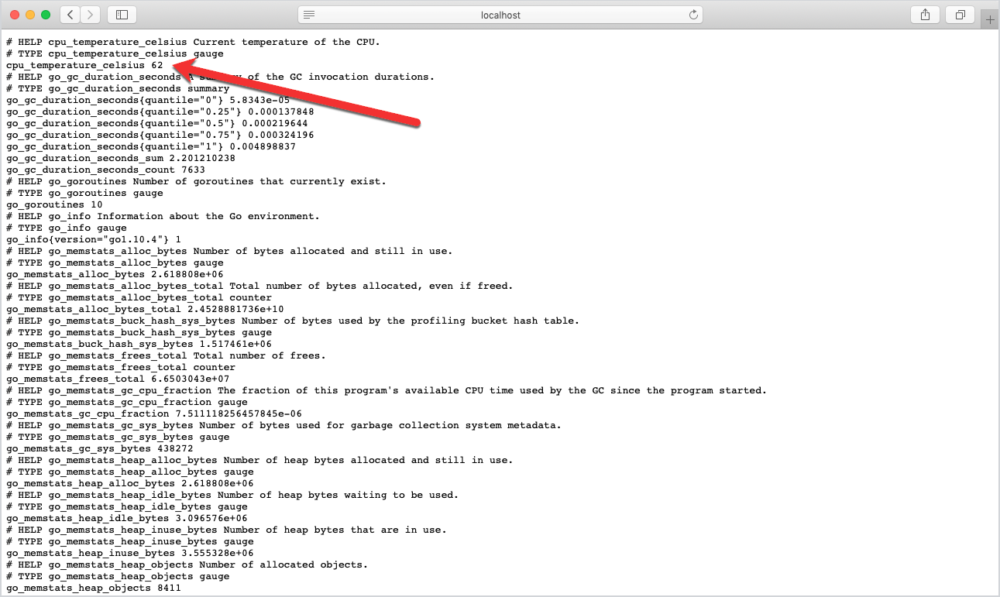
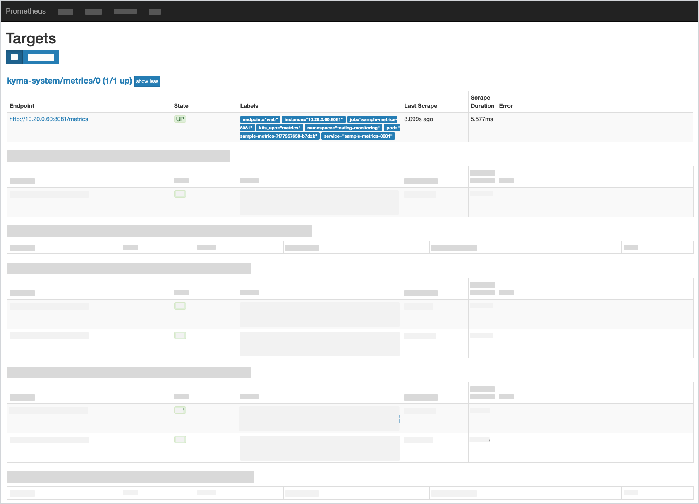
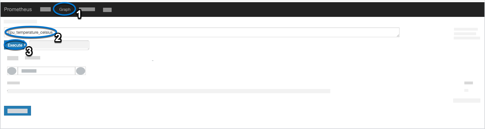

## Purpose

Learn how to list all metrics exposed by a sample Go service and watch their changing values by redirecting the metrics port and the default Prometheus server port to the localhost.

Use the [`monitoring-custom-metrics`](https://github.com/kyma-project/examples/tree/master/monitoring-custom-metrics) example and one of its services named `sample-metrics`. The service exposes its metrics on the standard `/metrics` endpoint that is available under port `8080`. You deploy the service (`deployment.yaml`) along with the Service Monitor custom resource (`service-monitor.yaml`) that instructs Prometheus to scrape metrics:

- From the service with the `app: sample-metrics` label
- From the `/metrics` endpoint
- At `10s` interval

The instructions focus on the `cpu_temperature_celsius` metric, which is one of the custom metrics exposed by the `sample-metrics` service. Using the metric logic implemented in the example, you can observe how the CPU temperature changes in the range between 60 and 90 degrees Celsius when Prometheus calls the `/metrics` endpoint.

## Prerequisites

- You have defined the kubeconfig file for your cluster as default (see [Kubernetes: Organizing Cluster Access Using kubeconfig Files](https://kubernetes.io/docs/concepts/configuration/organize-cluster-access-kubeconfig/)).

Follow this tutorial to:

- Deploy the sample service with its default configuration.
- Redirect the metrics to the localhost.
- Redirect the metrics to the Prometheus server to observe the metrics in the Prometheus UI.
- Clean up the deployed example.

## Deploy the example configuration

1. Create the `testing-monitoring` Namespace.

   ```bash
   kubectl create namespace testing-monitoring
   ```

2. Deploy the sample service in the `testing-monitoring` Namespace.

   ```bash
   kubectl create -f https://raw.githubusercontent.com/kyma-project/examples/main/monitoring-custom-metrics/deployment/deployment.yaml --namespace=testing-monitoring
   ```

3. Deploy the Service Monitor custom resource definition (CRD) in the `testing-monitoring` Namespace.

   ```bash
   kubectl apply -f https://raw.githubusercontent.com/kyma-project/examples/main/monitoring-custom-metrics/deployment/service-monitor.yaml --namespace=testing-monitoring
   ```

4. Test your deployment.

   ```bash
   kubectl get pods -n testing-monitoring
   ```

   You should get a result similar to this one:

   ```bash
   NAME                              READY   STATUS    RESTARTS   AGE
   sample-metrics-6f7c8fcf4b-mlgbx   2/2     Running   0          26m
   ```

## View metrics on a localhost

1. Run the `port-forward` command on the `sample-metrics` service for port `8080` to check the metrics.

   ```bash
   kubectl port-forward svc/sample-metrics -n testing-monitoring 8080:8080
   ```

2. Open a browser and access [`http://localhost:8080/metrics`](http://localhost:8080/metrics).

You can see the `cpu_temperature_celsius` metric and its current value of `62` on the list of all metrics exposed by the `sample-metrics` service.



Thanks to the example logic, the custom metric value changes each time you refresh the localhost address.

## View metrics on the Prometheus UI

You can also observe the `cpu_temperature_celsius` metric in the Prometheus UI and see how its value changes in the pre-defined `10s` interval in which Prometheus scrapes the metric values from the service endpoint.

Follow these steps to redirect the metrics:

1. Run the `port-forward` command on the `monitoring-prometheus` service.

   ```bash
   kubectl port-forward svc/monitoring-prometheus -n kyma-system 9090:9090
   ```

2. Access the [Prometheus UI](http://localhost:9090/targets#job-sample-metrics) to see the service endpoint and its details on the **Targets** list.

   

3. Click the **Graph** tab, search for the `cpu_temperature_celsius` metric in the **Expression** search box, and click the **Execute** button to check the last value scraped by Prometheus.

   

   The Prometheus UI shows a new value every 10 seconds upon refreshing the page.

4. If you don't want to proceed with the following tutorial, [clean up the configuration](obsv-05-clean-up-configuration.md).

## Limitations

The configured memory limits of the Prometheus and Prometheus-Istio instances limit the number of time series samples that can be ingested. The amount of generated time series in a Kyma cluster depends on the following factors:

* Number of Pods in the cluster
* Number of Nodes in the cluster
* Amount of exported (custom) metrics
* Label cardinality of metrics
* Number of buckets for histogram metrics
* Frequency of Pod recreation
* Topology of the Istio service mesh

The default resource configuration of the monitoring component in the production profile is sufficient to serve 800K time series in the Prometheus Pod, and 400K time series with a retention time of 30 days in the Prometheus-Istio Pod. The evaluation profile has lower limits. For more information about profiles, see the [Install Kyma Guide](../../04-operation-guides/operations/02-install-kyma.md#choose-resource-consumption).

You can see the number of ingested time series samples from the `prometheus_tsdb_head_series` metric, which is exported by the Prometheus itself. Furthermore, you can identify expensive metrics with the [TSDB Status](http://localhost:9090/tsdb-status) page.
