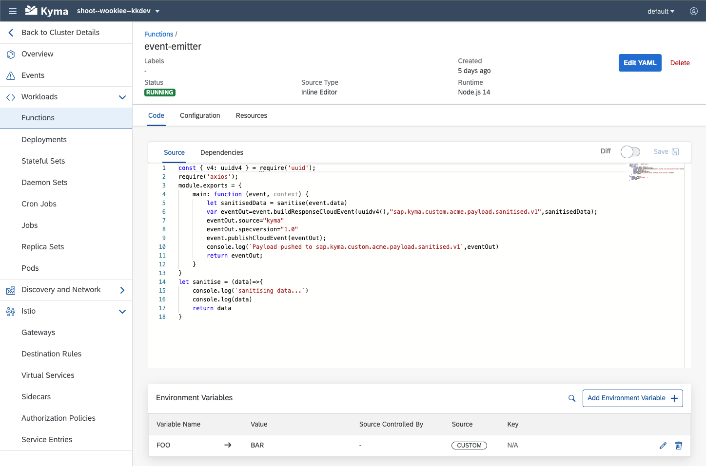
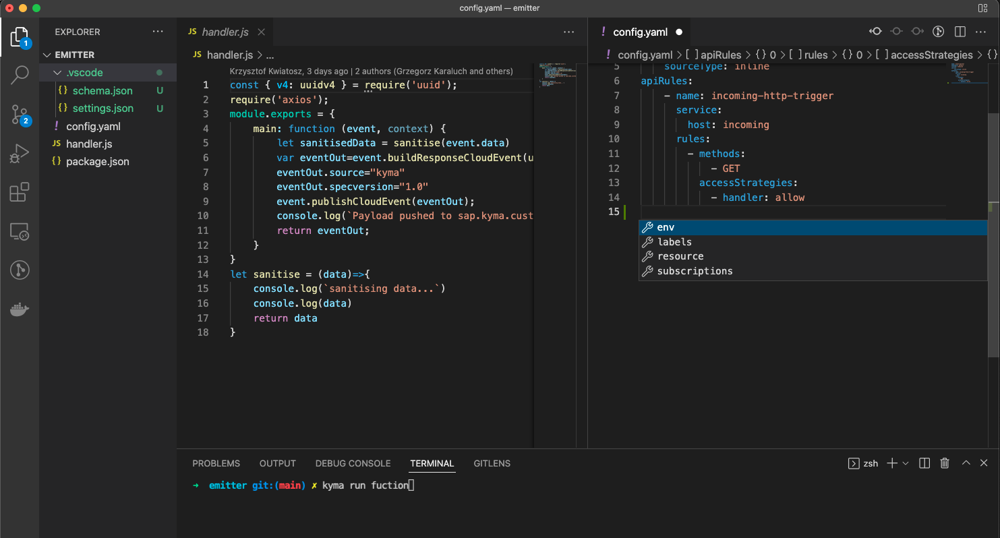

### Overview - Its all about custom resources

Kyma Serverless introduces a [Function](../../05-technical-reference/00-custom-resources/svls-01-function.md) CustomResourceDefinition (CRD) as an extension to the Kubernetes API server.
Defining a Function in Kyma essentially means creating a new instance of the Function custom resource (CR). However, the content of the Function CR specification may become quite long. It consists of the code (or git reference to the code), dependencies, runtime specification, build-time specification, etc. Additionally, there are other CRs that are relevant for a Function developer - i.e. [APIRule](../../05-technical-reference/00-custom-resources/apix-01-apirule.md) (defining how Function is exposed to the outside world), [Subscription](../../05-technical-reference/00-custom-resources/evnt-01-subscription.md) (defining which CloudEvents should trigger Function) and others.

All of that can be easily managed using the following best practices for the Function development. You will find hints that will be helpful for you at any stage of your development journey.

### Use UI to explore

At the beginning of your Kyma journey you will probably want to evaluate Serverless and draft a few Functions.
Kyma Dashboard is perfect to gain basic experience and start the journey with Kyma Functions. The Dashboard consists of UI components dedicated to Serverless. They will help you draft your first Functions by putting the code directly in the browser using a Web IDE.
Kyma Dashboard will also help you expose your Function using HTTP, define environment variables, subscribe to CloudEvents, bind ServiceInstances, and even show you the Function logs - all in one place.

Get started with [Function UI](./svls-01-create-inline-function.md)


### Use Kyma CLI for better development experience

Defining your Function from the UI is very quick and easy but it might not be enough to satisfy your needs as a developer. To code and test more complex cases, you may want to write your Function in your favorite IDE or run and debug the Function on your local machine, before actually deploying in Kyma runtime. Also, you would probably want to avoid recreating the same Functions manually from the UI on a different environment. In the end, having deployable artefacts is more desirable. This is where Kyma CLI comes in handy as it allows you to keep your Function's code and configuration in a form of a workspace. 

Initialize a scaffold for a brand new Function using the `kyma init function` command or fetch the current state of an existing Function deployed in your Kyma runtime using `kyma sync function`.
Focus on the Function code and develop it from your favorite IDE. Configure your Functions directly in the [`config.yaml` manifest file](../../05-technical-reference/svls-06-function-configuration-file.md)

> **NOTE:** Use `kyma init function --vscode` to generate json schema which can be used in VSCode for autocompletion.

Kyma CLI helps you run your code locally with a single `kyma run function` command. You can run your Function using your local Docker daemon with the same runtime Docker context, as if it was run in Kyma runtime. 

> **NOTE:** Use `kyma run function` with `--hot-deploy` and spare yourself unnecessary restarts of the Functions whenever you test a changed Function logic. Also, use [`--debug` option](./svls-05-debug-function.md) to allow connecting with your favorite debugger.



Having written and tested your Function locally, simply deploy it to the Kyma runtime with the `kyma apply function` command, used in the folder of your Function's workspace. It will read the files, translate it to the Kubernetes manifests, and deploy the Function.

### Deploy via CI/CD

Kyma UI helps you get started. Kyma CLI helps you iterate and develop Functions. 
But at the end of the day you may want an automated deployment of your application, where Functions are just part of it.
It all comes down to deployment of the Kubernetes applications on different Kyma runtimes in a GitOps fashion. For the sake of simplicity, the deployment approach for Functions should not differ from deployment of the other Kubernetes workloads, ConfigMaps or Secrets.

So in the end what you need is those yaml manifests for everything - including Functions.

Fortunately, Kyma CLI helps you generate the yaml mainfests matching your `config.yaml` file crafted before.
Use `--dry-run` option of the `kyma apply function` command to generate Kubernetes manifests that will include the Function CR itself but also all the related CRs (i.e. APIRules, Subscriptions, etc).

```bash
kyma apply function --dry-run --ci -o yaml > my-function.yaml
```  

The generated manifest should be a part of all the manifests that define your application and pushed to the git repository.
Deploy everything in a consistent way either using CI/CD or GitOps operators (e.g. [fluxcd](./svls-06-sync-function-with-gitops.md)) installed on your Kyma runtime.

> **NOTE:** Kyma Functions come in two types: `git` and `inline`. [Git type](./svls-02-create-git-function.md) allows you to configure a git repository as a source of your Function code instead of creating it `inline`.
This allows you to skip rendering of the Kubernetes manifests and deploying them each time you made a change in the Function code or dependencies. Simply push the changes to the referenced git repository and the Serverless controller will rebuild the Function that is deployed in your Kyma runtime. 
>
> Please have a look at this [example](https://github.com/kyma-project/examples/tree/main/incluster_eventing) that illustrates how you can set up your git project. Mind the `k8s resources` folder with the yaml manifests to be pushed to the Kubernetes API server (for example using kubectl in our CI/CD or GitOps) and `src` folder containing the Functions' source code. They are pulled directly by Kyma Serverless to build new Function images whenever the source content changes in the git repository.  

Browse the tutorials for Serverless to learn how to use it step-by-step in different scenarios.
