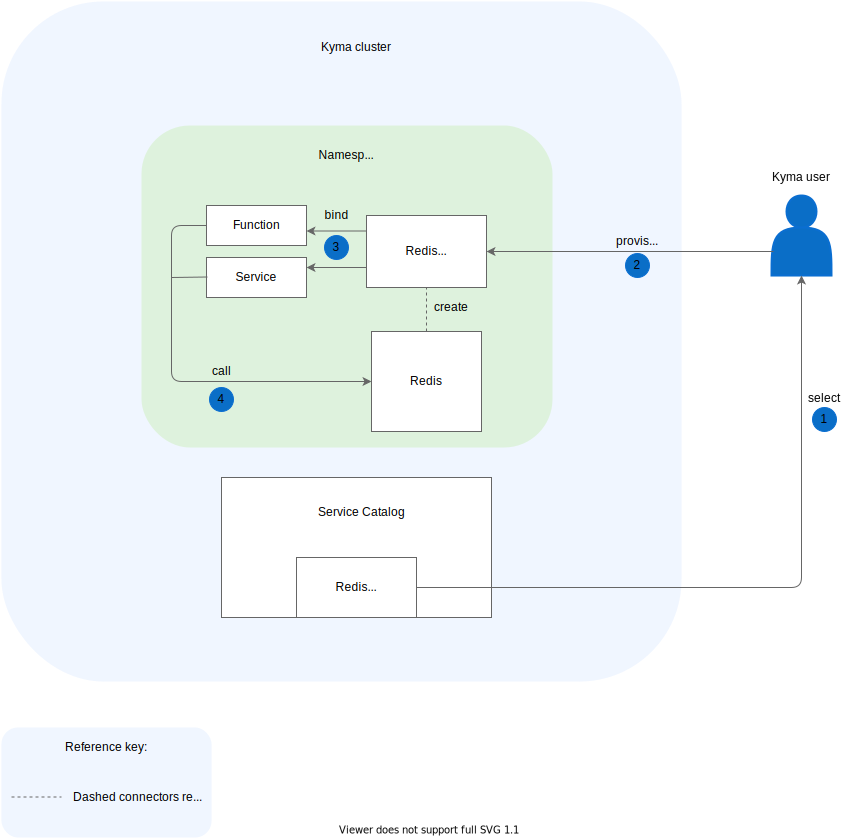

After you [register your addons in Service Catalog](./smgt-16-hb-register-addons-sc.md), you can provision and bind Service Classes that your addons provide.

1. Select a given addon Service Class from the Service Catalog.
2. Provision this Service Class by creating its ServiceInstance in a given Namespace.
3. Bind your ServiceInstance to a service or a Function.
4. The service or Function calls a given addon.

