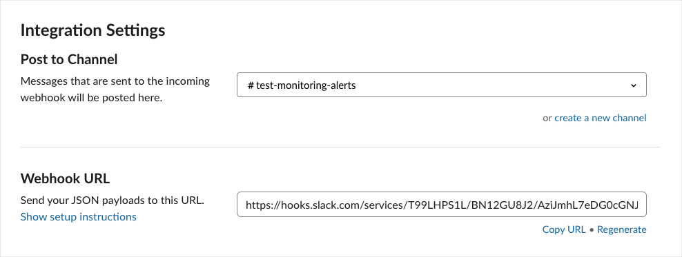
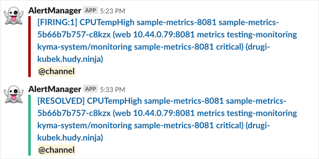

This tutorial shows you how to configure Alertmanager to send notifications. Alertmanager supports several [notification receivers](https://prometheus.io/docs/alerting/configuration/#receiver), but this tutorial only focuses on sending notifications to Slack.

## Prerequisites

This  tutorial is a follow-up of the [**Observe application metrics**](#tutorials-observe-application-metrics) and the [**Define alerting rules**](#tutorials-define-alerting-rules) tutorials that use the `monitoring-custom-metrics` example. Follow this tutorial to deploy the `sample-metrics-8081` service which exposes the `cpu_temperature_celsius` metric and creates an alert based on it. That configuration is required to complete this tutorial.

## Steps

Follow these steps to configure notifications for Slack every time Alertmanager triggers and resolves the `CPUTempHigh` alert.

1. Install the Incoming WebHooks application using Slack App Directory.

   >**NOTE**: The approval of your Slack workspace administrator may be necessary to install the application.

2. Configure the application to receive notifications coming from third-party services. Read the [instructions](https://api.slack.com/incoming-webhooks#create_a_webhook) to find out how to set up the configuration for Slack.

   The integration settings should look similar to the following:

   

3. To ..., run the following command.

   ```
   kyma deploy \
   --component monitoring \
   --value "global.alertTools.credentials.slack.channel={CHANNEL_NAME}" \
   --value "global.alertTools.credentials.slack.apiurl={WEBHOOK_URL}"
   ```
4. Verify if your Slack channel receives alert notifications about firing and resolved alerts. See the example:

   
