This tutorial shows how to create and configure a basic Grafana dashboard of a [Gauge](https://grafana.com/docs/grafana/latest/panels/visualizations/gauge-panel/#gauge-panel) type. The dashboard shows how the values of the `cpu_temperature_celsius` metric change in time, representing the current processor temperature ranging from 60 to 90 degrees Celsius. The dashboard shows explicitly when the CPU temperature exceeds the pre-defined threshold of 75 degrees Celsius.

## Prerequisites

You have performed the steps to observe application metrics using the `monitoring-custom-metrics` example and successfully deployed the `sample-metrics-8081` service which exposes the `cpu_temperature_celsius` metric.

## Steps

Follow these sections to create the Gauge dashboard type for the `cpu_temperature_celsius` metric.

### Create the dashboard

1. Navigate to Grafana. It is available under the `https://grafana.{DOMAIN}` address, where `{DOMAIN}` is the domain of your Kyma cluster, such as `https://grafana.34.63.57.190.xip.io` or `https://grafana.example.com/`. To access it from the Console UI, click **Metrics** on the left navigation menu.

   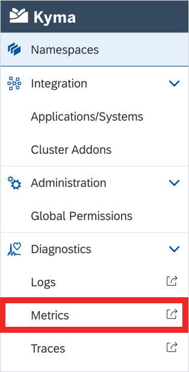

2. Click the **+** icon on the left sidebar and select **Dashboard** from the **Create** menu.

   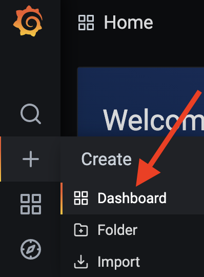

3. Select **Add new panel**.

   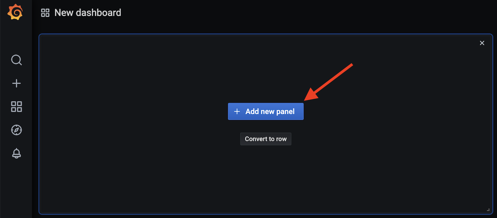

4. Select Prometheus data source from the **Queries to** drop-down list and pick the `cpu_temperature_celsius` metric.

   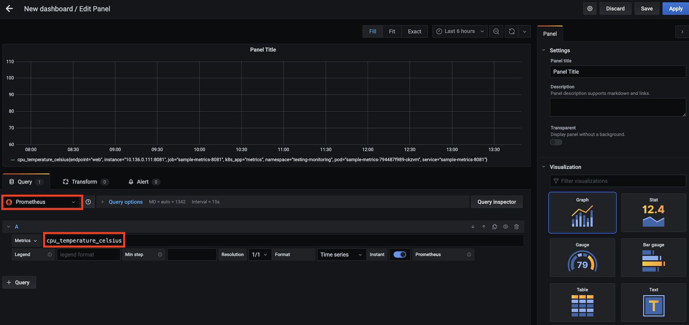

5. Toggle the **Instant** query to be able to retrieve the latest metric value on demand.

   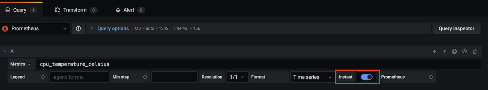

6. Switch on the right menu to the **Panel** tab and select in the **Visualization** section the **Gauge** dashboard type.

   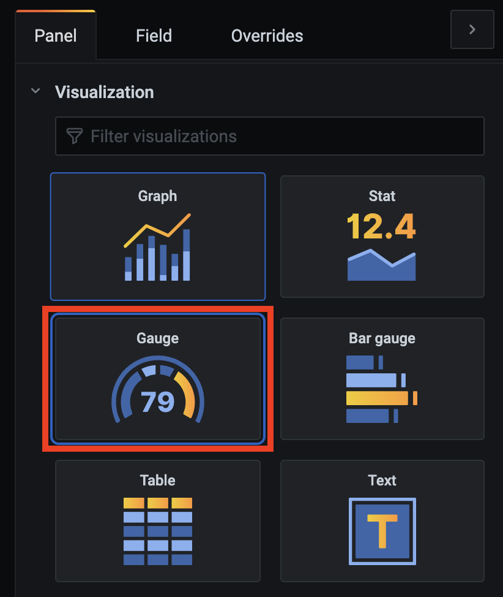

7. Click the save button in the top right corner of the page to save the changes. Provide a name for the dashboard.

   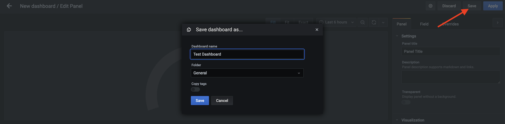

### Configure the dashboard

1. To edit the dashboard settings, go to the **Panel Title** options and select **Edit**.

   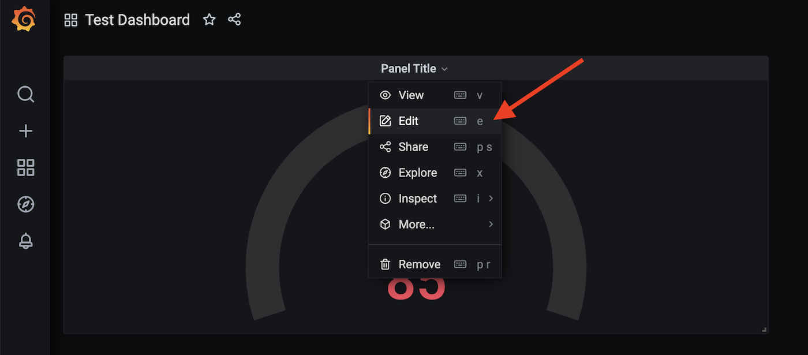

2. Back in the right menu switch to the **Field** tab and go to the **Standard options** section, set up the measuring unit to Celsius degrees to reflect the metric data type.

   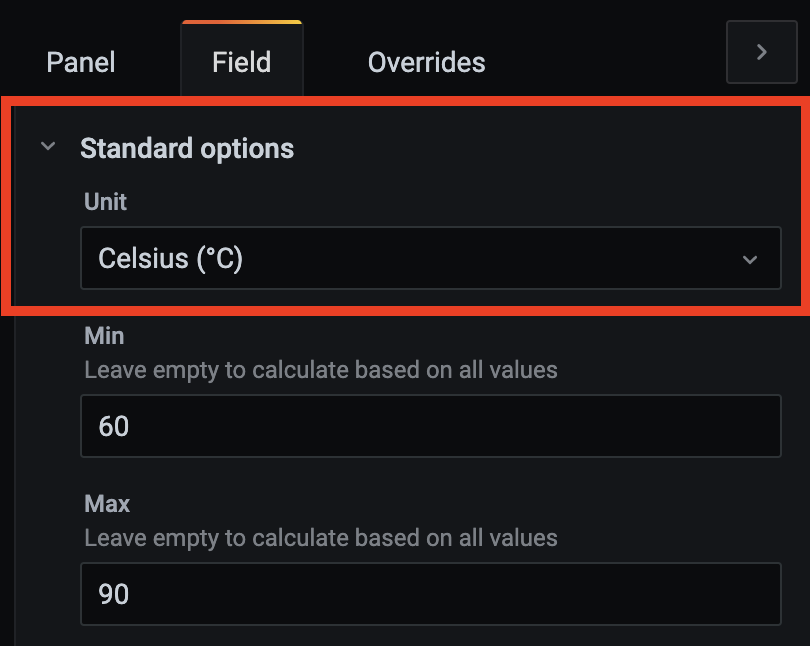

3. Set the minimum metric value to `60` and the maximum value to `90` to reflect the `cpu_temperature_celsius` metric value range.

   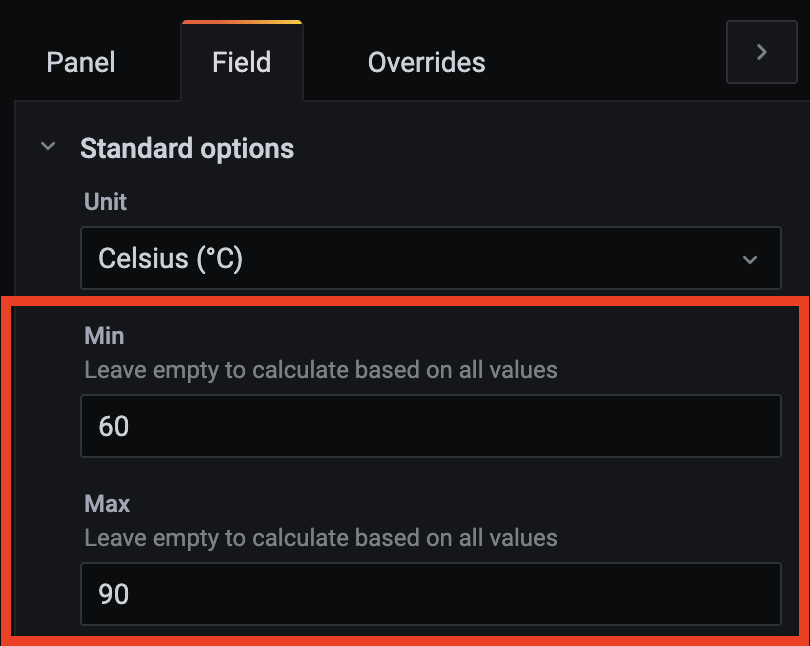

4. Set a red color threshold to `75` for the dashboard to turn red once the CPU temperature reaches and exceeds this value.

   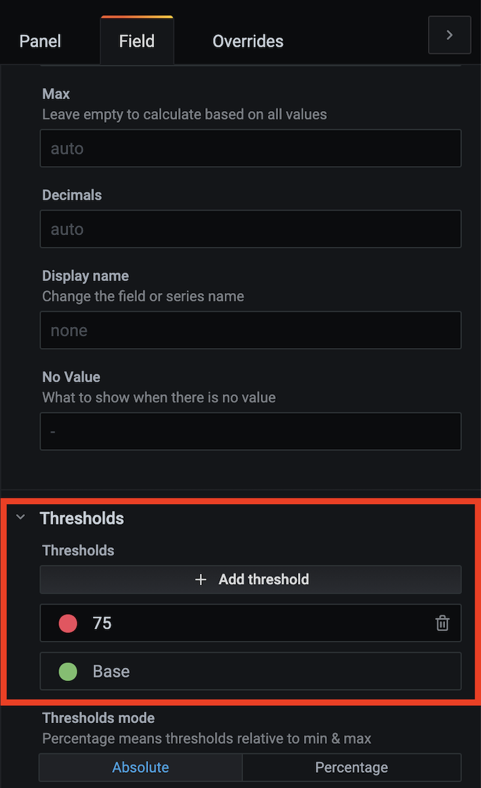

5. Go to the **Panel** tab and give a title to the dashboard.

   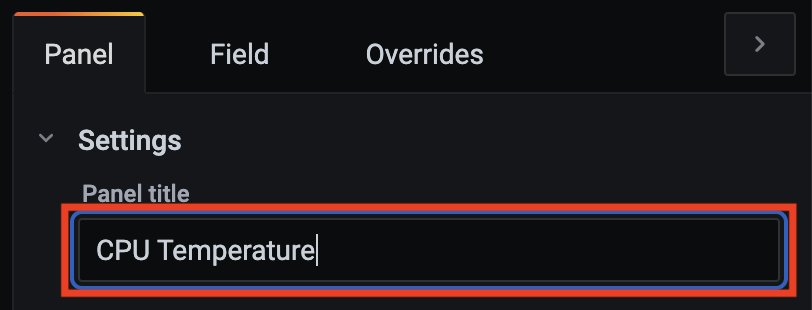

6. Enable the **Labels** option to display this range on the dashboard.

   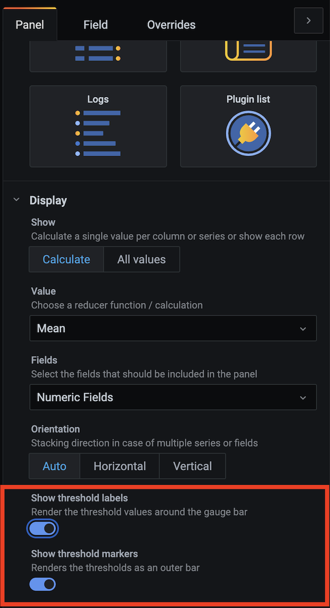

7. Click the save button in the top right corner of the page to save the changes. Add an optional note to describe the changes made.

   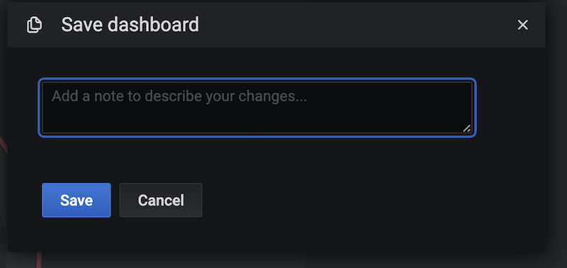

### Verify the dashboard

Refresh the browser to see how the dashboard changes according to the current value of the `cpu_temperature_celsius` metric.

- It turns green if the current metric value ranges from 60 to 74 degrees Celsius:

   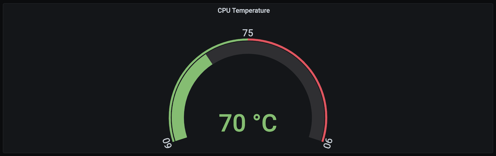

- It turns red if the current metric value ranges from 75 to 90 degrees Celsius:

   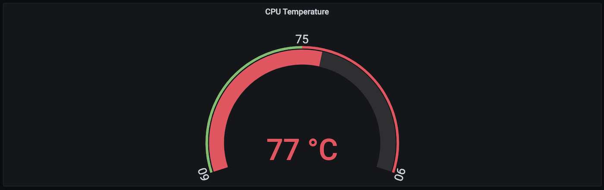

>**NOTE:** You can also define the dashboard's ConfigMap and add it to the `resources` folder under the given component's chart. To make the dashboard visible, simply use the `kubectl apply` command to deploy it. For details on adding monitoring to components, see the [`README.md`](https://github.com/kyma-project/kyma/blob/master/resources/monitoring/charts/grafana/README.md) document.

> **NOTE:** If you don't want to proceed with the following tutorial, [clean up the configuration](obsv-06-clean-up-configuration.md).
