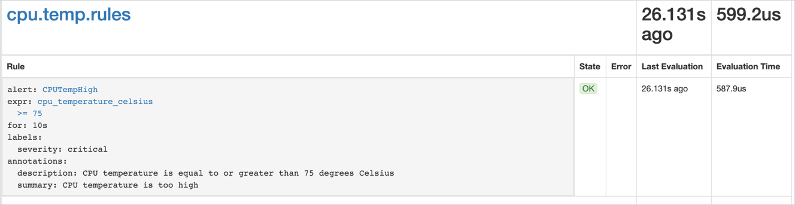

To monitor the health status of your resources, you can define alerting rules. In the following example, you write an alerting rule based on the `cpu_temperature_celsius` metric. The alert defined in the rule fires whenever the CPU temperature is equal to or greater than 75 degrees Celsius.

## Prerequisites

You have performed the steps to observe application metrics using the `monitoring-custom-metrics` example and successfully deployed the `sample-metrics-8081` service, which exposes the `cpu_temperature_celsius` metric.

## Steps

1. Create the PrometheusRule resource holding the configuration of your alerting rule.

   >**NOTE:** Prometheus requires specific labels to identify PrometheusRule definitions. Make sure you set **app** and **release** to `monitoring`.

   ```yaml
   apiVersion: monitoring.coreos.com/v1
   kind: PrometheusRule
   metadata:
     name: cpu.temp.rules
     namespace: kyma-system
     labels:
       app: monitoring
       release: monitoring
   spec:
     groups:
     - name: cpu.temp.rules
       rules:
       - alert: CPUTempHigh
         expr: cpu_temperature_celsius >= 75
         for: 10s
         labels:
           severity: critical
         annotations:
           description: "CPU temperature is equal to or greater than 75 degrees Celsius"
           summary: "CPU temperature is too high"
   ```

   Configure your alert rule with the following parameters:

   | Parameter | Description | Example value |
   |-----------|-------------|---------------|
   | **groups.name** | Specifies the name of the group listing the rules.  | `cpu.temp.rules` |
   | **rules.alert** | Specifies the name of the alert. | `CPUTempHigh`  |
   | **rules.expr** | A PromQL expression which specifies the conditions that must be met for the alarm to fire. Specify the expression using Kubernetes [Functions](https://prometheus.io/docs/prometheus/latest/querying/functions/) and [metrics](https://github.com/kubernetes/kube-state-metrics/blob/master/docs/README.md). | `cpu_temperature_celsius >= 75`  |
   | **rules.for** | Specifies the time period between encountering an active alert for the first time during rule evaluation and firing the alert.  | `10s` |
   | **rules.labels.severity** | Specifies the severity of the alert.  | `critical` |
   | **rules.annotations.description** | Provides the alert details. | `CPU temperature is equal to or greater than 75 degrees Celsius` |
   | **rules.annotations.summary** | Provides a short alert summary. | `CPU temperature is too high` |

   For more details on defining alerting rules, see the [Prometheus documentation](https://prometheus.io/docs/prometheus/latest/configuration/alerting_rules/).

2. Deploy the alerting rule:

   ```bash
   kubectl apply -f {FILE_NAME}.yaml
   ```

3. Run the `port-forward` command on the `monitoring-prometheus` service to access the Prometheus dashboard:

   ```bash
   kubectl port-forward svc/monitoring-prometheus -n kyma-system 9090:9090
   ```

4. Go to [`http://localhost:9090/rules`](http://localhost:9090/rules) to view the rule in the dashboard.

   

5. Go to [`http://localhost:9090/alerts`](http://localhost:9090/alerts) to see if the alert fires appropriately.

   

6. If you don't want to proceed with the following tutorial, [clean up the configuration](obsv-06-clean-up-configuration.md).
