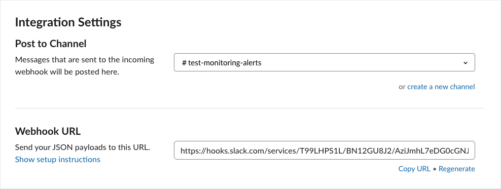
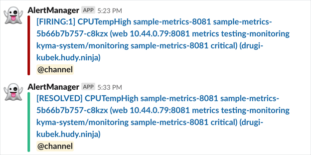

This tutorial shows you how to configure Alertmanager to send notifications. Alertmanager supports several [notification receivers](https://prometheus.io/docs/alerting/configuration/#receiver), but this tutorial only focuses on sending notifications to Slack.

## Prerequisites

-You have performed the steps to observe application metrics and define alerting rules using the `monitoring-custom-metrics` example and successfully deployed the `sample-metrics-8081` service which exposes the `cpu_temperature_celsius` metric.

## Steps

Follow these steps to configure notifications for Slack every time Alertmanager triggers and resolves the `CPUTempHigh` alert.

1. Install the Incoming WebHooks application using Slack App Directory.

   >**NOTE**: The approval of your Slack workspace administrator may be necessary to install the application.

2. Configure the application to receive notifications coming from third-party services. Read the [instructions](https://api.slack.com/incoming-webhooks#create_a_webhook) to find out how to set up the configuration for Slack.

   The integration settings should look similar to the following:

   

3. To deploy the configuration, run the following command:

   ```bash
   kyma deploy \
   --component monitoring \
   --value "global.alertTools.credentials.slack.channel={CHANNEL_NAME}" \
   --value "global.alertTools.credentials.slack.apiurl={WEBHOOK_URL}"
   ```

4. Verify if your Slack channel receives alert notifications about firing and resolved alerts. See the example:

   

5. If you don't want to proceed with the following tutorial, [clean up the configuration](obsv-06-clean-up-configuration.md).
