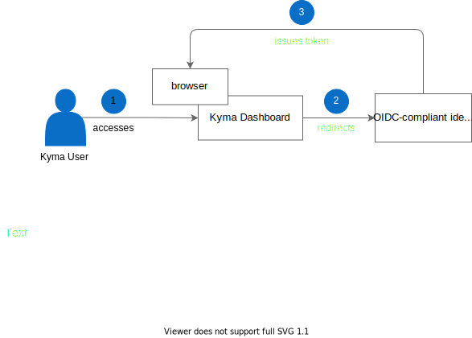

The identity federation in Kyma is managed through an [OpenID Connect (OIDC)](https://openid.net/connect/)-compliant identity provider.

The diagram shows the user authentication flow:



1. Access Kyma Dashboard.
2. Kyma Dashboard redirects you to an OIDC-compliant identity provider to handle the authentication.
3. After successful authentication, the identity provider issues a JWT token that is stored in the browser session and used for all subsequent requests.

### ID Tokens

 ID Tokens are JSON Web Tokens (JWTs) signed by an OIDC-compliant identity provider and returned as part of the OAuth2 response that attest to the end user's identity.
 An example of the decoded JWT looks as follows:

```json
{
  "iss": "https://myapp.eu.auth0.com",
  "sub": "CgcyMzQyNzQ5EgZnaXRodWI",
  "aud": "example-app",
  "exp": 1492882042,
  "iat": 1492795642,
  "at_hash": "bi96gOXZShvlWYtal9Eqiw",
  "email": "jane.doe@coreos.com",
  "email_verified": true,
  "groups": [
    "admins",
    "developers"
  ],
  "name": "Jane Doe"
}
```

## Service-to-service authentication

As Kyma is built on top of Istio Service Mesh, service-to-service authentication and encryption is enabled with [Istio MutualTLS](https://istio.io/latest/docs/concepts/security/#mutual-tls-authentication). For details, read the [Kyma-specific Istio configuration](../../01-overview/service-mesh/smsh-02-default-istio-setup-in-kyma.md#kyma-specific-configuration) documentation.

## User-to-service authentication

Kyma uses a custom [API Gateway](../../01-overview/api-exposure/apix-01-api-gateway.md) component that is built on top of [ORY Oathkeeper](https://www.ory.sh/oathkeeper/docs/). The API Gateway allows exposing user applications within the Kyma environment and secures them if necessary. You can then access the secured resources using [authentication options](../../05-technical-reference/00-architecture/apix-01-architecture-apigateway.md#request-flow).
