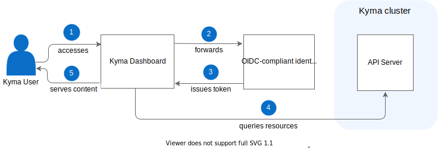

As a user, you can access Kyma using the following user interfaces:

- [Kyma Dashboard](../../01-overview/ui/ui-01-gui.md), which allows you to view, create, and manage your resources.
- [Kubernetes-native CLI (kubectl)](https://kubernetes.io/docs/reference/kubectl/overview/), which allows you to manage your resources using a command-line interface.

## Kyma Dashboard

The diagram shows the Kyma access flow using Kyma Dashboard.

>**NOTE:** Kyma Dashboard is permission-aware so it only shows elements to which you have access as a logged-in user. The access is RBAC-based.

1. Access Kyma Dashboard.
2. If Kyma Dashboard does not find a JWT token in the browser session storage, it forwards the authentication request to your Open ID Connect (OIDC)-compliant identity provider.
3. After successful authentication, the provider issues a JWT token for you. The token is stored in the browser session so it can be used for further interactions.
4. Kyma Dashboard queries the API server to retrieve all resources available in the cluster.
5. Kyma Dashboard shows the cluster content for you to interact with.

## Kubernetes-native CLI (kubectl)

To access and manage your resources, you need a `kubeconfig` file required for authentication. 
You can obtain the `kubeconfig` file directly from your Kubernetes Service Provider. It allows you to access the Kubernetes API server, usually as the admin user. Kyma does not manage this config file in any way.
