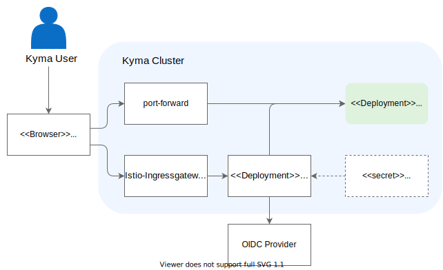

>  - To replace [deprecated](https://kyma-project.io/blog/2022/12/9/monitoring-deprecation) Prometheus and Grafana, take a look at [Install a custom kube-prometheus-stack in Kyma](https://github.com/kyma-project/examples/tree/main/prometheus).

By default, Kyma does not expose Grafana. However, you can still access them using port forwarding. If you want to expose Grafana, use an identity provider of your choice.



## Prerequisites

- You have defined the kubeconfig file for your cluster as default (see [Kubernetes: Organizing Cluster Access Using kubeconfig Files](https://kubernetes.io/docs/concepts/configuration/organize-cluster-access-kubeconfig/)).
- To expose the services securely with OAuth, you must have a registered OAuth application with one of the [supported providers](https://oauth2-proxy.github.io/oauth2-proxy/docs/configuration/oauth_provider#github-auth-provider).

## Access Grafana

### Steps

1. To forward a local port to a port on the service's Pod, run the following command:
  
    ```bash
    kubectl -n kyma-system port-forward svc/monitoring-grafana 3000:80
    ```


>**NOTE:** `kubectl port-forward` does not return. To stop port forwarding, cancel it with `Ctrl`+`C`.

2. To access the Grafana UI, open `http://localhost:3000` in your browser.

## Expose Grafana securely

Kyma manages an [OAuth2 Proxy](https://oauth2-proxy.github.io/oauth2-proxy/) instance to secure access to Grafana. To make the services accessible, configure OAuth2 Proxy by creating a Kubernetes Secret with your identity provider credentials.

### Steps

The following example shows how to use an OpenID Connect (OIDC) compliant identity provider for Grafana.

>**NOTE:** The OAuth2 Proxy supports a wide range of other well-known authentication services or OpenID Connect for custom solutions. To find instructions for other authentication services, see the [list of supported providers](https://oauth2-proxy.github.io/oauth2-proxy/docs/configuration/oauth_provider).

1. Create a new OpenID Connect application for your identity provider and set the callback URL to the `/oauth2/callback` path of your service.

   For example, if your Kyma cluster is reachable under `kyma.example.com`, use `https://grafana.kyma.example.com/oauth2/callback` for Grafana.

   > **TIP:** The subdomain is already exposed by default. Simply change the root domain to your cluster domain.

   Your identity provider will return a client ID, a client secret, and a token issuer URL.

2. Create a Secret for the OAuth2 Proxy configuration [environment variables](https://oauth2-proxy.github.io/oauth2-proxy/docs/configuration/overview/#environment-variables).

   - For an OpenID Connect compliant provider, adapt the client ID, secret and token issuer to the values that were provided while creating the application.

   - To limit access to specific user groups, configure this with the `OAUTH2_PROXY_ALLOWED_GROUPS` variable and ensure that `OAUTH2_PROXY_OIDC_GROUPS_CLAIM` points to the groups attribute name that is used by your authentication service (`groups` is the default). To get the configuration flags required for other identity provider types, see [OAuth2 Proxy docs](https://oauth2-proxy.github.io/oauth2-proxy/docs/configuration/oauth_provider/).

   - The following code works on Linux and macOS. If you are using Windows, replace the `` \ `` character by `` ` `` (PowerShell) or `` ^ `` (CMD) for multi-line commands.


      ```bash
      kubectl -n kyma-system create secret generic monitoring-auth-proxy-grafana-user \
        --from-literal="OAUTH2_PROXY_CLIENT_ID=<my-client-id>" \
        --from-literal="OAUTH2_PROXY_CLIENT_SECRET=<my-client-secret>" \
        --from-literal="OAUTH2_PROXY_OIDC_ISSUER_URL=<my-token-issuer>" \
        --from-literal="OAUTH2_PROXY_PROVIDER=oidc" \
        --from-literal="OAUTH2_PROXY_SCOPE=openid email" \
        --from-literal="OAUTH2_PROXY_ALLOWED_GROUPS=<my-groups>" \
        --from-literal="OAUTH2_PROXY_SKIP_PROVIDER_BUTTON=true"
      ```


>**NOTE:** By default, you are redirected to the documentation. To go to the service's UI instead, disable the OAuth2 Proxy provider button by setting `OAUTH2_PROXY_SKIP_PROVIDER_BUTTON=true`.

3. Restart the OAuth2 Proxy Pod:

      ```bash
      kubectl -n kyma-system rollout restart deployment monitoring-auth-proxy-grafana
      ```
