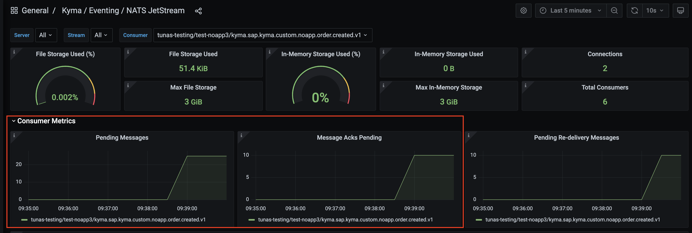

## Symptom

You publish events, but some of them are not received by the subscriber and stay pending in the stream.

## Cause

When the NATS EventingBackend has more than 1 replica, and the `Clustering` property on the NATS Server is enabled, one replica is elected as a leader on the stream and consumer levels (see [NATS Documentation](https://docs.nats.io/running-a-nats-service/configuration/clustering/jetstream_clustering)).
When the leader is elected, all the messages are replicated across the replicas.

Sometimes replicas can go out of sync with the other replicas.
As a result, messages on some consumers can stop being acknowledged and start piling up in the stream.

## Remedy

To fix the "broken" consumers with pending messages, trigger a leader reelection. You can do this either on the consumers that have pending messages, or if that fails, on the stream level.

You need the latest version of NATS CLI installed on your machine.

### Consumer leader reelection

First, find out which consumer(s) have pending messages. You can find the broken consumer either with the NATS CLI command or with a Grafana dashboard in case you had a [custom kube-prometheus-stack installed](https://github.com/kyma-project/examples/tree/main/prometheus).

#### Option 1: Find the broken consumers with NATS CLI

1. Port forward to a NATS replica:

   ```bash
   kubectl port-forward -n kyma-system eventing-nats-0 4222  

2. Run this shell script:

   ```bash
   for consumer in $(nats consumer list -n sap) # sap is the stream name
   do
     nats consumer info sap $consumer -j | jq -c '{name: .name, pending: .num_pending, leader: .cluster.leader}'
   done
   ```

   You get an output like the following:

   ```bash
   {"name":"ebcabfe5c902612f0ba3ebde7653f30b","pending":25,"leader":"eventing-nats-1"}
   {"name":"c74c20756af53b592f87edebff67bdf8","pending":0,"leader":"eventing-nats-0"}
   ```

3. Check the output to see which consumer has pending messages and which replica is the leader.
   In this example, the consumer `ebcabfe5c902612f0ba3ebde7653f30b` has 25 pending messages and has the leader.
   The other one has no pending message and is successfully processing events.

#### Option 2: Find the broken consumers using Grafana dashboard
1. [Access Grafana](https://github.com/kyma-project/examples/tree/main/prometheus#verify-the-installation).
2. Find the NATS JetStream Dashboard and check the pending messages:
   
3. Find the consumer with pending messages and encode it as an `md5` hash:

   ```bash
   echo -n "tunas-testing/test-noapp3/kyma.noapp.order.created.v1" | md5
   ```

   This shell command results in `ebcabfe5c902612f0ba3ebde7653f30b`.

4. Port forward to a NATS replica:

   ```bash
   kubectl port-forward -n kyma-system eventing-nats-0 4222  

5. Get information about the consumer:

   ```bash
   nats consumer info sap ebcabfe5c902612f0ba3ebde7653f30b
   ```

6. In the output, find the consumer's leader.
   In the following example, the leader is the `eventing-nats-1` replica:

   ```bash
   Information for Consumer sap > ebcabfe5c902612f0ba3ebde7653f30b created 2022-10-24T15:49:43+02:00
   
   Configuration:
   
                   Name: ebcabfe5c902612f0ba3ebde7653f30b
            Description: tunas-testing/test-noapp3/kyma.noapp.order.created.v1
             ...
   
   Cluster Information:
   
                   Name: eventing-nats
                 Leader: eventing-nats-1 # that's what we need
                Replica: eventing-nats-0, current, seen 0.96s ago
                Replica: eventing-nats-2, current, seen 0.96s ago
   ```

#### Trigger the consumer leader reelection

Knowing the name of the broken consumer and its leader, you can trigger the reelection:

1. Port forward the leader replica:

   ```bash
   kubectl port-forward -n kyma-system eventing-nats-1 4222  
   ```

2. Trigger the leader reelection for that broken consumer:

   ```bash
   nats consumer cluster step-down sap ebcabfe5c902612f0ba3ebde7653f30b
   ```

   After execution, you see a message like the following:

   ```yaml
   New leader elected "eventing-nats-2"
   
   Information for Consumer sap > ebcabfe5c902612f0ba3ebde7653f30b created 2022-10-24T15:49:43+02:00
   ```

3. Check the consumer and confirm that the pending messages started to be dispatched.

### Stream leader reelection

Sometimes triggering the leader reelection on the broken consumers doesn't work. In that case, you must restart the NATS Pods to trigger leader reelection on the stream level.

1. Run the NATS command:

   ```bash
   nats stream cluster step-down sap
   ```

2. Check that your result looks like the following example:

   ```bash
   11:08:22 Requesting leader step down of "eventing-nats-1" in a 3 peer RAFT group
   11:08:23 New leader elected "eventing-nats-0"
   
   Information for Stream sap created 2022-10-24 15:47:19
   
                Subjects: kyma.>
                Replicas: 3
                 Storage: File
   ```
