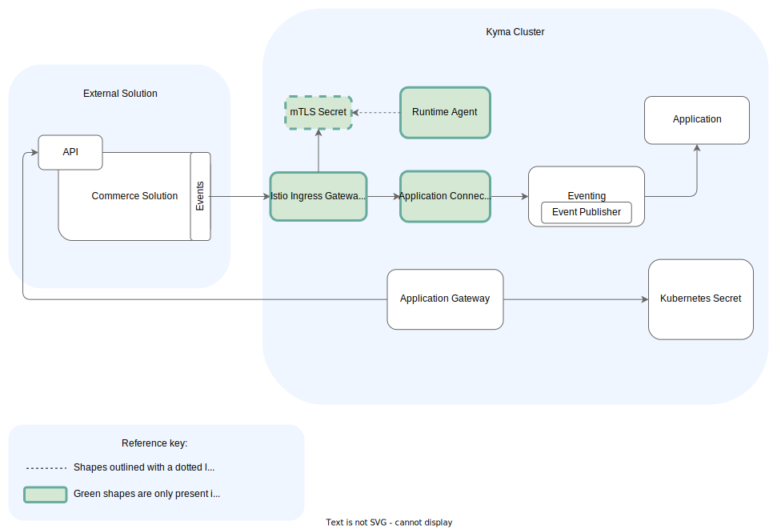

## Istio Ingress Gateway

The Istio Ingress Gateway exposes Application Connector and other Kyma components.
The DNS name of the Ingress is cluster-dependent and follows the `gateway.{cluster-dns}` format. For example, `gateway.servicemanager.cluster.kyma.cx`.
Istio Ingress Gateway secures the endpoints with certificate validation in the [Compass scenario](../../01-overview/application-connectivity/README.md). Each call must include a valid client certificate.

## Application Connectivity Validator

Application Connectivity Validator verifies the subject of the client certificate and proxies requests to Event Publisher in the [Compass scenario](../../01-overview/application-connectivity/README.md).

## Event Publisher

Event Publisher sends events to Eventing with metadata that indicates the source of the event.
This allows routing events to Functions and services based on their source Application.

## Application

An Application represents an external solution connected to Kyma. It handles the integration with other components, such as Eventing.
Using the components of Application Connector, the Application creates a coherent identity for a connected external solution and ensures its separation.
All Applications are instances of the Application custom resource, which also stores all the relevant metadata.

>**NOTE:** Every Application custom resource corresponds to a single Application to which you can connect an external solution.

## Application Gateway

Application Gateway is an intermediary component between a Function or a service and an external API.
It [proxies the requests](./ac-03-application-gateway.md) from Functions and services in Kyma to external APIs based on the configuration stored in Secrets.

Application Gateway can call services which are not secured, or are secured with:

- [Basic Authentication](https://tools.ietf.org/html/rfc7617)
- [OAuth](https://tools.ietf.org/html/rfc6750)
- [OAuth 2.0 mTLS](https://datatracker.ietf.org/doc/html/rfc8705)
- Client certificates

Additionally, Application Gateway supports cross-site request forgery (CSRF) tokens as an optional layer of API protection.

## Kubernetes Secret

The Kubernetes Secret is a Kubernetes object which stores sensitive data, such as the OAuth credentials.
