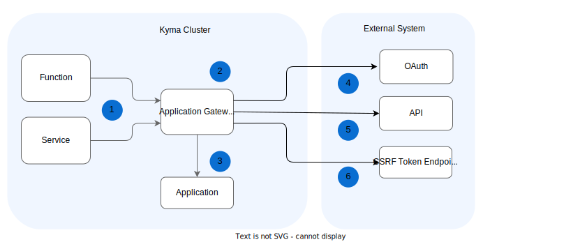

Application Gateway sends the requests from Functions and services in Kyma to external APIs.

The following diagram illustrates how Application Gateway interacts with other components and external APIs
which are either unsecured or secured with various security mechanisms and protected against cross-site request forgery (CSRF) attacks.

> **NOTE:** See how the [Gateway URL differs](../ac-01-application-gateway-details.md#application-gateway-url) for the [Standalone and Compass modes](../../01-overview/application-connectivity/README.md).

1. A Function calls Application Gateway. 
2. Application Gateway extracts the Application name and the service name from the path. Using the extracted Application name, Application Gateway finds the respective Application custom resource and obtains the information about the registered external API, such as the API URL and security credentials. 
3. Application Gateway gets a token from the OAuth server.
4. Application Gateway gets a CSRF token from the endpoint exposed by the upstream service. This step is optional and is valid only for the API which was registered with a CSRF token enabled.
5. Application Gateway calls the target API.

To learn more, read about the [Application Gateway details](../ac-01-application-gateway-details.md). 
