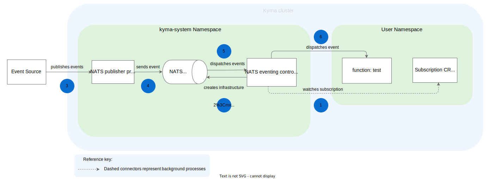

Eventing uses Event Publisher Proxy and Eventing Controller to connect to the default NATS JetStream backend. They work together to process and deliver events in Kyma.

## Event processing and delivery

The event processing and delivery flow uses the NATS server to process events and send them to subscribers.
This diagram explains the event flow in Kyma, from the moment the Application sends an event, to the point when the event triggers the Function.

1. The Eventing Controller watches the Subscription Custom Resource. It detects if there are any new incoming events.

2. The Eventing Controller creates an infrastructure for the NATS server.

3. The [Application Connector](../../01-overview/main-areas/application-connectivity/ac-01-application-connector.md) publishes events to the Event Publisher Proxy.

4. The Event Publisher Proxy sends events to the NATS server.

5. The NATS server dispatches events to the Eventing Controller.

6. The Eventing Controller dispatches events to subscribers (microservices or Functions).

## Event Publisher Proxy

Event Publisher Proxy receives legacy and Cloud Event publishing requests from the cluster workloads (microservices or Functions). It converts any legacy events to Cloud Events. Then, it redirects events to the NATS server. It also fetches a list of Subscriptions for a connected Application.

## Eventing Controller

Eventing Controller manages the internal infrastructure in order to receive an event. It watches Subscription Custom Resource Definitions. When an event is received in an Application, it lays down the Eventing infrastructure in NATS in order to trigger a Function. Eventing Controller also dispatches messages to subscribers such as a Function or another workload.

## JetStream

Kyma now supports JetStream by default, which is a persistence offering from NATS, that guarantees `at least once` delivery. It is built-in within our default NATS backend.

The key advantages of JetStream over Core NATS are:

- At least once delivery of JetStream compared to at most once delivery of NATS.
- Streaming: Streams receive and store messages that are published and subscribers can consume these messages at any time.
- Persistent stream storage: Messages are retained in the stream storage even when the NATS server is restarted.
