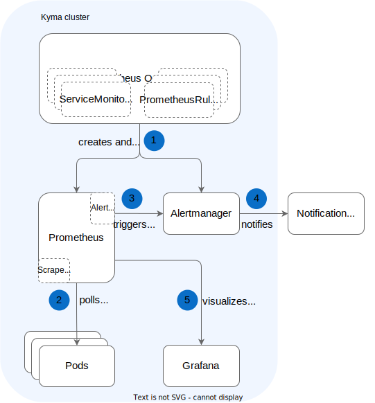
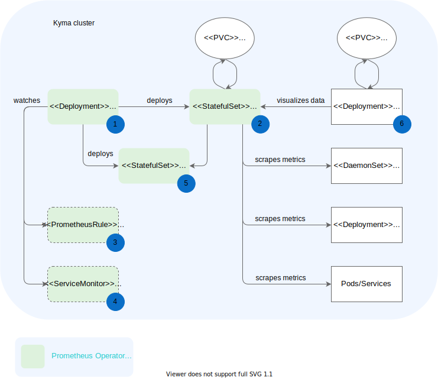
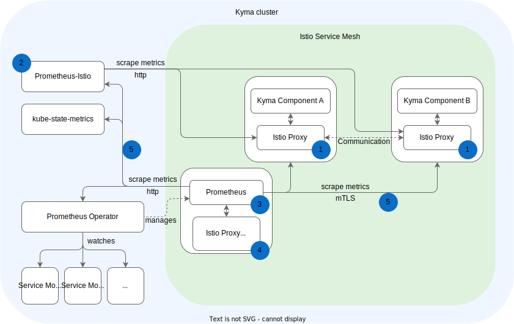
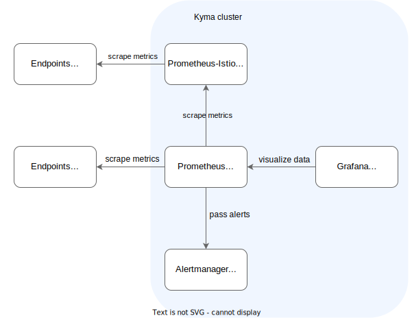

> **NOTE:** Prometheus and Grafana are [deprecated](https://github.com/kyma-project/website/blob/main/content/blog-posts/2022-12-09-monitoring-deprecation/index.md) and are planned to be removed. If you want to install a custom stack, take a look at [Install a custom kube-prometheus-stack in Kyma](https://github.com/kyma-project/examples/tree/main/prometheus).

>**NOTE:** Kyma's monitoring stack is designed to monitor all components that are deployed with Kyma. We recommend to deploy your own [kube-probetheus-stack](https://github.com/kyma-project/examples/tree/main/prometheus) if you plan to collect custom metrics.

## End-to-end monitoring flow

The monitoring flow in Kyma comes down to the following components and steps:

1. Upon Kyma installation on a cluster, **Prometheus Operator** creates a **Prometheus** and an **Alertmanager** instance with the default configuration.
2. The Prometheus server periodically polls all metrics exposed on `/metrics` endpoints of <!-- ports specified in ServiceMonitor CRDs --> Pods. Prometheus stores these metrics in a time-series database.
3. When Prometheus detects any metric values matching the logic of alerting rules, it triggers the alerts and passes them to **Alertmanager**.
4. If you have configured a notification channel, you can instantly receive detailed information on metric alerts detected by Prometheus.
5. You can visualize metrics and track their historical data on **Grafana** dashboards.

Learn how to [set up the monitoring flow](../../03-tutorials/00-observability.md).

## Monitoring components

The diagram presents monitoring components and the way they interact with one another.

1. [**Prometheus Operator**](https://github.com/coreos/prometheus-operator) creates a **Prometheus** instance, manages its deployment, and provides configuration for it. It also deploys **Alertmanager** and manages **ServiceMonitor** custom resources that specify monitoring definitions for groups of services.

2. [**Prometheus**](https://prometheus.io/docs/introduction) collects metrics from Pods.

   - Metrics specific to applications (like orders processed per second) are polled from the application pods.
   - Metrics common for all applications are scraped from specialized pods like the **node-exporter**.

Prometheus stores this polled data in a time-series database (TSDB) and runs rules over them to create aggregated metrics or generate alerts if it detects any metric anomalies.

   >**NOTE:** Besides this main Prometheus instance, there is a second Prometheus instance running in the `kyma-system` Namespace. This second instance is responsible for collecting and aggregating [Istio Service Mesh metrics](https://kyma-project.io/#/istio/user/00-overview/00-20-overview-service-mesh).

3. You can use **PrometheusRules** to define alert conditions for metrics. Kyma provides a set of out-of-the-box alerting rules. The definitions of such rules specify the alert logic, the value at which alerts are triggered, the alerts' severity, and more.

4. **ServiceMonitors** monitor services and specify the endpoints from which Prometheus polls the metrics. Even if you expose a handful of metrics in your application, Prometheus polls only those from the `/metrics` endpoints of ports specified in ServiceMonitor CRDs.

5. [**Alertmanager**](https://prometheus.io/docs/alerting/alertmanager/) receives alerts from Prometheus and forwards this data to configured notification channels like Slack or Victor Ops.

    >**NOTE:** By default, no notification channels are configured. We recommend to deploy a [custom kube-prometheus stack](https://github.com/kyma-project/examples/tree/main/prometheus) if you want to set up notification channels.

6. [**Grafana**](https://grafana.com/docs/guides/getting_started/) provides a dashboard and a graph editor to visualize metrics collected from the Prometheus API. Grafana uses the query language [PromQL](https://prometheus.io/docs/prometheus/latest/querying/basics/) to select and aggregate metrics data from the Prometheus database. Learn how to [access the Grafana UI](../../04-operation-guides/security/sec-06-access-expose-grafana.md).

## Istio monitoring architecture

The [monitoring chart](https://github.com/kyma-project/kyma/blob/main/resources/monitoring/values.yaml) is preconfigured to collect all metrics relevant for observing the in-cluster [Istio](https://istio.io/latest/docs/concepts/observability/) Service Mesh, including the proxy-level, service-level, and control-plane metrics.

The whole implementation of our monitoring solution is built around [Istio's observability best practices](https://istio.io/latest/docs/ops/best-practices/observability/).

### Default setup

1. The concept of collecting the [service-level](https://istio.io/latest/docs/concepts/observability/#service-level-metrics) metrics is based on the Istio Proxy implemented by Envoy. Istio Proxy collects all communication details inside the service mesh in a decentralized way. After getting (scraping) these high-cardinality metrics from the envoys, the metrics must be aggregated on a service level to get the final service-related details.

2. A dedicated Prometheus instance (Prometheus-Istio) scrapes and aggregates the service-level metrics. That instance is configured with the smallest possible data retention time because the raw metrics scraped from the Istio Proxies have high-cardinality and don't need to be kept further.
The Istio-Prometheus instance is a Deployment named `monitoring-prometheus-istio-server`, with a hardcoded configuration that must not be changed. It also has no PersistentVolume attached. This instance never discovers additional metric endpoints from such resources as ServiceMonitors.

3. The main Prometheus instance scrapes these aggregated Istio metrics through the `/federate` endpoint of the Prometheus-Istio instance and any other metric endpoints from such resources as ServiceMonitors.
The main Prometheus instance supports scraping metrics using [`Strict mTLS`](https://istio.io/latest/docs/tasks/security/authentication/authn-policy/#globally-enabling-istio-mutual-tls-in-strict-mode). For this to work, Prometheus is configured to scrape metrics using Istio certificates.

4. Prometheus is deployed with a sidecar proxy which rotates SDS certificates and outputs them to a volume mounted to the corresponding Prometheus container. It is configured to not intercept or redirect any traffic.

5. By default, metrics from Kyma components are scraped using mTLS. As an exception, components deployed without sidecar proxy (for example, controllers like Prometheus operator) and Istio system components (for example, the Istio sidecars proxies themselves) are scraped using HTTP. For more information, see [Istio's setup recommendation](https://istio.io/latest/docs/ops/integrations/prometheus/#tls-settings).

>**NOTE:** Learn how to [deploy a sample `Go` service exposing metrics](https://github.com/kyma-project/examples/tree/main/prometheus/monitoring-custom-metrics) which are scraped by Prometheus using mTLS.

### Istio monitoring flow

The following diagram shows how the Istio-related instance fits into the monitoring setup in Kyma:

