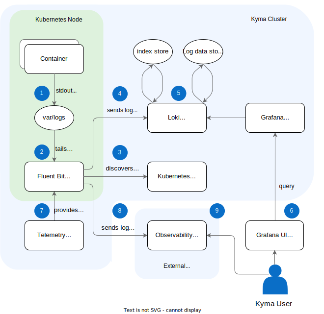

> **NOTE:** Loki is [deprecated](https://kyma-project.io/blog/2022/11/2/loki-deprecation/) and is planned to be removed. If you want to install a custom Loki stack, take a look at [Installing a custom Loki stack in Kyma](https://github.com/kyma-project/examples/tree/main/loki).

## Architecture diagram

## Process flow

1. Container logs are stored under the `var/log` directory and its subdirectories.
2. The agent detects any new log files in the folder and tails them.
3. The agent queries the [Kubernetes API Server](https://kubernetes.io/docs/reference/command-line-tools-reference/kube-apiserver/) for additional Pod metadata, such as Pod annotations and labels.
4. The agent enriches log data with labels and sends them to the Loki server.
5. The Loki server processes the log data and stores it in the log store. The data is indexed based on the passed labels
6. The user queries the logs using Grafana dashboards to analyze and visualize logs fetched and processed by Loki. Learn more about [accessing Grafana](../../04-operation-guides/security/sec-06-access-expose-grafana.md).

With the integration of Kyma's [telemetry component](./../../01-overview/telemetry/README.md), you can use additional functionality:

7. The telemetry operator provides your custom output configuration for Fluent Bit.
8. As specified in your configuration, Fluent Bit sends the log data to observability systems outside the Kyma cluster.
9. The user accesses the external observability system to analyze and vizualize the logs.
