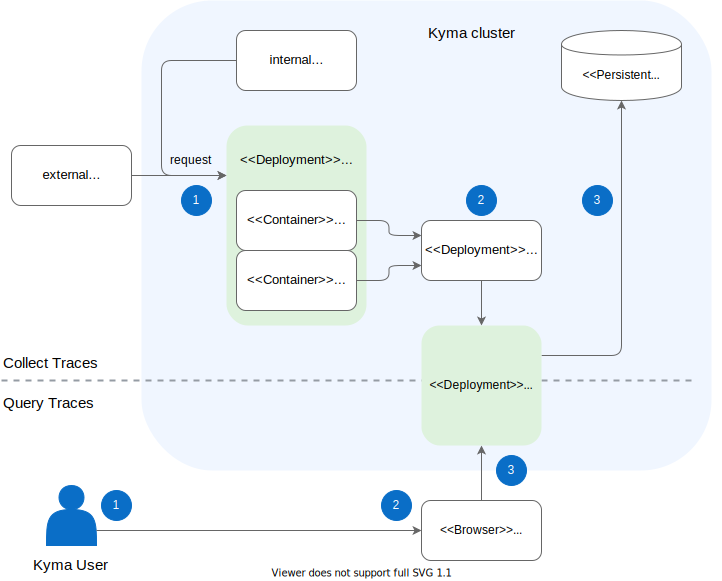

Kyma uses a Jaeger-based tracing component to collect and query traces.

Collection and query may occur at the same time. This way, you can inspect specific traces using the Jaeger UI, while Jaeger takes care of proper trace collection and storage in parallel.

## Architecture diagram

## Flow: Collect traces

The process of collecting traces by Jaeger looks as follows:

1. The application receives a request, either from an internal or external source.
2. If the application has Istio injection enabled and HTTP headers are missing, [Istio proxy](https://github.com/istio/proxy) enriches the request with the correct HTTP headers and propagates them to the Application container. Furthermore, Istio proxy sends the trace data for any intercepted request to Jaeger using the [Zipkin](https://zipkin.io/) service, which exposes a Jaeger port compatible with the Zipkin protocol.  
3. Jaeger stores the trace data on a PersistentVolume and makes the trace information available using an API and UI.

## Flow: Query traces

The process of querying traces from Jaeger looks as follows:

1. A Kyma user accesses the Jaeger UI to look for specific traces.
2. The user passes the request to the Jaeger Query service and retrieves the trace information. Learn more about [accessing Jaeger](../../04-operation-guides/security/sec-06-access-expose-grafana.md).
3. The Jaeger Deployment provides trace information.
