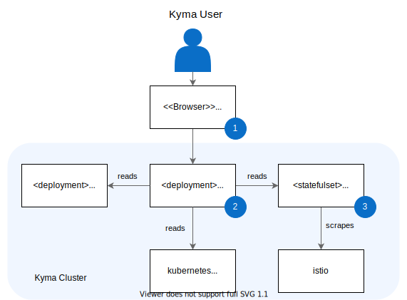

The following diagram presents the overall Kiali architecture and the way the components interact with each other.

Use the Kyma Console or direct URL to access Kiali. Learn more about [accessing Kiali](../../04-operation-guides/operations/obsv-02-access-expose-kiali-grafana.md).

Kiali collects the information on the cluster health from the following sources:

* Istio metrics scraped by Prometheus
* Kubernetes API server, which provides data on the cluster state
* Trace data collected by Jaeger
