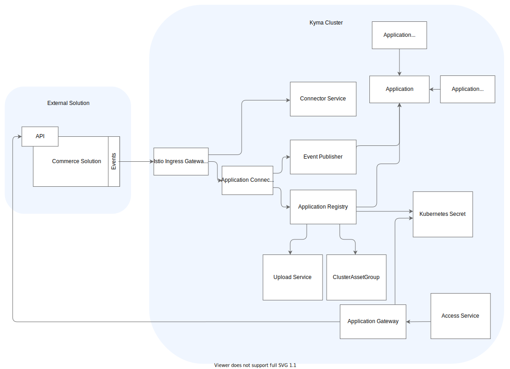

## Istio Ingress Gateway

The Istio Ingress Gateway exposes Application Connector and other Kyma components.
The DNS name of the Ingress is cluster-dependent and follows the `gateway.{cluster-dns}` format. For example, `gateway.servicemanager.cluster.kyma.cx`.
Istio Ingress Gateway secures the endpoints with certificate validation. Each call must include a valid client certificate.
You can access every exposed Application using the assigned path. For example, to reach the Gateway for the `user-custom` Application, use `gateway.servicemanager.cluster.kyma.cx/user-custom`.

## Application Connectivity Validator

Application Connectivity Validator verifies the subject of the client certificate. It is deployed per Application and it proxies requests to Application Registry and Event Publisher.

## Connector Service

>**CAUTION:** With [Compass](https://github.com/kyma-incubator/compass) being the target API for the Application Connectivity topics, this component's API has been deprecated. To learn how to install Compass and integrate with it, refer to the [Compass documentation](https://github.com/kyma-incubator/compass/blob/master/docs/compass/04-01-installation.md) or to the [Director GraphQL schema](https://github.com/kyma-incubator/compass/blob/master/components/director/pkg/graphql/schema.graphql) directly. Backward compatibility is being preserved via the introduction of [Connectivity Adapter](https://github.com/kyma-incubator/compass/tree/master/components/connectivity-adapter).

Connector Service:

- Handles the exchange of client certificates for a given Application.
- Provides the Application Registry and Event Publisher endpoints.
- Signs client certificates using the server-side certificate stored in a Kubernetes Secret.

## Application Registry

>**CAUTION:** With [Compass](https://github.com/kyma-incubator/compass) being the target API for the Application Connectivity topics, this component's API has been deprecated. To learn how to install Compass and integrate with it, refer to the [Compass documentation](https://github.com/kyma-incubator/compass/blob/master/docs/compass/04-01-installation.md) or to the [Director GraphQL schema](https://github.com/kyma-incubator/compass/blob/master/components/director/pkg/graphql/schema.graphql) directly. Backward compatibility is being preserved via the introduction of [Connectivity Adapter](https://github.com/kyma-incubator/compass/tree/master/components/connectivity-adapter).

Application Registry saves and reads the APIs and Event Catalog metadata of the connected external solution in the [Application](../../05-technical-reference/06-custom-resources/ac-01-application.md) custom resource (CR).
The system creates a new Kubernetes service for each registered API.

>**NOTE:** Using Application Registry, you can register an API along with its OAuth or Basic Authentication credentials. The credentials are stored in a Kubernetes Secret.

## Event Publisher

Event Publisher sends events to Eventing with metadata that indicates the source of the event.
This allows routing events to Functions and services based on their source Application.

## Application

An Application represents an external solution connected to Kyma. It handles the integration with other components, such as the Service Catalog or Eventing.
Using the components of Application Connector, the Application creates a coherent identity for a connected external solution and ensures its separation.
All Applications are instances of the Application custom resource, which also stores all of the relevant metadata. You can bind an Application to many Kyma Namespaces and use the APIs and the Event Catalogs of the connected external solution within their context.

## Application Broker

Application Broker (AB) watches all [Application](../../05-technical-reference/06-custom-resources/ac-01-application.md) custom resources (CRs). These custom resources contain definitions of the external solutions’ APIs and events. The AB exposes those APIs and events definitions as ServiceClasses to the Service Catalog. Create an ApplicationMapping to be able to provision those ServiceClasses and enable them for Kyma services. This allows you to extend the functionality of existing systems.

The AB implements the [Open Service Broker API](https://www.openservicebrokerapi.org/). For more details, see the [Service Brokers documentation](../../01-overview/02-main-areas/service-management/smgt-02-brokers-overview.md).

## Application Operator

Application Operator (AO) can work in two modes. In the default legacy mode, the AO listens for creating or deleting the [Application](../06-custom-resources/ac-01-application.md) custom resources and acts accordingly, either provisioning or deprovisioning an instance of Application Gateway and Event Publisher for every custom resource. In the alternative Compass mode, it listens for an additional resource, [ServiceInstance](../../01-overview/02-main-areas/service-management/smgt-03-sc-resources.md). In this mode, it provisions an instance of Application Gateway once per Namespace. That means that there is always only one Application Gateway per Namespace, even if there are more ServiceInstances and Applications. Application Gateway gets deleted with the last ServiceInstance in that Namespace. The Compass mode is enabled by setting the **gatewayOncePerNamespace** [feature flag](https://github.com/kyma-project/kyma/blob/main/components/application-operator/README.md#usage) to true.

>**NOTE:** Every Application custom resource corresponds to a single Application to which you can connect an external solution.

## Application Gateway

Application Gateway is an intermediary component between a Function or a service and an external API. Application Gateway can work in [two modes](#application-operator), legacy (default) or Compass (required for Runtimes with the Runtime Agent connected to Compass). In the legacy mode, Application Gateway [proxies the requests](ac-03-application-gateway.md) based on the services registered with Application Registry. In the alternative Compass mode, Application Gateway [proxies the requests](../ac-02-application-gateway-details.md) from Functions and services in Kyma to external APIs based on the configuration stored in Secrets.

Application Gateway can call services which are not secured, or are secured with:

- [Basic Authentication](https://tools.ietf.org/html/rfc7617)
- OAuth
- Client certificates

Additionally, Application Gateway supports cross-site request forgery (CSRF) tokens as an optional layer of API protection.

## Access Service

The Access Service exposes Application Gateway and manages the access from the Functions and services deployed in Kyma to the external APIs over Application Gateway.

## Rafter

Rafter stores the documentation of the connected external solution's registered APIs and event catalogs.

## Kubernetes Secret

The Kubernetes Secret is a Kubernetes object which stores sensitive data, such as the OAuth credentials.