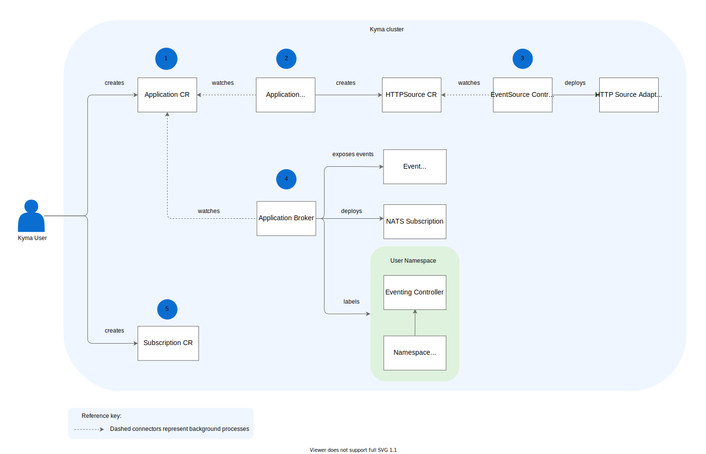

Eventing uses NATS to implement the Event Publisher Proxy and the Eventing Controller which work together to process and deliver events in Kyma. See how Eventing works inside a Kyma cluster:

1. Kyma user creates the Application custom resource (CR).
2. Application Operator watches for Application CRs and creates a HTTPSource CR.
3. EventSource Controller watches for HTTPSource CRs and deploys the HTTP Source Adapter.
4. Application Broker watches for Application CRs, exposes events, deploys NATS subscriptions, and labels secrets in the User Namespace.
5. Kyma user creates an event [Subscription CR]()../../../05-technical-reference/06-custom-resources/evnt-01-subscription.md).

## Event Publisher Proxy

The Event Publisher Proxy component receives legacy and Cloud Event publishing requests from the cluster workloads (microservices or Functions) and redirects them to the NATS server. It also fetches a list of subscriptions for a connected application.

## Eventing Controller

The Eventing Controller component manages the internal infrastructure in order to receive an event. The Controller watches Subscription Custom Resource Definitions. When an event is received in an Application, it lays down the Eventing infrastructure in NATS in order to trigger a Function. The Eventing Controller also dispatches messages to subscribers such as a Function or another workload.

## Event types

Eventing supports both Cloud Events and legacy events. Kyma converts legacy events to Cloud Events and adds the `sap.kyma.custom` prefix.

For a Subscription Custom Resource, the fully qualified event type takes the form of `sap.kyma.custom.commerce.order.created.v1`. The event type is composed of the following components:

- Prefix: `sap.kyma.custom`
- Application: `commerce`
- Event: `order.created`
- Version: `v1`
​
For publishers, the event type takes this form:
- `order.created` for legacy events coming from the `commerce` application
- `sap.kyma.custom.commerce.order.created.v1` for Cloud Events.
