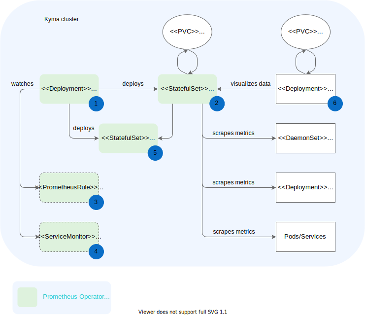

## End-to-end monitoring flow

The monitoring flow in Kyma comes down to the following components and steps:

1. Upon Kyma installation on a cluster, **Prometheus Operator** creates a **Prometheus** instance with the default configuration.
2. The Prometheus server periodically polls all metrics exposed on `/metrics` endpoints of <!-- ports specified in ServiceMonitor CRDs --> Pods. Prometheus stores these metrics in a time-series database.
3. When Prometheus detects any metric values matching the logic of alerting rules, it triggers the alerts and passes them to **Alertmanager**.
4. If you have configured a notification channel, you can instantly receive detailed information on metric alerts detected by Prometheus.
5. You can visualize metrics and track their historical data on **Grafana** dashboards.

Learn how to [set up the monitoring flow](../../../03-tutorials/observability/obsv-01-monitoring-overview.md).

## Monitoring components

The diagram presents monitoring components and the way they interact with one another.

1. [**Prometheus Operator**](https://github.com/coreos/prometheus-operator) creates a **Prometheus** instance, manages its deployment, and provides configuration for it. It also deploys **Alertmanager** and operates **ServiceMonitor** custom resources that specify monitoring definitions for groups of services.

2. [**Prometheus**](https://prometheus.io/docs/introduction) collects metrics from Pods. Metrics are the time-stamped data that provide information on the running jobs, workload, CPU consumption, memory usage, and more. To obtain such metrics, Prometheus uses the [**kube-state-metrics**](https://github.com/kubernetes/kube-state-metrics) service. It generates the metrics from Kubernetes API objects and exposes them on the `/metrics` **HTTP endpoint**.  
Pods can also contain applications with custom metrics, such as the total storage space available in the MinIO server. Prometheus stores this polled data in a time-series database (TSDB) and runs rules over them to generate alerts if it detects any metric anomalies. It also scrapes metrics provided by [**Node Exporter**](https://github.com/mindprince/nvidia_gpu_prometheus_exporter) which exposes existing hardware metrics from external systems as Prometheus metrics.

   >**NOTE:** Besides this main Prometheus instance, there is a second Prometheus instance running in the `kyma-system` Namespace. This second instance is responsible for collecting and aggregating [Istio Service Mesh metrics](../../../01-overview/02-main-areas/service-mesh/con-monitoring-istio.md).

3. **ServiceMonitors** monitor services and specify the endpoints from which Prometheus should poll the metrics. Even if you expose a handful of metrics in your application, Prometheus polls only those from the `/metrics` endpoints of ports specified in ServiceMonitor CRDs.

4. [**Alertmanager**](https://prometheus.io/docs/alerting/alertmanager/) receives alerts from Prometheus and forwards this data to configured Slack or Victor Ops channels.  You can use **PrometheusRules** to define alert conditions for metrics. Kyma provides a set of out-of-the-box alerting rules that are passed from Prometheus to Alertmanager. The definitions of such rules specify the alert logic, the value at which alerts are triggered, the alerts' severity, and more.

    >**NOTE:** By default, no notification channels are configured; you need to [set them up](../../../03-tutorials/observability/obsv-05-send-notifications.md).

5. [**Grafana**](https://grafana.com/docs/guides/getting_started/) provides a dashboard and a graph editor to visualize metrics collected from the Prometheus API. Grafana uses the query language called [PromQL](https://prometheus.io/docs/prometheus/latest/querying/basics/) to select and aggregate metrics data from the Prometheus database. Learn how to [access the Grafana UI](../../../04-operation-guides/operations/obsv-02-access-expose-kiali-grafana.md).
