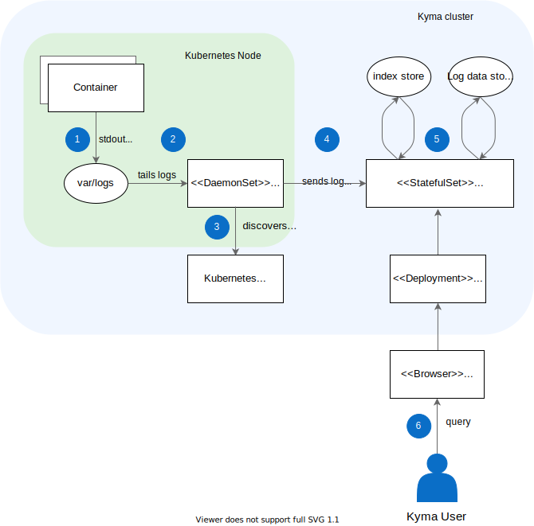

## Architecture diagram

## Process flow

1. Container logs are stored under the `var/log` directory and its subdirectories.
2. The agent detects any new log files in the folder and tails them.
3. The agent queries the [Kubernetes API Server](https://kubernetes.io/docs/reference/command-line-tools-reference/kube-apiserver/) for additional Pod metadata, such as annotations and Pod labels.
4. The agent enriches log data with Pod labels and sends them to the Loki server. To enable faster data processing, log data is organized in log chunks. A log chunk consists of metadata, such as labels, collected over a certain time period.
5. The Loki server processes the log data and stores it in the log store. The labels are stored in the index store.
6. The user queries the logs using the following tools:

    * Grafana dashboards to analyze and visualize logs fetched and processed by Loki. 
    * API clients to query log data using the [HTTP API](https://github.com/grafana/loki/blob/master/docs/sources/api/_index.md) for Loki.
    * Log UI, accessed from the Kyma Console, to display and analyze logs.

> **TIP:** Learn how to [access the logs](../../../04-operation-guides/operations/obsv-01-access-logs.md) and how to [access and expose Grafana](../../../04-operation-guides/operations/obsv-02-access-expose-kiali-grafana.md).
