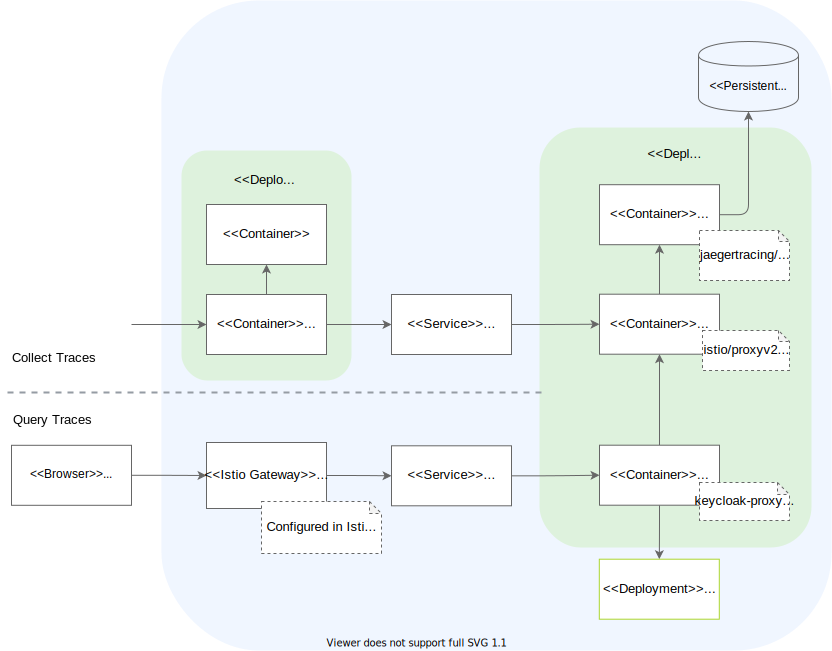

Kyma uses a Jaeger-based tracing component to collect and query traces.

Collection and query may occur at the same time. This way, you can inspect specific traces using the Jaeger UI, while Jaeger takes care of proper trace collection and storage in parallel.

## Architecture diagram

## Flow: Collect traces

The process of collecting traces by Jaeger looks as follows:

1. The application receives a request, either from an internal or external source.
2. If the application has Istio injection enabled, [Istio proxy](https://github.com/istio/proxy) enriches the request with the correct [HTTP headers](docs/05-technical-reference/other-tracing-envoy-http-headers.md) if missing and propagates them to the Application container. Furthermore Istio proxy sends the trace data for any intercepted request to Jaeger using the [Zipkin](https://zipkin.io/) service, which exposes a Jaeger port compatible with the Zipkin protocol.  
3. Jaeger stores the trace data on a PersistentVolume and makes the trace information available using an API and UI.

## Flow: Query traces

The process of querying traces from Jaeger looks as follows:

1. A Kyma user accesses the Jaeger UI to look for specific traces.
2. The user has [two options](../../04-operation-guides/operations/obsv-02-access-expose-kiali-grafana.md) to pass the request to the Jaeger Query service and retrieve the trace information:
   - If port forwarding has been set up, the user can access the Jaeger UI directly.
   - If authentication using a OIDC provider has been configured, the request goes through the [Istio Ingress Gateway](TO_DO), which forwards the incoming connections to the service. Jaeger Query passes the request to the [Keycloak Gatekeeper](https://github.com/keycloak/keycloak-gatekeeper) for authorization. The Gatekeeper calls the identity provider to authenticate the user and the request, and grants further access if the authentication is successful.
3. The Jaeger Deployment provides trace information.
