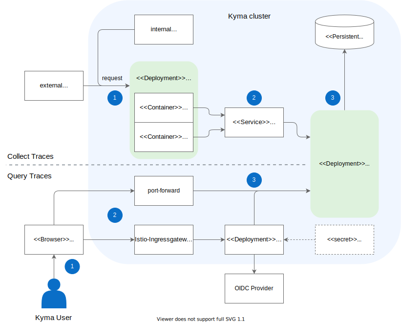

Kyma uses a Jaeger-based tracing component to collect and query traces. 

Collection and query may occur at the same time. This way, you can inspect specific traces using the Jaeger UI, while Jaeger takes care of proper trace collection and storage in parallel.

## Architecture diagram

## Flow: Collect traces

The process of collecting traces by Jaeger looks as follows:

1. The application receives a request, either from an internal or external source.
2. If the application has Istio injection enabled, [Istio proxy](https://github.com/istio/proxy) propagates the correct [HTTP headers](docs/05-technical-reference/other-tracing-envoy-http-headers.md) of the requests to the Jaeger Deployment. Istio proxy calls Jaeger using the [Zipkin](https://zipkin.io/) service which exposes a Jaeger port compatible with the Zipkin protocol.  
3. Jaeger processes the data. Specifically, the Jaeger Agent component receives the spans, batches them, and forwards to the Jaeger Collector service.
4. The BadgerDB database stores the data and persists it using a PersistentVolume resource.

## Flow: Query traces

The process of querying traces from Jaeger looks as follows:

1. A Kyma user accesses the Jaeger UI to look for specific traces.
2. Jaeger UI passes the request to the Jaeger Query service. The request goes through the [Istio Ingress Gateway](TO_DO) which forwards the incoming connections to the service.
3. Jaeger Query passes the request to the [Keycloak Gatekeeper](https://github.com/keycloak/keycloak-gatekeeper) for authorization. The Gatekeeper calls [Dex](https://github.com/dexidp/dex) to authenticate the user and the request, and grants further access if the authentication is successful.
4. Finally, the functionality provided by the Jaeger Deployment allows you to retrieve trace information.
