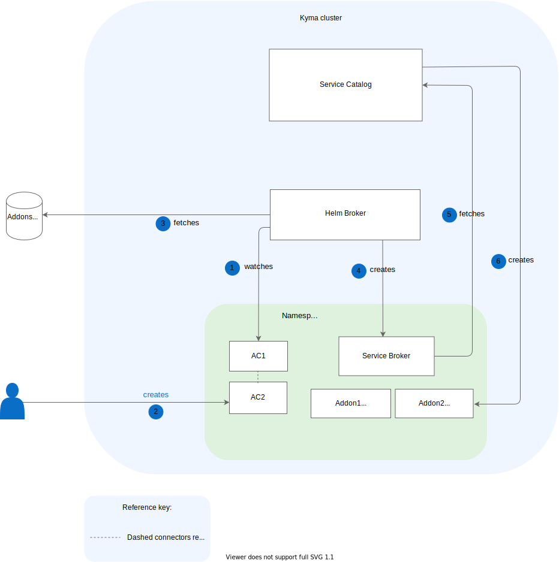

Helm Broker is installed alongside other Kyma components and it automatically registers itself in Service Catalog as a ClusterServiceBroker. The installation provides the default [helm-repos-urls](https://github.com/kyma-project/kyma/blob/main/resources/helm-broker/templates/addons-cfg.yaml) ClusterAddonsConfiguration (CAC) custom resource (CR). It contains URLs from which Helm Broker fetches addons. You can also add your own addons with URLs that point to [your addons repository](../../03-tutorials/service-management/smgt-14-hb-create-addons-repo.md).

If you want Helm Broker to act as a Namespace-scoped ServiceBroker, create the [AddonsConfiguration](../06-custom-resources/smgt-04-hb-addonsconfiguration.md) (AC) CR. In such a case, Helm Broker creates a service and registers itself in Service Catalog as a ServiceBroker inside the Namespace in which the CR is created.

Helm Broker workflow starts with the registration process, during which Helm Broker fetches addons from URLs provided in the ClusterAddonsConfiguration or AddonsConfiguration CRs and registers them as Service Classes in the Service Catalog.

## Cluster-wide addons flow

1. Helm Broker watches for ClusterAddonsConfiguration CRs in a given cluster.
2. The user creates a ClusterAddonsConfiguration CR.
3. Helm Broker fetches and parses the data of all addon repositories defined in the ClusterAddonsConfiguration CR.
4. Helm Broker creates a ClusterServiceBroker. There is always only one ClusterServiceBroker, even if there are multiple ClusterAddonsConfiguration CRs.
>**NOTE:** Helm Broker is the sole component that manages the Cluster Service Broker. The user must not create or delete this resource.
5. Service Catalog fetches services that the ClusterServiceBroker exposes.
6. Service Catalog creates a ClusterServiceClass for each service received from the ClusterServiceBroker.

## Namespace-scoped addons flow

1. Helm Broker watches for AddonsConfiguration CRs in all Namespaces.
2. The user creates an AddonsConfiguration CR in a given Namespace.
3. Helm Broker fetches and parses the data of all addon repositories defined in the AddonsConfiguration CR.
4. Helm Broker creates a Service Broker (SB) inside the Namespace in which the AddonsConfiguration CR is created. There is always a single ServiceBroker per Namespace, even if there are more AddonsConfigurations CRs.
>**NOTE:** Helm Broker is the sole component that manages the Service Broker. The user must not create or delete this resource.
5. Service Catalog fetches the services that the Service Broker exposes.
6. Service Catalog creates a ServiceClass for each service received from the Service Broker.

