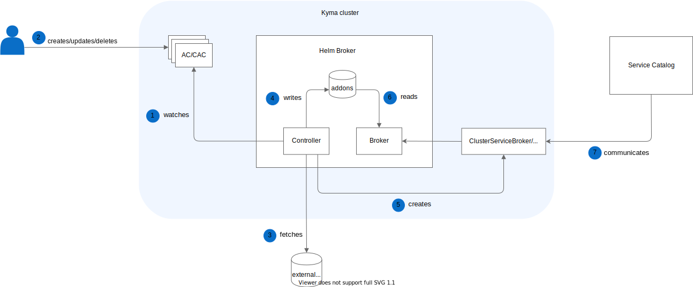

This document describes the Helm Broker workflow in details, including the logic of its inner components, namely the Controller and Broker.

1. The Controller watches for ClusterAddonsConfiguration (CAC) and AddonsConfiguration (AC) custom resources (CRs).
2. The user creates, updates, or deletes CAC or AC custom resources.
3. The Controller fetches and parses the data of all addon repositories defined under the **spec.repositories** field in a given CR. During this step the Controller:
    - Analyzes fetched addons against errors.
    - Checks for ID duplications under the **repositories** field.
    - Checks for ID conflicts with already registered addons.
4. The Controller saves the fetched addons to the storage.
5. When the first CR appears, the Controller creates a ClusterServiceBroker or a ServiceBroker, depending on the type of the CR. The ClusterServiceBroker or the ServiceBroker provides information about the Broker's endpoint, which returns the list of all available services to the Service Catalog. There is always only one ClusterServiceBroker per cluster and one ServiceBroker per Namespace, no matter the number of existing CRs. Whenever the list of offered services changes, the Controller triggers the Service Catalog to fetch a new list of services from the ClusterServiceBroker or the ServiceBroker.
6. The Broker component fetches addons from the storage and exposes them to the Service Catalog.
7. The Service Catalog calls the catalog endpoint of the ClusterServiceBroker or the ServiceBroker and creates Service Classes based on the list of registered services.

## Update CRs

There are two cases in which you might want to update your CR:
- Re-fetching addons from a remote server
- Changing repositories URLs

### Re-fetching addons

If you provided changes to your addon on a remote server but the URL did not change, you must re-fetch your changes manually. In such a case, increment the **reprocessRequest** field to explicitly request the reprocessing of already registered and processed CR.

### Changing repositories URLs

If you made any change in your addon's URLs, the update process is triggered automatically and the Controller performs its logic.

## Delete CRs

This is the logic the Controller executes after you delete a given CR:

1. If a given CR is in the **Ready** state, the Controller removes it from the storage.
2. After addons are removed from the storage, the Controller increments the **reprocessRequest** field of all failed CRs that had conflicts with the deleted CR in order to reprocess them.
3. The Controller deletes a [finalizer](https://kubernetes.io/docs/reference/using-api/api-concepts/#resource-deletion) from the given CR.
