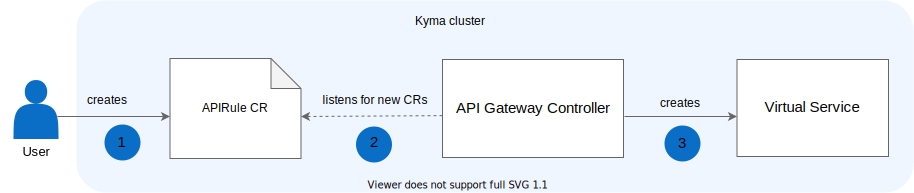

To access a Function within the cluster, use the `{function-name}.{namespace}.svc.cluster.local` endpoint, such as `test-function.default.svc.cluster.local`. To expose a Function outside the cluster, you must create an [APIRule custom resource (CR)](./05-technical-reference/06-custom-resources/apig-01-apirule.md):

1. Create the APIRule CR where you specify the Function to expose, define an Oathkeeper Access Rule to secure it, and list which HTTP request methods you want to enable for it.

2. The API Gateway Controller detects a new APIRule CR and reads its definition.

3. The API Gateway Controller creates an Istio Virtual Service and Access Rules according to details specified in the CR. Such a Function service is available under the `{host-name}.{domain}` endpoint, such as `my-function.kyma.local`.

This way you can specify multiple APIRules with different authentication methods for a single Function service.

>**TIP:** See the [tutorial](./03-tutorials/serverless/svls-03-expose-function.md) for a detailed example.

>**NOTE:** If you are using Minikube, before you can access the function you must add the endpoint to the Minikube IP entry in the `/etc/hosts` file.
