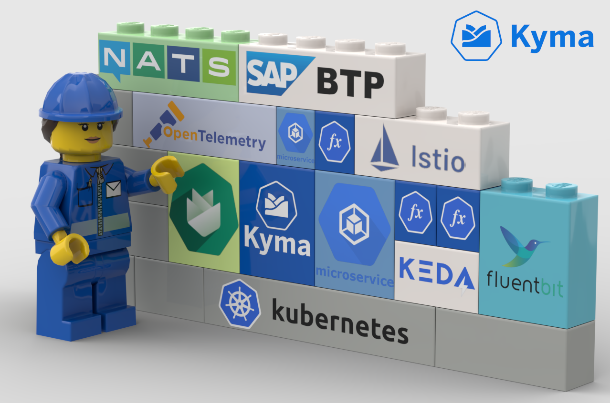

# What Is Kyma

Kyma is an opinionated set of Kubernetes-based modular building blocks, including all necessary capabilities to develop and run enterprise-grade cloud-native applications.
It is the open path to the SAP ecosystem supporting business scenarios end-to-end.

Kyma is an actively maintained open-source project supported by SAP. The Kyma project is also a foundation of SAP BTP, Kyma runtime which is a part of SAP Business Technology Platform (BTP). You can use Kyma modules in your own Kubernetes cluster, or try the managed version from SAP BTP with a ready-to-use Kubernetes cluster powered by Gardener.

# Kyma's Strengths

Kyma is built upon leading cloud-native, open-source projects and open standards, such as Istio, NATS, Cloud Events, and Open Telemetry. We created an opinionated set of modules you can easily add in your Kubernetes cluster to speed up cloud application development and operations. With Kyma, you save the time to pick the right tools and the effort to keep them secure and up to date. Also, you can use the modules you need from Kyma and complement them with other Kubernetes tools.

Kyma is a Kubernetes-based application runtime with several extensions, not a full-blown platform. The extensions make Kyma more attractive for developers who want to focus on business logic and limit investment in technical services and infrastructure. Kyma is part of SAP Business Technology Platform and offers easy integration with BTP services and other SAP systems.

Kyma has been open-source since 2018 and part of SAP BTP since 2019. We believe that openness and vendor independence is a valuable proposition. Even though Kyma is a part of the commercial product, SAP BTP, Kyma runtime, it will remain an open project. We also believe that offering an open-source project as a commercial product only benefits both parties. Open-source users get the confidence that the project won't be abandoned anytime soon, and customers see the quality and technical details of the product. Apart from that, SAP strongly supports the open-source community. For more information, visit [SAP Open Source](https://community.sap.com/topics/open-source).

# Kyma and SAP BTP, Kyma Runtime

There's a difference between the open-source Kyma project and SAP BTP, Kyma runtime. The latter one is a bundle of a Kubernetes cluster powered by Gardener and Kyma modules provided as a managed service. All the components are regularly updated, and the availability is monitored and guaranteed by Service-Level Agreement (SLA). Kyma runtime is also preconfigured to easily connect to other SAP services and systems. Using Kyma runtime, you can face some limitations in configuring Kyma components because some settings are managed centrally and overwrite user changes. But still, you get the admin access to the cluster, that is, the **cluster-admin** role. If you use Kyma open-source components, you have more control and flexibility over installation, configuration, and upgrade processes but more operations-related responsibilities.
