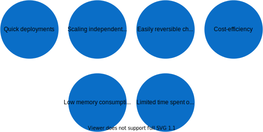

Kyma is an application runtime that provides you a flexible and easy way to connect, extend, and customize your applications in the cloud-native world of Kubernetes.

Classic Kyma offered a fixed set of preconfigured components whose development rhythm is synchronized and determined by the release schedule. With the modular approach, Kyma components become modules, each providing one functionality developed independently of the other ones. With each successive release, fewer components will be available within the preconfigured Kyma, but more and more will be offered as independent modules.

The modular approach boosts Kyma's extensibility and scalability, making it even more cost-effective. With fully modularized Kyma, you can choose from many of its modules to facilitate your business needs best.  You can enable modules on demand and configure them. By disabling the modules you don't need to use, you considerably reduce the attack surface area, as well as the upgrade time and risk.

Kyma offers various functionalities, such as:  

- Serverless development platform to run lightweight Functions in a cost-efficient and scalable way
- System connectivity that provides endpoint to register Events and APIs of external applications
- Eventing that provides messaging channel to receive events, enrich them, and trigger business flows using Functions or services
- Service Mesh for service-to-service communication and proxying
- Service management
- Secure API exposure
- In-cluster observability
- CLI supported by the intuitive UI

Kyma consists of the following main areas and components:

Go to the respective sections to learn more about specific Kyma areas and functionalities.

Kyma is built upon leading cloud-native, open-source projects, such as Istio, NATS, Serverless, and Prometheus. The features developed by Kyma are the unique “glue” that holds them together, so you can connect and extend your applications easily and intuitively. To learn how to do that, head over to the [Get Started](./02-get-started) section where you can find step-by-step instructions to get your environment up and running.

The extensions and customizations you create are decoupled from your core applications, which adds to these general advantages of using Kyma:

