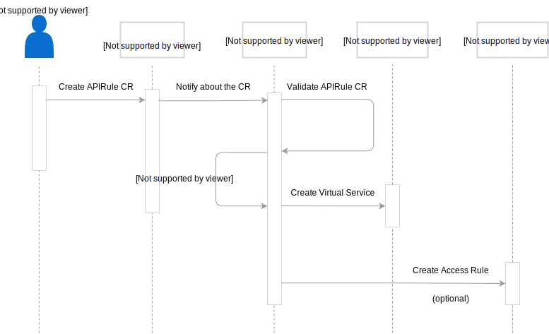

This diagram illustrates the workflow that leads to exposing a service in Kyma:



- **API Gateway Controller** is a component responsible for exposing services. The API Gateway Controller is an application deployed in the `kyma-system` Namespace, implemented according to the [Kubernetes Controller](https://book.kubebuilder.io/) principles. The API Gateway Controller listens for newly created custom resources (CR) that follow the set `apirule.gateway.kyma-project.io` CustomResourceDefinition (CRD), which describes the details of exposing services in Kyma.

- **Istio Virtual Service** specifies the services visible outside the cluster. The API Gateway Controller creates a Virtual Service for the hostname defined in the `apirule.gateway.kyma-project.io` CRD. The convention is to create a hostname using the name of the service as the subdomain, and the domain of the Kyma cluster. To learn more about the Istio Virtual Service concept, read this [Istio documentation](https://kubernetes.io/docs/concepts/services-networking/ingress/).
To get the list of Virtual Services in Kyma, run:

  ```shell
  kubectl get virtualservices.networking.istio.io --all-namespaces
  ```

- **Oathkeeper Access Rule** allows operators to specify authentication requirements for a service. It is an optional resource, created only when the CR specifies the desired authentication method, the trusted token issuer, allowed methods and paths, and required scopes. To learn more about Oathkeeper Access Rules, read [this](https://www.ory.sh/docs/oryos.10/oathkeeper/api-access-rules) document.

  To get the list of Oathkeeper Access Rules created in Kyma, run:

  ```shell
  kubectl get rules.oathkeeper.ory.sh --all-namespaces
  ```

## Request flow

This diagram illustrates the request flow for 3 cases:
  - Accessing secured resources with an OAuth2 token
  - Accessing secured resources with a JWT token
  - Accessing unsecured resources without a token


### Accessing secured resources with an OAuth2 token

The developer sends a request to access a secured resource with an OAuth2 access token issued for a registered client. The request is proxied by the Oathkeeper proxy. The proxy identifies the token as an OAuth2 access token and sends it to the registered Token Introspection endpoint in the Hydra OAuth2 server. The OAuth2 server validates the token and returns the outcome validation to Oathkeeper. If the validation is successful, Oathkeeper checks the token against the Access Rules that exist for the resource and authorizes the request. Upon successful authorization, the request is forwarded to the resource.

### Accessing secured resources with a JWT token

The developer sends a request to access a secured resource with JWT token. The request is proxied by the Oathkeeper proxy. The proxy identifies the token as a JWT token and fetches the public keys required for token validation from the registered Dex instance. Oathkeeper uses these keys to validate the token. If the validation is successful, Oathkeeper checks the token against the Access Rules that exist for the resource and authorizes the request. Upon successful authorization, the request is forwarded to the resource.

### Accessing unsecured resources without a token

The developer sends a request to access a resource without a token. The request is proxied by the Oathkeeper proxy. The proxy checks if the Access Rules created for the resource, and verifies if it can be accessed without a token. If the resource can be accessed without a token, the request is forwarded to the resource.
