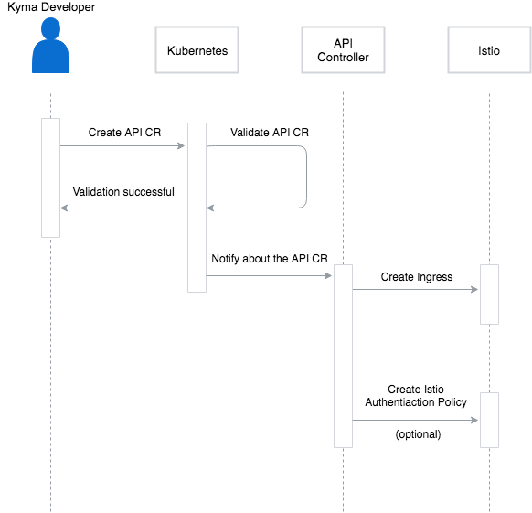

This diagram illustrates the workflow that leads to exposing a service in Kyma:



- **API-Controller** is a component responsible for exposing services. The API-Controller is an application deployed in the `kyma-system` Namespace, implemented according to the [Kubernetes Operator](https://coreos.com/blog/introducing-operators.html) principles. The API-Controller listens for newly created Custom Resources (CR) that follow the set `api.gateway.kyma.cx` Custom Resource Definition (CRD), which describes the details of exposing services in Kyma.

- **Istio Ingress** is used to specify the services that are visible outside the cluster. The API-Controller creates Istio Ingress for the hostname defined in the `api.gateway.kyma.cx` CRD. The convention is to create a hostname using the name of the service as the subdomain, and the domain of the Kyma cluster. Although you can specify any hostname, TLS termination functions only for the domain of the Kyma cluster because the API-Controller injects the TLS configuration of the cluster into the Istio Ingress. To learn more about the Istio Ingress concept, read this [Istio documentation](https://kubernetes.io/docs/concepts/services-networking/ingress/).
To get the list of all Ingresses in Kyma, run:
```
kubectl get ingresses
```

- **Istio Authentication Policy** allows operators to specify authentication requirements for a service. It is an optional resource, created only when the CR specifies the desired authentication method, the token issuer, and the JSON Web Key Set (JWKS) endpoint URI. You can secure services using the `JWT` authentication method. You can specify multiple JWT issuers to allow to access the service with tokens from different ID providers. For more details, see the [Security](./008-security.md) document.
The JWKS endpoint is used to fetch cryptographic keys, which allow to verify the ID token signature. Services exposed through a CR with the **authentication** section specified require valid ID tokens to access them. To learn more about the Istio Authentication Policy, read this [Istio security documentation](https://istio.io/docs/concepts/security/authn-policy/).
To get the list of all Istio Authentication Policies created in Kyma, run:
```
kubectl get policies.authentication.istio.io --all-namespaces
```
