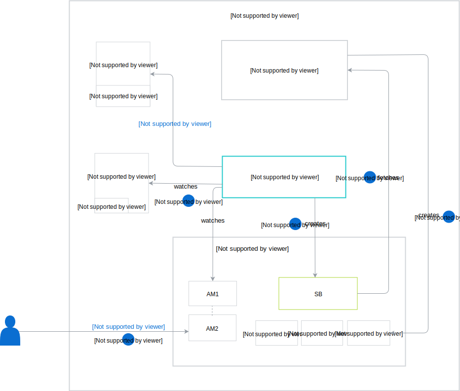
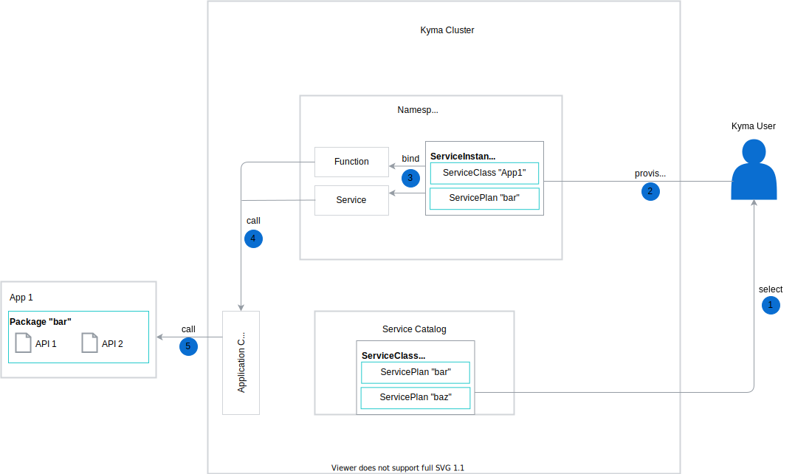
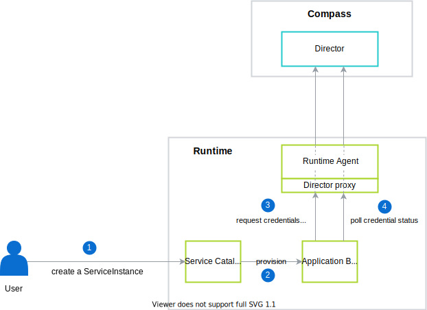
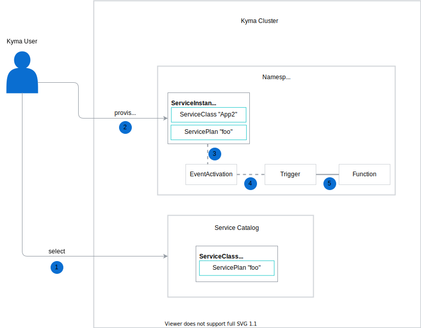

The Application Broker (AB) workflow consists of the following steps:

1. The Application Broker watches for Applications in the cluster and ApplicationMappings (AMs) in all Namespaces.
2. The user creates an ApplicationMapping custom resource in a given Namespace. The AM activates services offered by an Application. The AM must have the same name as the Application.
3. The Application Broker creates an `application-broker` Service Broker (SB) inside the Namespace in which the AM is created. This Service Broker contains data of all services provided by the activated Applications. There is always only one `application-broker` Service Broker per Namespace, even if there are more AMs.
>**NOTE:** The Application Broker is the sole component that manages the `application-broker` Service Broker. The user should not create or delete this resource.

4. The Service Catalog fetches services and their plans that the `application-broker` Service Broker exposes.
5. The Service Catalog creates a ServiceClass with its corresponding ServicePlans for each service received from the Service Broker.

When this process is complete, you can provision and bind your services.

## Provisioning and binding for an API ServicePlan

This ServicePlan has a **bindable** parameter set to `true`, which means that you have to provision a ServiceInstance and bind it to the service or Function to connect to a given API.
The provisioning and binding workflow for an API ServicePlan consists of the following steps:

1. Select an API ServiceClass and choose an API ServicePlan from the Service Catalog.
2. Provision the ServiceClass with the chosen API ServicePlan by creating its ServiceInstance in a Namespace.
3. Bind your ServiceInstance to the service or Function. During the binding process, ServiceBinding and ServiceBindingUsage resources are created.
  * ServiceBinding contains a Secret with the Gateway URL required to connect to the given API. The Gateway URL is specified under the **sanitized({API\_NAME}_{API_ID})_GATEWAY_URL** field. To learn more about sanitization, refer to the [sanitization function](https://github.com/kyma-project/kyma/blob/master/components/application-broker/internal/broker/bind_creds_renderer.go#L109).
>**NOTE:** If you want to call the Application directly and skip the Application Gateway component, use **sanitized({API\_NAME}_{API_ID})_TARGET_URL** with corresponding **CONFIGURATION** and **CREDENTIALS_TYPE**. For more information, read the document about [proxy configuration](https://kyma-project.io/docs/components/application-connector#details-application-gateway-proxy-configuration).
  * ServiceBindingUsage injects the Secret, together with the label given during the registration process, to the Function or service.
4. The service or Function calls the API through the Application Gateway, allowing you to access the Application API.
5. The Application Gateway enriches the call with the necessary credentials, which it fetches from Secrets created by Service Catalog.

### Generating API credentials

This section describes in detail how the API credentials are generated.

1. User creates a ServiceInstance.
2. Service Catalog sends a provisioning request to the Application Broker.
3. Application Broker requests credentials for a ServiceInstance. The request is processed through the Director proxy exposed by Runtime Agent to Director.
    >**NOTE:** The Director proxy is secured by [Istio RBAC](https://github.com/kyma-project/kyma/blob/master/resources/compass-runtime-agent/templates/istio-rbac.yaml) and only Application Broker can access it.

4. Application Broker polls credential status with a 20 minute timeout. The polling is completed when the credential status is either `SUCCEEDED` or `FAILED`.

Application Broker uses these credentials during the binding action. To use another set of credentials, you must create a new ServiceInstance.

## Provisioning and binding for an event ServicePlan

This ServicePlan has a **bindable** parameter set to `false`, which means that after provisioning a ServiceInstance in a Namespace, given events are ready to use for all services. The provisioning workflow for an event ServicePlan consists of the following steps:

1. Select a given ServiceClass with an event ServicePlan from the Service Catalog.
2. Provision this ServiceClass with the chosen event ServicePlan by creating a ServiceInstance in the given Namespace.
3. During the provisioning process, the [EventActivation](/components/application-connector/#custom-resource-event-activation) resource is created together with the ServiceInstance. This resource allows you to create a Trigger from the Kyma Console.
4. The Application sends an event to the Application Connector.
5. When the Trigger receives the event, it triggers the Function based on the parameters defined for a Trigger.

For more information, read about [event processing and delivery](/components/eventing/#details-event-processing-and-delivery).

## Provisioning and binding for both the API and event ServicePlan

This ServicePlan has a **bindable** parameter set to `true`.
The provisioning and binding workflow for both the API and event ServicePlan is a combination of the steps described for an [API ServicePlan](#architecture-the-application-broker-architecture-provisioning-and-binding-for-an-api-serviceplan) and an [event ServicePlan](#architecture-the-application-broker-architecture-provisioning-and-binding-for-an-event-serviceplan).
