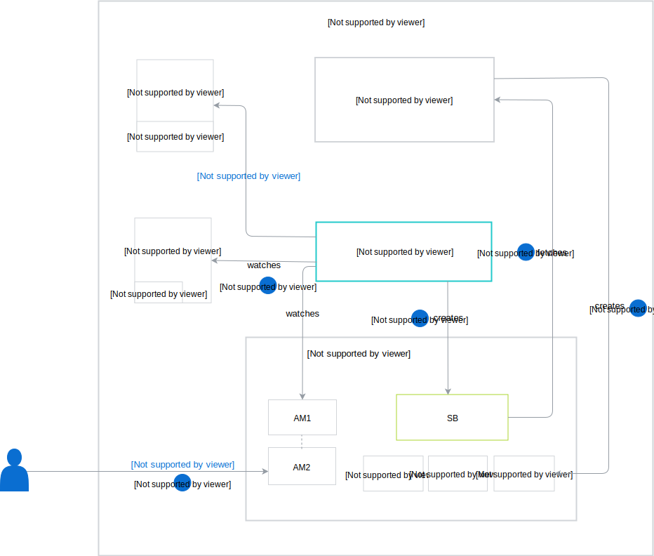
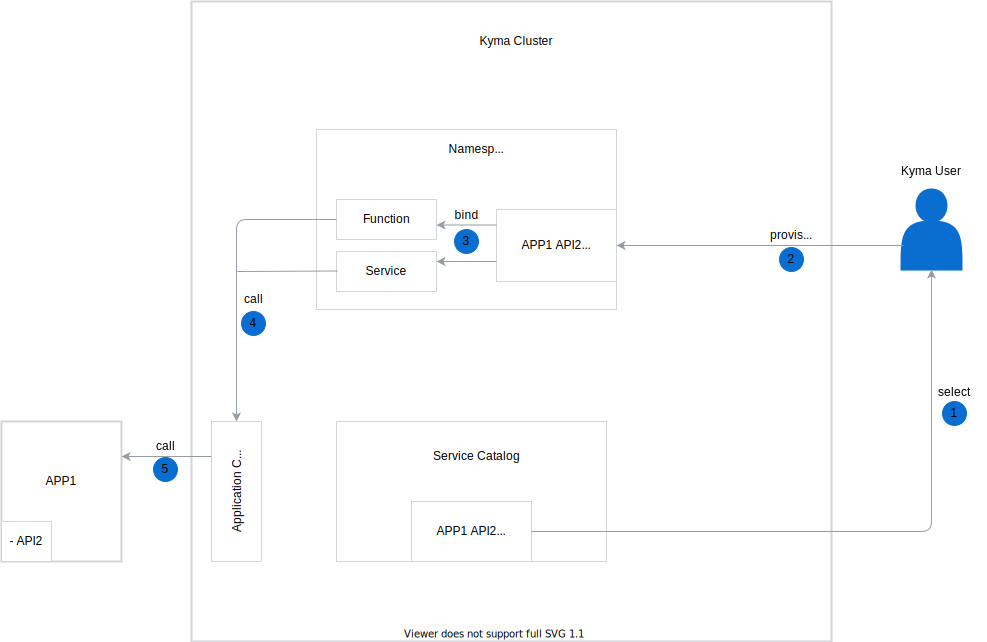
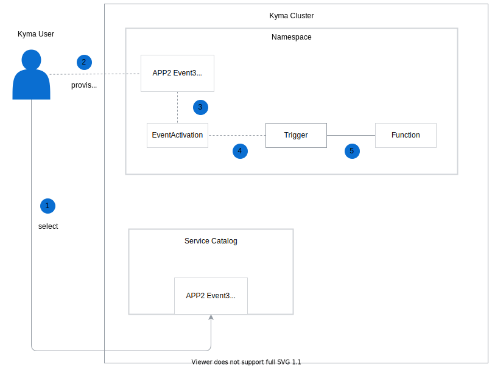

The Application Broker (AB) workflow consists of the following steps:

1. The Application Broker watches for Applications in the cluster and ApplicationMappings (AMs) in all Namespaces.
2. The user creates an ApplicationMapping custom resource in a given Namespace. The AM activates services offered by an Application. The AM must have the same name as the Application.
3. The Application Broker creates an `application-broker` Service Broker (SB) inside the Namespace in which the AM is created. This Service Broker contains data of all services provided by the activated Applications. There is always only one `application-broker` Service Broker per Namespace, even if there are more AMs.

>**NOTE:** The Application Broker is the sole component that manages the `application-broker` Service Broker. The user should not create or delete this resource.

4. The Service Catalog fetches services that the `application-broker` Service Broker exposes.
5. The Service Catalog creates a ServiceClass for each service received from the Service Broker.

When this process is complete, you can provision and bind your services.

## Provisioning and binding for an API ServiceClass

This ServiceClass has a **bindable** parameter set to `true`, which means that you have to provision a ServiceInstance and bind it to the service or Function to connect to the given API. The provisioning and binding workflow for an API ServiceClass consists of the following steps:

1. Select an API ServiceClass from the Service Catalog.
2. Provision this ServiceClass by creating its ServiceInstance in a Namespace.
3. Bind your ServiceInstance to the service or Function. During the binding process, ServiceBinding and ServiceBindingUsage resources are created.
  * ServiceBinding contains a Secret with a GatewayURL required to connect to the given API.
  * ServiceBindingUsage injects the Secret, together with the label given during the registration process, to the Function or service.
4. The service or Function calls the API through the Application Connector. The Application Connector verifies the label to check if you have the authorization to access this API.
5. After verifying the label, the Application Connector allows you to access the Application API.

## Provisioning and binding for an event ServiceClass

This ServiceClass has a **bindable** parameter set to `false` which means that after provisioning a ServiceClass in the Namespace, given events are ready to use for all services. The provisioning workflow for an event ServiceClass consists of the following steps:

1. Select a given event ServiceClass from the Service Catalog.
2. Provision this ServiceClass by creating a ServiceInstance in the given Namespace.
3. During the provisioning process, the [EventActivation](/components/application-connector/#custom-resource-event-activation) resource is created together with the ServiceInstance. This resource allows you to create a Trigger from the Kyma Console.
4. The Application sends an event to the Application Connector.
5. When the Trigger receives the event, it triggers the Function based on the paramertes defined for a Trigger.

For more information, read about [event processing and delivery](/components/event-mesh/#details-event-processing-and-delivery).

## Provisioning and binding for both the API and event ServiceClass

This ServiceClass has a **bindable** parameter set to `true`.
The provisioning and binding workflow for both the API and event ServiceClass is a combination of the steps described for an [API ServiceClass](#architecture-the-application-broker-architecture-provisioning-and-binding-for-an-api-serviceclass) and an [event ServiceClass](#architecture-the-application-broker-architecture-provisioning-and-binding-for-an-event-serviceclass).
