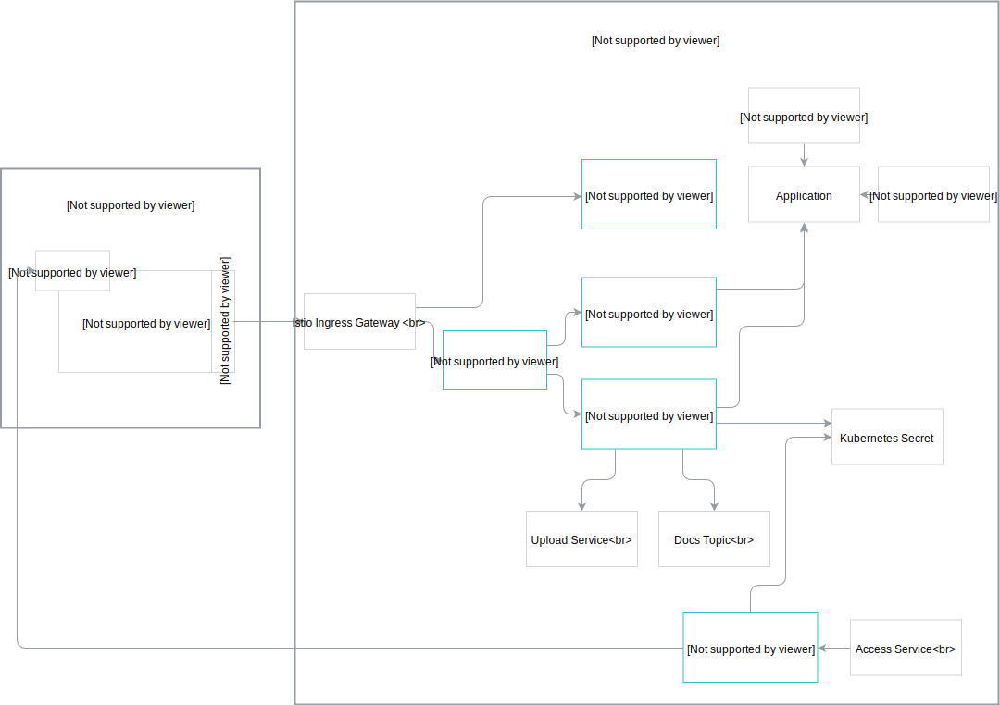

## Istio Ingress Gateway

The Istio Ingress Gateway exposes the Application Connector and other Kyma components.
The DNS name of the Ingress is cluster-dependent and follows the `gateway.{cluster-dns}` format. For example, `gateway.servicemanager.cluster.kyma.cx`.
Istio Ingress Gateway secures the endpoints with certificate validation. Each call must include a valid client certificate.
You can access every exposed Application using the assigned path. For example, to reach the Gateway for the `user-custom` Application, use `gateway.servicemanager.cluster.kyma.cx/user-custom`.

## Application Connectivity Validator

The Application Connectivity Validator verifies the subject of the client certificate. It is deployed per Application and it proxies requests to the Application Registry and the Event Service.

## Connector Service

The Connector Service:

- Handles the exchange of client certificates for a given Application.
- Provides the Application Registry and Event Service endpoints.
- Signs client certificates using the server-side certificate stored in a Kubernetes Secret.

## Application Registry

The Application Registry saves and reads the APIs and Event Catalog metadata of the connected external solution in the [Application](#custom-resource-application) custom resource.
The system creates a new Kubernetes service for each registered API.

>**NOTE:** Using the Application Registry, you can register an API along with its OAuth or Basic Authentication credentials. The credentials are stored in a Kubernetes Secret.

## Event Service

The Event Service sends events to the Kyma Event Bus and enriches events with metadata that indicates the source of the event.
This allows routing events to lambda functions and services based on their source Application.

## Application

An Application represents an external solution connected to Kyma. It handles the integration with other components, such as the Service Catalog or the Event Bus.
Using the components of the Application Connector, the Application creates a coherent identity for a connected external solution and ensures its separation.
All Applications are instances of the Application custom resource, which also stores all of the relevant metadata. You can bind an Application to many Kyma Namespaces and use the APIs and the Event Catalogs of the connected external solution within their context.

## Application Broker

The Application Broker (AB) watches all [Application](#custom-resource-application) custom resources. These custom resources contain definitions of the external solutions’ APIs and events. The AB exposes those APIs and events definitions as ServiceClasses to the Service Catalog. Create an ApplicationMapping to provision those ServiceClasses and enable them for Kyma services. This allows you to extend the functionality of existing systems.

The AB implements the [Open Service Broker API](https://www.openservicebrokerapi.org/). For more details about Service Brokers, see [this](/components/service-catalog#service-brokers-service-brokers) documentation.

## Application Operator

The operator listens for creating or deleting the Application custom resources and acts accordingly, either provisioning or de-provisioning an instance of the Application Gateway and the Event Service for every custom resource.

>**NOTE:** Every Application custom resource corresponds to a single Application to which you can connect an external solution.

## Application Gateway

The Application Gateway is an intermediary component between a lambda function or a service and an external API registered with the Application Registry. It can call services secured with:

- [Basic Authentication](https://tools.ietf.org/html/rfc7617) mechanism,
- OAuth
- Client certificates

Additionally, the Application Gateway supports cross-site request forgery (CSRF) tokens as an optional layer of API protection.

## Access Service

The Access Service exposes the Application Gateway and manages the access from the Lambda functions and services deployed in Kyma to the external APIs over the Application Gateway.

## Rafter

Rafter stores the documentation of the connected external solution's registered APIs and event catalogs.

## Kubernetes Secret

The Kubernetes Secret is a Kubernetes object which stores sensitive data, such as the OAuth credentials.
