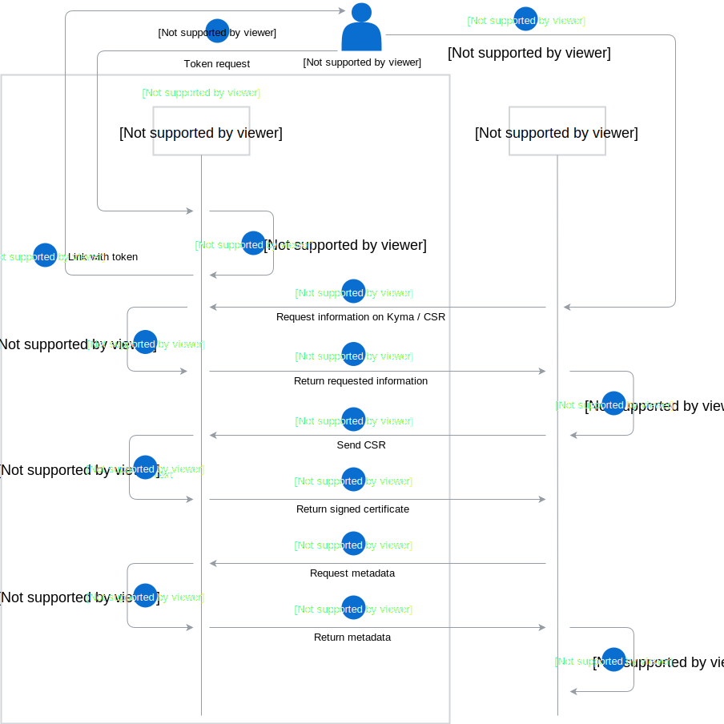

The Connector Service generates client certificates which are used to secure the communication between Kyma and the connected external solutions.

The Connector Service exposes two separate APIs:

- An internal API available in the Kyma cluster used to initiate certificate generation
- An external API exposed through Ingress used to finalize certificate generation

Generating a new client certificate is the first step in the process of configuring an Application. Kyma stores the root certificate and serves as the Certificate Authority when you configure a new Application. When you generate a new client certificate, the Connector Service returns it along with the root certificate to allow validation.  

This diagram illustrates the client certificate generation flow in details:

1. The administrator requests a token using the CLI or the UI and receives a link with the token, which is valid for a limited period of time.
2. The administrator passes the token to the external system, which requests information regarding the Kyma installation. In the response, it receives the following information:
    - the URL to which a third-party solution sends its Certificate Signing Request (CSR)
    - the URL of the `metadata` endpoint
    - information required to generate a CSR
3. The external system generates a CSR based on the information provided by Kyma and sends the CSR to the designated URL. In the response, the external system receives a signed certificate. It can use the certificate to authenticate and safely communicate with Kyma.
4. The external system calls the `metadata` endpoint that contains the following information:
    - the URL of the Application Registry API
    - the URL of the Event Service API
    - the certificate renewal URL used to rotate certificates
    - the certificate revocation URL used to revoke compromised certificates
    - information uniquely identifying a certificate, such as the Application name
    - information required to generate a CSR  

>**NOTE:** The external Application should not hardcode any URLs. The information returned from the `metadata` endpoint should be stored by the external Application along with the certificate. This approach implicates less coupling and offers a great deal of flexibility.

>**NOTE:**  The external Application can call the `metadata` endpoint to fetch information required to generate a CSR prior to certificate renewal. This approach makes certificate rotation process convenient and flexible, since the external Application does not need to store information required to generate a CSR in its data model.

>**NOTE:** Follow [this](#tutorials-get-the-client-certificate) tutorial to learn how to get a client certificate for your implementation.
